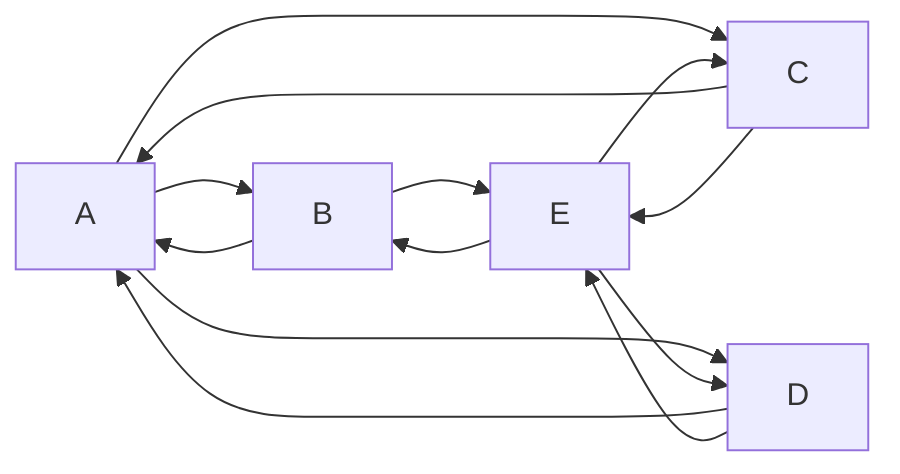

The way we render Markdown on our websites is through the use of
[MDX](https://mdxjs.com/). This allows us to extend Markdown with our own
tags. These tags are custom React components.

Such custom components allow us to put things in Markdown content that would
typically require a lot more complexity.

Below is a list of custom tags that we support in our Markdown-based
documentation, both for freesewing.dev as freesewing.org.

## Comment

Use a **Comment** when you want to illustrate something is a personal opinion
or tip/advice rather than the sort more neutral voice used throughout
our documentation.

| Attribute | Default | Description |
| ----:| ------- | ----------- |
| `by` |         | Name of the commenter |

<Tabs tabs="example, markdown">
<Tab>
<Comment by="joost">MDX is essentially Markdown + (React) components</Comment>
</Tab>
<Tab>
```markdown
<Comment by="joost">MDX is essentially Markdown + (React) components</Comment>
```
</Tab>
</Tabs>

## Example

The **Example** tag allows you to embed a FreeSewing code example and have it rendered in the browser.
Specifically, you should write a [draft method](/reference/api/part/draft) which will then be rendered.

| Attribute | Default | Description |
| ----:| ------- | ----------- |
| `caption` |         | The caption to go under the example |
| `tutorial` | `false` | Set this to show the Code tab first, rather than the default Preview tab. Also, additional options are made available for use in pattern examples |
| `previewFirst` | `false` | Set this to always show the Preview tab first, regardless of the value of `tutorial` |
| `withHead` | `false` | Set this to include a head measurement (for tutorial pattern examples) |
| `paperless` | `false` | Set this to enable paperless mode |
| `settings` |  | A YAML string of settings to take into account |

<Tabs tabs="example, markdown">
<Tab>
<Example caption="Example of the Path.curve() method">
```js
({ Point, points, Path, paths, part }) => {

  points.from = new Point(10, 20)
  points.cp1 = new Point(40, 0)
  points.cp2 = new Point(60, 40)
  points.to = new Point(90, 20)
  
  paths.line = new Path()
    .move(points.from)
    .curve(points.cp1, points.cp2, points.to)
    .setText("Path.curve()", "text-sm center fill-note")

  return part
}
```
</Example>
</Tab>
<Tab>
````markdown
<Example caption="Example of the Path.curve() method">
```js
({ Point, points, Path, paths, part }) => {

  points.from = new Point(10, 20)
  points.cp1 = new Point(40, 0)
  points.cp2 = new Point(60, 40)
  points.to = new Point(90, 20)
  
  paths.line = new Path()
    .move(points.from)
    .curve(points.cp1, points.cp2, points.to)
    .setText("Path.curve()", "text-sm center fill-note")

  return part
}
```
</Example>
````
</Tab>
</Tabs>


## Fixme

Use **Fixme** to indicate something needs attention/work but you don't have time
or can't fix it now.

| Attribute | Default | Description |
| ---------:| ------- | ----------- |
| `compact` | `false` | Renders compact variant |

<Tabs tabs="example, markdown">
<Tab>
<Fixme>
##### ToDo
- Include link to roadmap
- Fix style for text outside paragraphs
</Fixme>
<Fixme compact>Show compact example</Fixme>
</Tab>
<Tab>
```markdown
<Fixme>
##### ToDo
- Include link to roadmap
- Fix style for text outside paragraphs
</Fixme>
<Fixme compact>Show compact example</Fixme>
```
</Tab>
</Tabs>

## Mermaid

Not strictly speaking a custom tag, but by using a fenced code block with the
`mermaid` language, you can generate [Mermaid](https://mermaid.js.org/)
diagrams. Like this:

<Tabs tabs="example, markdown">
<Tab>

</Tab>
<Tab>
````markdown

````
</Tab>
</Tabs>

## Note

Use **Note** to add something that stands out to draw attention.

| Attribute | Default | Description |
| ----:| ------- | ----------- |
| `compact` | `false` | Renders compact variant |

<Tabs tabs="example, markdown">
<Tab>
<Note>
##### Also available in black
This style also comes in black, which we can all agree is the superior color
</Note>
<Note compact>And in pink</Note>
</Tab>
<Tab>
```markdown
<Note>
##### Also available in black
This style also comes in black, which we can all agree is the superior color
</Note>
<Note compact>And in pink</Note>
```
</Tab>
</Tabs>

## ReadMore

The **ReadMore** tag allows you to insert a list of child-pages.
The list is automatically generated from the pages in the subdirectories
of the documentation page's directory.
This tag is typically used on overview pages, such as our [Markdown guide](/guides/markdown) page.

| Attribute | Default | Description |
| ----:| ------- | ----------- |
| `recurse` | `false` | Include all child-pages and sub-child-pages in the entire directory tree |

```markdown
<ReadMore />
```

(It won't show anything on this page, since this page has no child-pages.)

## Related

Use **Related** to add something that is relevant to the current topic.

| Attribute | Default | Description |
| ----:| ------- | ----------- |
| `compact` | `false` | Renders compact variant |

<Tabs tabs="example, markdown">
<Tab>
<Related>
  This snippet is provided by [the buttons plugin](/reference/plugins/buttons)
</Related>
<Related compact>See [snippets](/reference/snippets)</Related>
</Tab>
<Tab>
```markdown
<Related>
  This snippet is provided by [the buttons plugin](/reference/plugins/buttons)
</Related>
<Related compact>See [snippets](/reference/snippets)</Related>
```
</Tab>
</Tabs>


## Tip

Use **Tip** for, you know, tips.

| Attribute | Default | Description |
| ----:| ------- | ----------- |
| `compact` | `false` | Renders compact variant |

<Tabs tabs="example, markdown">
<Tab>
<Tip>
  The notches on the shoulder and sleeve parts are used to help with
  alignment when attaching the sleeve.
</Tip>
<Tip compact>Align the notches so they match</Tip>
</Tab>
<Tab>
```markdown
<Tip>
  The notches on the shoulder and sleeve parts are used to help with
  alignment when attaching the sleeve.
</Tip>
<Tip compact>Align the notches so they match</Tip>
```
</Tab>
</Tabs>


## Warning

Use **Warning** when you want to warn the reader of potential danger or unintended side-effects.

| Attribute | Default | Description |
| ----:| ------- | ----------- |
| `compact` | `false` | Renders compact variant |

<Tabs tabs="example, markdown">
<Tab>
<Warning>
  ##### Please make a backup
  Following these instructions will remove all your data
</Warning>
<Warning compact>Take it slow</Warning>
</Tab>
<Tab>
```markdown
<Warning>
  ##### Please make a backup
  Following these instructions will remove all your data
</Warning>
<Warning compact>Take it slow</Warning>
```
</Tab>
</Tabs>

## YouTube

The **YouTube** tag will embed YouTube videos or YouTube playlists responsively.

| Attribute | Default | Description |
| ----:| ------- | ----------- |
| `id` |  | ID of the YouTube video or playlist |
| `playlist` | `false` | Set this when embedding a playlist |

<Tabs tabs="example, markdown">
<Tab>
### Video
<YouTube id='Rz6ShSftDlI' />
### Playlist
<YouTube id='PL1gv5yv3DoZOFSXz7yydeV1H8m6pfwstn' playlist />
</Tab>
<Tab>
```markdown
### Video
<YouTube id='Rz6ShSftDlI' />
### Playlist
<YouTube id='PL1gv5yv3DoZOFSXz7yydeV1H8m6pfwstn' playlist />
```
</Tab>
</Tabs>
