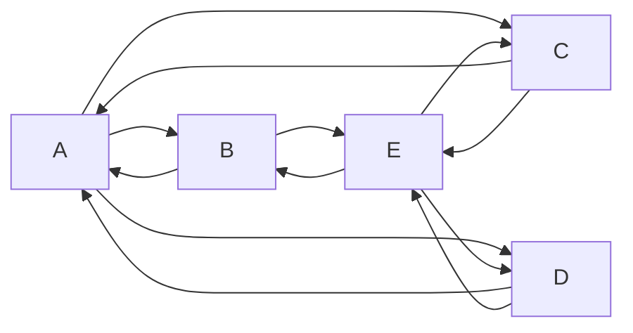

The way we render Markdown on our websites is through the use of
[MDX](https://mdxjs.com/). This allows us to extend Markdown with our own
tags. These tags are custom React components.

Such custom components allow us to put things in Markdown content that would
typically require a lot more complexity.

Below is a list of custom tags that we support in our Markdown-based
documentation, both for freesewing.dev as freesewing.org.

## Summary and Availability

This is a summary of the available custom tags and where each tag
can be used.
- **sde** tags can be used in the standalone development environment
(provided by the [new-design](/reference/packages/new-design) package).
- **dev** and **org** tags can be used on the
freesewing.dev and freesewing.org sites, respectively.
- For convenience, tags with similar functionality have been grouped together.

### Text popouts

These are markdown tags used to display text in a colored _popout_ box,
to make the text stand out and to quickly convey what type of
information is being presented.

| Tag     | sde | dev | org |
| ------: | :---: | :---: | :---: |
| [Comment](#comment) | X   | X   | X   |
| [Fixme](#fixme)     | X   | X   | X   |
| [Link](#link)       | X   | X   | X   |
| [Note](#note)       | X   | X   | X   |
| [Related](#related) | X   | X   | X   |
| [Tip](#tip)         | X   | X   | X   |
| [Tldr](#tldr)       | X   | X   | X   |
| [Warning](#warning) | X   | X   | X   |

### Features and Formatting

These tags provide special features or ways to format content.

| Tag                         | sde | dev | org |
| --------------------: | :---: | :---: | :---: |
| [ControlTip](#controltip)   |     | X   | X   |
| [DocsTitle](#docstitle)     |     | X   | X   |
| [DocsLink](#docslink)       |     | X   | X   |
| [Example](#example)         |     | X   | X   |
| [Legend](#legend)           |     |     | X*  |
| [MeasieImage](#measieimage) |     |     | X*  |
| [(Mermaid)](#mermaid)       |     | X   | X   |
| [Method](#method)           |     | X   |     |
| [StatusCode](#statuscode)   |     | X   |     |
| [Tab](#tab)                 |     | X   | X   |
| [Tabs](#tabs)               |     | X   | X   |
| [Youtube](#youtube)         |     | X   | X   |

<Note>

- **Legend** is available to use only on the
[Pattern Notation Guide](https://freesewing.org/docs/about/notation) and
[On the Fold](https://freesewing.org/docs/sewing/on-the-fold)
documentation pages.

- **MeasieImage** is available to use only on the immediate subpages in the
[Measurements](https://freesewing.org/docs/measurements)
section of the documentation.

</Note>

### Documentation Generators

These tags generate documentation-related content related to designs
and documentation files.
This prevents the need to write and edit the documentation manually,
making it easier to write and to maintain when changes occur.

| Tag                | sde | dev | org |
| -----------------: | :---: | :---: | :---: |
| [DesignInfo](#designinfo)                 |     |     | X*  |
| [DesignMeasurements](#designmeasurements) |     |     | X*  |
| [DesignOptions](#designoptions)           |     |     | X*  |
| [ReadMore](#readmore)                     | X   | X   | X   |

<Note>

- **DesignInfo** is available to use only on an individual design's
main documentation page, for example
[Aaron A-Shirt](https://freesewing.org/docs/designs/aaron).

- **DesignMeasurements** is available to use only on an individual design's
Required Measurements documentation page, for example
[Aaron A-Shirt: Required Measurements](https://freesewing.org/docs/designs/aaron/measurements).

- **DesignMeasurements** is available to use only on an individual design
Design Options documentation page, for example
[Aaron A-Shirt: Design Options](https://freesewing.org/docs/designs/aaron/options).

</Note>

***

## Details

All custom tags are listed alphabetically below.

### Comment

Use a **Comment** when you want to illustrate something that is a personal opinion
or advice rather than the sort more neutral voice used throughout
our documentation.

| Attribute | Required? | Default | Description |
| ----:| :---: | ------- | ----------- |
| `by` | yes |        | Name of the commenter |
| `hideable` | | `false` | Allows popout to be hidden |

<Tabs tabs="example, markdown">
<Tab>
<Comment by="joost">MDX is essentially Markdown + (React) components</Comment>
<Comment hideable by="Ben F.">
  It can be helpful to be able to hide long comments that might take up
  too much space on the page _(hideable)_
</Comment>
</Tab>
<Tab>
```markdown
<Comment by="joost">MDX is essentially Markdown + (React) components</Comment>
<Comment hideable by="Ben F.">
  It can be helpful to hide long comments that might take up too much
  space on the page _(hideable)_
</Comment>
</Tab>
```
</Tab>
</Tabs>

### ControlTip

The **ControlTip** tag provides a popout box containing pre-written,
formatted text describing the
[User Experience](https://freesewing.org/account/control)
account setting and explaining what it does.

<Tabs tabs="example, markdown">
<Tab>
<ControlTip />
</Tab>
<Tab>
```markdown
<ControlTip />
```
</Tab>
</Tabs>

### DesignInfo

**DesignInfo** generates a detailed web page for a given FreeSewing
design with information including line drawings, example photos,
required measurements, design options, and links to documentation.

| Attribute | Required? |  Default | Description |
| ----:| :---: | ------- | ----------- |
| `design` | yes |        | Name of the design |
| `docs` | | `false` | Generates content suitable for a documentation page |

<Tabs tabs="example, markdown">
<Tab>
(Please see the
[Aaron A-Shirt documentation](https://freesewing.org/docs/designs/aaron)
page for an example of this tag.)
</Tab>
<Tab>
```markdown
<DesignInfo design='aaron' docs />
```
</Tab>
</Tabs>

<Note>
Because design documentation pages are the only place this tag can
be used, you should always include the `docs` attribute when using
this tag.
(Omitting it will generate different content, less suited for
documentation.)
</Note>

### DesignMeasurements

**DesignMeasurements** generates a list of required and optional
measurements for a given FreeSewing design.

| Attribute | Required? |  Default | Description |
| ----:| :---: | ------- | ----------- |
| `design` | yes |        | Name of the design |

<Tabs tabs="example, markdown">
<Tab>
(Please see
[Aaron A-Shirt: Requirement Measurements](https://freesewing.org/docs/designs/aaron/measurements)
for an example of this tag.)
</Tab>
<Tab>
```markdown
<DesignMeasurements design='aaron' />
```
</Tab>
</Tabs>

### DesignOptions

**DesignOptions** generates a list of design options and settings
for a given FreeSewing design.

| Attribute | Required? |  Default | Description |
| ----:| :---: | ------- | ----------- |
| `design` | yes |        | Name of the design |

<Tabs tabs="example, markdown">
<Tab>
(Please see
[Aaron A-Shirt: Design Options](https://freesewing.org/docs/designs/aaron/options)
for an example of this tag.)
</Tab>
<Tab>
```markdown
<DesignOptions design='aaron' />
```
</Tab>
</Tabs>

### DocsLink

The **DocsLink** tag creates a formatted link from a given slug
(a relative URL path).
It also looks up the title of the linked web page and uses it as
the link text.

| Attribute | Required? |  Default | Description |
| ----:| :---: | ------- | ----------- |
| `slug` | yes |        | Relative path for the link |

<Tabs tabs="example, markdown">
<Tab>
<DocsLink slug='guides/markdown' />
</Tab>
<Tab>
```markdown
<DocsLink slug='guides/markdown' />
```
</Tab>
</Tabs>

### DocsTitle

The **DocsTitle** tag looks up the title of a web page from a
given slug (a relative URL path) and provides the title as formatted
text.

| Attribute | Required? |  Default | Description |
| ----:| :---: | ------- | ----------- |
| `slug` | yes |        | Relative path of the link |
| `className` | | | CSS classes to style the text |
| `format` | | defaultFormater | Formatter used to format the text |


<Tabs tabs="example, markdown">
<Tab>
<DocsTitle slug='guides/markdown' />
</Tab>
<Tab>
```markdown
<DocsTitle slug='guides/markdown' />
```
</Tab>
</Tabs>


### Example

The **Example** tag allows you to embed a FreeSewing code example and have it rendered in the browser.
Specifically, you should write a [draft method](/reference/api/part/draft) which will then be rendered.

| Attribute | Required? | Default | Description |
| ----:| :---: | ------- | ----------- |
| `caption` | |        | The caption to go under the example |
| `tutorial` | | `false` | Set this to show the Code tab first, rather than the default Preview tab. Also, additional options are made available for use in pattern examples |
| `previewFirst` | | `false` | Set this to always show the Preview tab first, regardless of the value of `tutorial` |
| `withHead` | | `false` | Set this to include a head measurement (for tutorial pattern examples) |
| `paperless` | | `false` | Set this to enable paperless mode |
| `settings` | |  | A YAML string of settings to take into account |

<Tabs tabs="example, markdown">
<Tab>
<Example caption="Example of the Path.curve() method">
```js
({ Point, points, Path, paths, part }) => {

  points.from = new Point(10, 20)
  points.cp1 = new Point(40, 0)
  points.cp2 = new Point(60, 40)
  points.to = new Point(90, 20)

  paths.line = new Path()
    .move(points.from)
    .curve(points.cp1, points.cp2, points.to)
    .setText("Path.curve()", "text-sm center fill-note")

  return part
}
```
</Example>
</Tab>
<Tab>
````markdown
<Example caption="Example of the Path.curve() method">
```js
({ Point, points, Path, paths, part }) => {

  points.from = new Point(10, 20)
  points.cp1 = new Point(40, 0)
  points.cp2 = new Point(60, 40)
  points.to = new Point(90, 20)

  paths.line = new Path()
    .move(points.from)
    .curve(points.cp1, points.cp2, points.to)
    .setText("Path.curve()", "text-sm center fill-note")

  return part
}
```
</Example>
````
</Tab>
</Tabs>


### Fixme

Use **Fixme** to indicate something needs attention/work but you don't have time
or can't fix it now.

| Attribute  | Required? | Default | Description |
| ---------: | :-------: | ------- | ----------- |
| `compact`  |           | `false` | Renders compact variant |
| `hideable` |           | `false` | Allows popout to be hidden |

<Tabs tabs="example, markdown">
<Tab>
<Fixme>
##### ToDo
- Include link to roadmap
- Fix style for text outside paragraphs
</Fixme>
<Fixme compact>Proofread documentation _(compact)_</Fixme>
<Fixme hideable>
  Proofread it a second time _(hideable)_
</Fixme>
</Tab>
<Tab>
```markdown
<Fixme>
##### ToDo
- Include link to roadmap
- Fix style for text outside paragraphs
</Fixme>
<Fixme compact>Proofread documentation _(compact)_</Fixme>
<Fixme hideable>
  Proofread it a second time _(hideable)_
</Fixme>
```
</Tab>
</Tabs>

### Legend

The **Legend** tag is used to display parts from a pattern of the
Legend design (a non-public design in the FreeSewing repository
created to provide examples of pattern features).

| Attribute  | Required? | Default | Description |
| ---------: | :-------: | ------- | ----------- |
| `part`  | yes          |       | The Legend part to display |

<Tabs tabs="example, markdown">
<Tab>
(Please see
[On the fold](https://freesewing.org/docs/sewing/on-the-fold)
for an example of this tag, used to display the _cut-on-fold_ indicator
on that page.)
</Tab>
<Tab>
```markdown
<Legend part='cutonfold' />
```
</Tab>
</Tabs>

### Link

Use **Link** for URLs.

| Attribute  | Required? | Default | Description |
| ---------: | :-------: | ------- | ----------- |
| `compact`  |           | `false` | Renders compact variant |
| `hideable` |           | `false` | Allows popout to be hidden |

<Tabs tabs="example, markdown">
<Tab>
<Link>
https://freesewing.org/
</Link>
<Link compact>https://freesewing.org/ _(compact)_</Link>
<Link hideable>https://freesewing.org/ _(hideable)_</Link>
</Tab>
<Tab>
```markdown
<Link>
https://freesewing.org
</Link>
<Link compact>https://freesewing.org/ _(compact)_</Link>
<Link hideable>https://freesewing.org/ _(hideable)_</Link>
```
</Tab>
</Tabs>

### MeasieImage

**MeasieImage** will show images of a FreeSewing measurement.
The name of the directory in which the tag is used is the
measurement which will be shown.

<Tabs tabs="example, markdown">
<Tab>
(Please see
[Biceps circumference](https://freesewing.org/docs/measurements/biceps)
for an example of this tag, used to display the image showing the
biceps circumference measurement.
</Tab>
<Tab>
```markdown
<MeasieImage />
```
</Tab>
</Tabs>


### (Mermaid)

There is no actual "Mermaid" custom tag.
However, by using a fenced [code block](/guides/markdown/code-blocks)
and specifying the `mermaid` language, you can generate
[Mermaid](https://mermaid.js.org/) diagrams. Like this:

<Tabs tabs="example, markdown">
<Tab>

</Tab>
<Tab>
````markdown

````
</Tab>
</Tabs>

### Method

**Method** is used to format HTTP methods.

| Attribute  | Required? | Default | Description |
| ---------: | :-------: | ------- | ----------- |
| `get`  |           | `false` | Display the HTTP `GET` method |
| `post` |           | `false` | Display the HTTP `POST` method |
| `put`  |           | `false` | Display the HTTP `PUT` method |
| `delete` |           | `false` | Display the HTTP `DELETE` method |


<Tabs tabs="example, markdown">
<Tab>
<Method get /><br />
<Method post />
</Tab>
<Tab>
```markdown
<Method get /><br />
<Method post />
```
</Tab>
</Tabs>

<Note>

- It is required that you provide one of the `get`, `post`, `put`,
or `delete` attributes when using **Method**.
- If more than one of those attributes is provided, only the first
one that gets processed will be used.

</Note>

### Note

Use **Note** to add something that stands out to draw attention.

| Attribute  | Required? | Default | Description |
| ---------: | :-------: | ------- | ----------- |
| `compact`  |           | `false` | Renders compact variant |
| `hideable` |           | `false` | Allows popout to be hidden |

<Tabs tabs="example, markdown">
<Tab>
<Note>
##### Also available in black
This style also comes in black, which we can all agree is the superior color
</Note>
<Note compact>And in pink _(compact)_</Note>
<Note hideable>Yet another note _(hideable)_</Note>
</Tab>
<Tab>
```markdown
<Note>
##### Also available in black
This style also comes in black, which we can all agree is the superior color
</Note>
<Note compact>And in pink _(compact)_</Note>
<Note hideable>Yet another note _(hideable)_</Note>
```
</Tab>
</Tabs>

### ReadMore

The **ReadMore** tag allows you to insert a list of child-pages.
The list is automatically generated from the pages in the subdirectories
of the documentation page's directory.
This tag is typically used on overview pages, such as our [Markdown guide](/guides/markdown) page.

| Attribute | Required? | Default | Description |
| ----:| :---: | ------- | ----------- |
| `asMenu` | | `false` | Start from the parent directory |
| `depth` | | 99 | Maximum levels to recurse |
| `recurse` | |`false` | Include all child-pages and sub-child-pages in the entire directory tree |
| `root` | | `false` | Start from the root directory |

<Tabs tabs="example, markdown">
<Tab>
<ReadMore asMenu />
</Tab>
<Tab>
```markdown
<ReadMore asMenu />
```
</Tab>
</Tabs>

### Related

Use **Related** to add something that is relevant to the current topic.

| Attribute  | Required? | Default | Description |
| ---------: | :-------: | ------- | ----------- |
| `compact`  |           | `false` | Renders compact variant |
| `hideable` |           | `false` | Allows popout to be hidden |

<Tabs tabs="example, markdown">
<Tab>
<Related>
  This snippet is provided by [the annotations plugin](/reference/plugins/annotations)
</Related>
<Related compact>See [snippets](/reference/snippets) _(compact)_</Related>
<Related hideable>
  See [snippets](/reference/snippets) _(hideable)_
</Related>
</Tab>
<Tab>
```markdown
<Related>
  This snippet is provided by [the annotations plugin](/reference/plugins/annotations)
</Related>
<Related compact>See [snippets](/reference/snippets) _(compact)_</Related>
<Related hideable>
  See [snippets](/reference/snippets) _(hideable)_
</Related>
```
</Tab>
</Tabs>

### StatusCode

**StatusCode** is used to format HTTP response status codes.

| Attribute  | Required? | Default | Description |
| ---------: | :-------: | ------- | ----------- |
| `status`  | yes        |         | The HTTP response status code to format |


<Tabs tabs="example, markdown">
<Tab>
<StatusCode status='200' /><br />
<StatusCode status='401' />
</Tab>
<Tab>
```markdown
<StatusCode status='200' /><br />
<StatusCode status='401' />
```
</Tab>
</Tabs>


### Tab

**Tabs** and **Tab** tags are used to present content in a tabbed view.
This is a view where only the active tab content is shown, with
content in other tabs hidden.
Selecting a different tab shows its contents while hiding
the others.

The **Tab** tag is used to add content for a tab.

<Tabs tabs="example, markdown">
<Tab>
  <Tabs tabs="one, two">
    <Tab>
      Content for tab one.
    </Tab>
    <Tab>
      This is tab two content.
    </Tab>
  </Tabs>
</Tab>
<Tab>
```markdown
  <Tabs tabs="one, two">
    <Tab>
      Content for tab one.
    </Tab>
    <Tab>
      Content for tab two.
    </Tab>
  </Tabs>
```
</Tab>
</Tabs>

<Note>

- The content of **Tabs** is individual **Tab** tags.
- The content of **Tab** is content for that tab.
- There should be one **Tab** for every tab defined in the `tabs` attribute of **Tabs**.

</Note>

### Tabs

**Tabs** and **Tab** tags are used to present content in a tabbed view.
This is a view where only the active tab content is shown, with
content in other tabs hidden.
Selecting a different tab shows its contents while hiding
the others.

The **Tabs** tag is used to set up the tabbed view.
It specifies how many tabs are in the view and what their names
are.

| Attribute  | Required? | Default | Description |
| ---------: | :-------: | ------- | ----------- |
| `tabs`  | yes |      | Comma-separated list of tab names |


<Tabs tabs="example, markdown">
<Tab>
  <Tabs tabs="one, two">
    <Tab>
      Content for tab one.
    </Tab>
    <Tab>
      This is tab two content.
    </Tab>
  </Tabs>
</Tab>
<Tab>
```markdown
  <Tabs tabs="one, two">
    <Tab>
      Content for tab one.
    </Tab>
    <Tab>
      Content for tab two.
    </Tab>
  </Tabs>
```
</Tab>
</Tabs>

<Note>

- The content of **Tabs** is individual **Tab** tags.
- The content of **Tab** is content for that tab.
- There should be one **Tab** for every tab defined in the `tabs` attribute of **Tabs**.

</Note>


### Tip

Use **Tip** for, you know, tips.

| Attribute  | Required? | Default | Description |
| ---------: | :-------: | ------- | ----------- |
| `compact`  |           | `false` | Renders compact variant |
| `hideable` |           | `false` | Allows popout to be hidden |

<Tabs tabs="example, markdown">
<Tab>
<Tip>
  The notches on the shoulder and sleeve parts are used to help with
  alignment when attaching the sleeve.
</Tip>
<Tip compact>Align the notches so they match _(compact)_</Tip>
<Tip hideable>
  Yet another tip _(hideable)_
</Tip>
</Tab>
<Tab>
```markdown
<Tip>
  The notches on the shoulder and sleeve parts are used to help with
  alignment when attaching the sleeve.
</Tip>
<Tip compact>Align the notches so they match _(compact)_</Tip>
<Tip hideable>
  Yet another tip _(hideable)_
</Tip>
```
</Tab>
</Tabs>

### Tldr

"TL;DR" stands for "Too long; didn't read", and the **Tldr** tag used
to provide a short summary for readers who might not want to read
the full text.

| Attribute  | Required? | Default | Description |
| ---------: | :-------: | ------- | ----------- |
| `compact`  |           | `false` | Renders compact variant |
| `hideable` |           | `false` | Allows popout to be hidden |

<Tabs tabs="example, markdown">
<Tab>
<Tldr>
  This page lists all the custom tags you can use.
</Tldr>
<Tldr compact>This page lists custom tags _(compact)_</Tldr>
<Tldr hideable>
  Yet another TL;DR summary _(hideable)_
</Tldr>
</Tab>
<Tab>
```markdown
<Tldr>
  This page lists all the custom tags you can use.
</Tldr>
<Tldr compact>This page lists custom tags _(compact)_</Tldr>
<Tldr hideable>
  Yet another TL;DR summary _(hideable)_
</Tldr>
```
</Tab>
</Tabs>


### Warning

Use **Warning** when you want to warn the reader of potential danger or unintended side-effects.

| Attribute  | Required? | Default | Description |
| ---------: | :-------: | ------- | ----------- |
| `compact`  |           | `false` | Renders compact variant |
| `hideable` |           | `false` | Allows popout to be hidden |

<Tabs tabs="example, markdown">
<Tab>
<Warning>
  ##### Please make a backup
  Following these instructions will remove all your data
</Warning>
<Warning compact>Take it slow _(compact)_</Warning>
<Warning hideable>
  Yet another warning _(hideable)_
</Warning>
</Tab>
<Tab>
```markdown
<Warning>
  ##### Please make a backup
  Following these instructions will remove all your data
</Warning>
<Warning compact>Take it slow _(compact)_</Warning>
<Warning hideable>
  Yet another warning _(hideable)_
</Warning>
```
</Tab>
</Tabs>

### YouTube

The **YouTube** tag will embed YouTube videos or YouTube playlists responsively.

| Attribute | Required? | Default | Description |
| ----:| :---: | ------- | ----------- |
| `id` | yes |  | ID of the YouTube video or playlist |
| `playlist` | | `false` | Set this when embedding a playlist |

<Tabs tabs="example, markdown">
<Tab>
#### Video
<YouTube id='Rz6ShSftDlI' />
#### Playlist
<YouTube id='PL1gv5yv3DoZOFSXz7yydeV1H8m6pfwstn' playlist />
</Tab>
<Tab>
```markdown
### Video
<YouTube id='Rz6ShSftDlI' />
### Playlist
<YouTube id='PL1gv5yv3DoZOFSXz7yydeV1H8m6pfwstn' playlist />
```
</Tab>
</Tabs>
