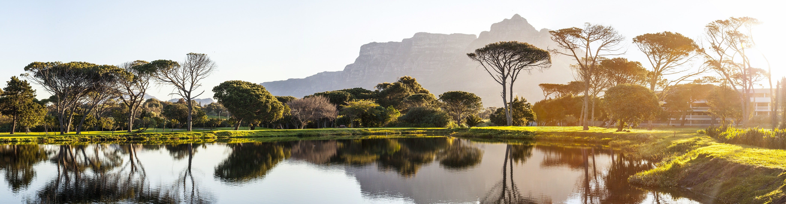

Images are like links, but you prefix them with an exclamation mark.

The part between square brackets is the image alt text.

Between the curly brackets you place the location of the image file
followed by a space and the image title between quotes.

```md

```


<Tip>

##### Images go in the same folder as your markdown file

The convention is to always place your images in the same folder as the 
text where you are including the image. That way, you just need to specify
the image name, and not the path to its location.

</Tip>

