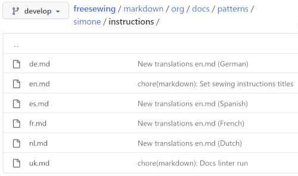
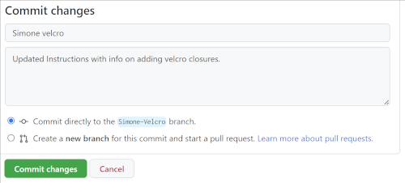

## Introduction
This 'How to' is designed to help get you started editing content using the [Github website](https://github.com/freesewing).

Github  stores all the Freesewing content, it allows supporters to suggest edits, and helps the administrators to review and implement approved changes.

If you are new to Githbub, you will need to [create an account](https://github.com/signup?user_email=&source=form-home-signup).

For info, it is also possible to make changes using the Git desktop application and/or your computer's command line; these advanced topics are beyond the scope of this 'How to'.

All pattern instructions and web pages (including this 'How to') are written in *Markdown*. Please see our [Markdown guide](https://freesewing.dev/guides/markdown) for more information on this.

For security, most contributors don't have permission to change the code.  Instead we must follow three steps to make edits:

1. *Fork* (create a copy of) the repository.  This will be your own copy and you can make all the changes you want.
2. Make the edits.
3. Save your edits and submit a *pull request* to let the admins know about your changes. This says *"hey, I made some changes. I think you might like them and consider them for inclusion into your (original) repository."*

The Github documentation provides a more [detailed explanation](https://docs.github.com/en/get-started/quickstart/fork-a-repo), but this guide should be enough to help you get started.

## Fork the repository
- On Github.com, navigate to the freesewing [repository](https://github.com/freesewing/freesewing)
- In the top-right corner of the page, click **Fork**  

- Click the **Create fork** button.  

## Make the edits
- Navigate to the folder containing the file that you want to edit.

To help you understand how the repository is organised, here is the path to the Simone instructions: `freesewing/markdown/org/docs/patterns/simone/instructions`  This folder contains several files, one for each language.

- Select on the file you want to update. Please only edit the English languagse files (called `en.md`), our translation software will handle the other languages. 
- Click on the **Edit** button (pencil icon).

<Note> 
Clicking **Preview** will show what your changes will look like.

</Note>

## Save your edits and submit a pull request
When you are happy with your edits:
- Scroll to the bottom of the page and enter a brief description of your edits. This will help us know what has changed.
- Click the **Commit** button.
  This is similar to saving a snapshot of your edits.

Now you will create a *pull request* to let the admins know your edits are ready for review:
- Navigate to the repository where you created your fork.
- Above the list of files, click the *Pull request* button.

Congratulations - you have just submitted your first edits to the site maintainers!

You can keep track of the progress of your changes in Github or in the [github-updates channel](discord-github-updates.PNG) on our Discord server.
