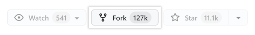
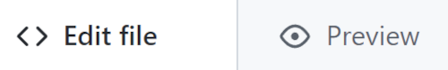
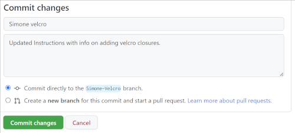
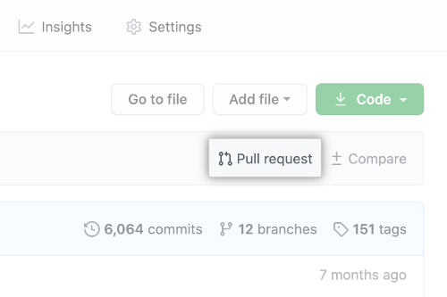

## Introduction
This 'How to' is designed to help get you started editing content using the [Github website](https://github.com/freesewing).

Github is a website that provides storage for all the Freesewing code and content.  It allows our supporters to make suggested edits and helps the administrators to review and implement approved changes. 

If you are new to Github, you will need to [create an account](https://github.com/signup?user_email=&source=form-home-signup).Github For info, it is also possible to make changes using the Git desktop application and/or your computer's command line, but these advanced topics are beyond the scope of this 'How to'.

All our pattern instructions and web pages (including this 'How to') are written in *Markdown*, which is an easy way to produce well-formated pages. Please see our [Markdown guide](https://freesewing.dev/guides/markdown) for more information on this.

All the Markdown and images are stored in the Freesewing repository.  For security, most contributors don't have permission to change the code ourselves.  Instead we must follow three steps to make changes:

1. *Fork* (create a copy of) the repository.  This will be your own copy and you can make all the changes you want.  There is no risk of you breaking the website or its content.
2. Make the edits.
3. Save your edits and submit a *pull request* to let the admins know about your changes.  The pull request is a way of saying *"Hey, I made some changes. I think you might like them and consider them for inclusion into your (original) repository."*

The Github documentation provides a more [detailed explanation](https://docs.github.com/en/get-started/quickstart/fork-a-repo) of this process.  The steps here should be enough to get you started.

## Fork the repository
- On Github.com, navigate to the freesewing [repository](https://github.com/freesewing/freesewing)
- In the top-right corner of the page, click **Fork**.  
 You should see a page similar to this:

- Click the green "Create fork" button at the bottom of the page.

## Make the edits
- Navigate to the folder containing the file that you want to edit.

To help you understand how the code is organised, here is the path to the Simone Instructions: <code>freesewing/markdown/org/docs/patterns/simone/instructions</code> This folder contains several files, one for each language. Please only update the English language `en.md` files. We have translation software to create other languages.

Clicking *Preview* will show what your changes will look like.

## Save your edits and submit a pull request
When you are happy with your edits:
- Scroll to the bottom of the page and enter a brief title and description of the changes you made.
- Click the *Commit* button.

Now you will create a *pull request* to submit your edits and let the admins know your changes are ready for review:
- Navigate to the repository where you created your fork.
- Above the list of files, click the *Pull request* button.

Congratulations - you have just submitted your first edits to the site maintainers!

Github will keey you updated by email on your changes as they are reviewed and accepted.  You can also keep track of thisin Github or in the [github-updates channel](discord-github-updates.PNG) on our Discord server.

If you have any questions, feel free to message us in the [development-help channel](https://discord.com/channels/698854858052075530/698862765053575188) on Discord.
