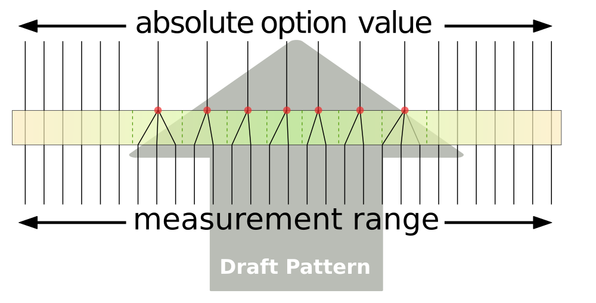

Snapped percentage options are a hybrid between [list options][list] and
[percentage options][pct]. By combining traits of both, they create a
sort of _smart list option_ that will select the most appropriate value
from the list, and also allow a pure parametric value if no close match
is found.

## Structure

Your snapped percentage option should be a plain object with these properties:

- `pct` : The default percentage
- `min` : The minimum percentage that's allowed
- `max` : The maximum percentage that's allowed
- `snap`: Holds the snap configuration (see below)
- `toAbs`: a method returning the **millimeter value** of the option ([see `toAbs()`][toabs])

<Tip>
##### Values for snapped percentage options are available through `absoluteOptions`

Your draft method can not only destructure the `options` property to get access to options,
it can also destructure the `absoluteOptions` property to get access to the values
for those options with snaps configured.

See [the part `draft()` method](/reference/api/part/draft) for more details.

</Tip>

## Snap configuration

A snapped percentage option requires a `snap` property that will determine
what **value in millimeter** to snap to.

There are three different scenarios:

### snap holds a number

When `snap` holds a number, the option will be _snapped_ to a
multiple of this value.

In the example below, the absolute value of this option will be set to a multiple of `7`
(so one of `0 mm`, `7 mm`, `14 mm`, `21 mm`, `28 mm`, `35 mm`, `42 mm`, ...).

```js
myOption: {
  pct:5,
  min: 0
  max: 25,
  snap: 7,
  toAbs: (pct, { measurements }) => measurements.waistToFloor * pct
}
```

<Note>

In a case like this, the value will **always** be snapped,
because the snap points will be distributed equally across the entire range
of all possible inputs.

</Note>

### snap holds an array of numbers

When snap holds an array of numbers, the option will be _snapped_ to one of
the numbers unless it's further away than half the distance to its closest neighbor.

In the example below, if the absolute value returned by `toAbs()` is in the
region of influence -- in this example between `4.5 mm` and `69.5 mm` --  the nearest snap value
will be used. If instead it is outside the region of influence, the result of
`toAbs()` will be uses as-is.

```js
myOption: {
  pct:5,
  min: 0
  max: 35,
  snap: [7, 12, 21, 34, 53, 64 ]
  toAbs: (pct, { measurements }) => measurements.waistToFloor * pct
}
```

### snap is a plain object with `metric` and `imperial` properties that each hold either a number or an array of numbers

In this case, the behavior is similar to either when `snap` holds a number or when it holds an array
of numbers.

The difference is that this allows you to supply a different multiple value or list of snap values
for users using metric or imperial units.

In the first example below, the value of [settings.units](/reference/settings/units) will
determine which list of snap values gets used.

Then, if the absolute value returned by `toAbs()` is in the
region of influence -- in this example between `4.5 mm` and `69.5 mm` for metric
and between `12.7 mm` and `88.9 mm` for imperial --  the nearest snap value
will be used. If instead it is outside the region of influence, the result of
`toAbs()` will be used as-is.

```js
myOption: {
  pct:5,
  min: 0
  max: 35,
  snap: {
    metric: [7, 12, 21, 34, 53, 64 ],
    imperial: [25.4, 50.8, 76.2 ],
  }
}
```

In this second example, the value of [settings.units](/reference/settings/units) will
determine which multiple value gets used.

If set to `metric`, the absolute value of this option will be set to a multiple of `7`
(so one of `0 mm`, `7 mm`, `14 mm`, `21 mm`, `28 mm`, `35 mm`, `42 mm`, ...).
If set to `imperial`, the absolute value of this option will be set to a
multiple of `25.4` (1 in.)
(so one of `0 mm` (0 in.), `25.4 mm` (1 in.), `50.8 mm` (2 in.), `76.2 mm` (3 in.), ...).

```js
myOption: {
  pct:5,
  min: 0
  max: 35,
  snap: {
    metric: 7,
    imperial: 25.4,
  }
}
```

(Again, similar to when `snap` is set to a single number, the snap points
will be distributed equally across the entire range, and
the value will **always** be snapped,)

<Comment by="joost">

##### Read on for an in-depth look at snapped percentage options

While this information above tells you how to use snapped percentage options,
it does not explain why or when you should use them, or how they work.

Read on if you'd like to learn more about that.

</Comment>

## Example use-case

To understand the need that snapped percentage options are addressing,
we'll use an example use-case: We'll be designing a pajama pants pattern
with an elasticated waist.

In our design, the `waistbandWidth` option should match the width of the
elastic we're going to use so we can construct the waistband accordingly.

We have a few different ways we can approach this:

### Approach A: We use a percentage option

We use a percentage option based on a vertical measurement, like
`waistToFloor`.

The elastic width people end up with is something like `34.12 mm` for
user A and `27.83 mm` for user B.

Elastic of that width is not for sale in the store, so that's not great.

### Approach B: We use a list option

We use a list option with a selection of standard elastic
widths to choose from: from half and inch to 3 inches
in 0.5 inch increments.

User A is a doll enthusiasts and 0.5 inch is too big.
User B is working on a giant to go on a float in a parade, and 3 inch
is way too small.

While it would probably work for most people somewhat in the middle,
our solution does not scale.

### Approach C: We use a snapped percentage option

We combine approaches A and B and configure a snapped percentage option
with:

- A percentage based on `waistToFloor`
- Our list of standard elastic widths as _snaps_

For typical humans, our options will _snap_ to the closest match in our
list and behave just like Approach B (with a list option).

For dolls and giants, the option will revert to the parametric value and
behave just like Approach A (with a percentage option).

## How snapped percentage options work

Before we wade into the details of how snapped percentage options are handled
under the hood, let's first agree on terminology:

- The **percentage value** is the value passed by the user for the option.
  Its value always represents a percentage. For example `0.5` for 50%.
- The **millimeter value** is the result of feeding the **percentage value** to
  the `toAbs()` method. Its value always represents millimeters. For example `12 mm`.
- The **snap values** are the values provided by the snap configuration.
  Each of the values always represents millimeters (even for imperial users).

Under the hood, and snapped percentage option will:

- Use `toAbs()` to calculate the **millimeter value** from the **percentage value**
- See whether the **millimeter value** approaches one of the **snap values**
- If so, use the snap value (in millimeter) as provided by one of the **snap values**
- If not, use the **millimeter value** as-is

If you're head's spinning, here's an image that will hopefully clarify things a bit:



The gradient box represents the range of any given measurement,
from dolls all the way on the left, to giants all the way on the right.
The sort of middle green-colored region is what the designer had in mind
when designing the pattern, and they have set up snap values -- marked by
a red dot -- for values that they feel make sense.

The region of influence of any given snap point will extend 50% towards its
neighbor on both sides (indicated by the dashed lines).This means that the
region of snap points is continuous, once you're in, you're going to be
snapped to one of the snap points.

However, when you venture out into the area where the designer did not
configure any snap points, the absolute value will be used as-is, without
snapping, just as it would in a normal percentage option.

This system results in the best of both worlds:

- Things like elastic widths and so on can be configured to be fixed values,
  of common elastic widths for example
- The absolute value will still scale up and down, but will snap to the closest
  fixed value when appropriate.
- When the input measurements go somewhere the designer did not anticipate,
  the option will just behave as a regular percentage option

[toabs]: /reference/api/part/config/options/pct/toabs

[pct]: /reference/api/part/config/options/pct

[list]: /reference/api/part/config/options/list
