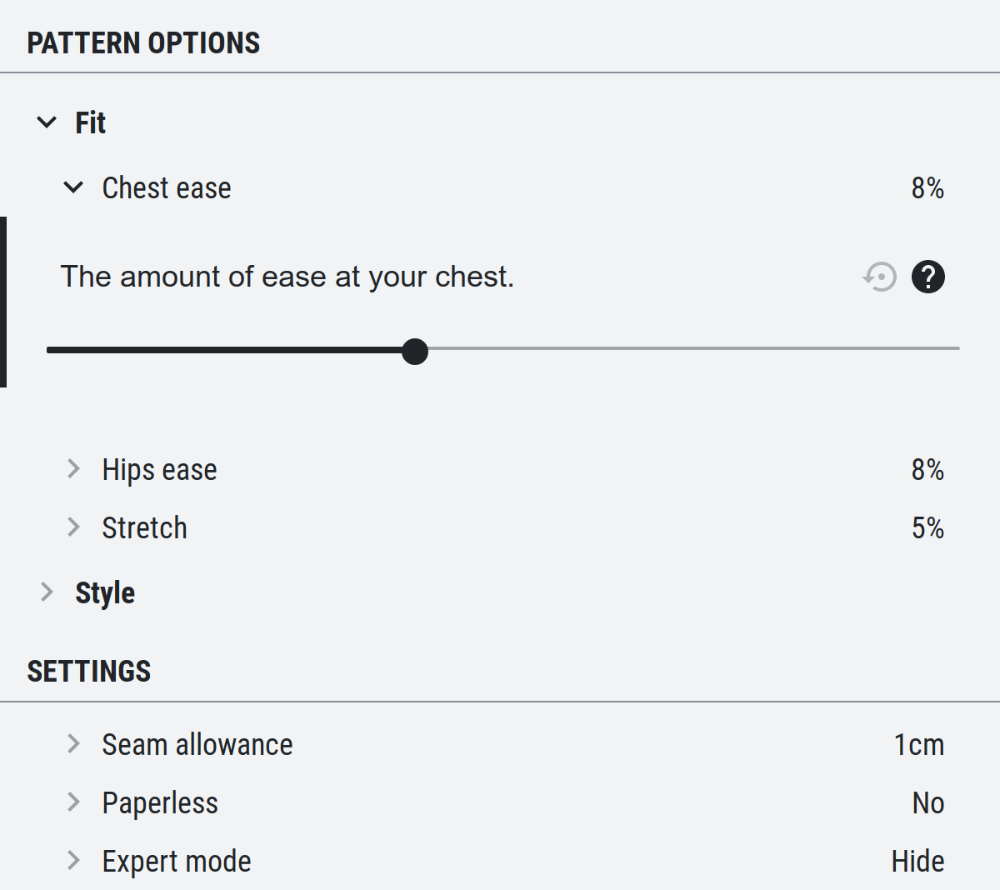

The `DraftConfigurator` provides the user interface for configuring a draft. It is a rather complex component, that is used both for the freesewing.org website as for our development environment.<Fixme> Add more documentation for this component </Fixme>

## Example

