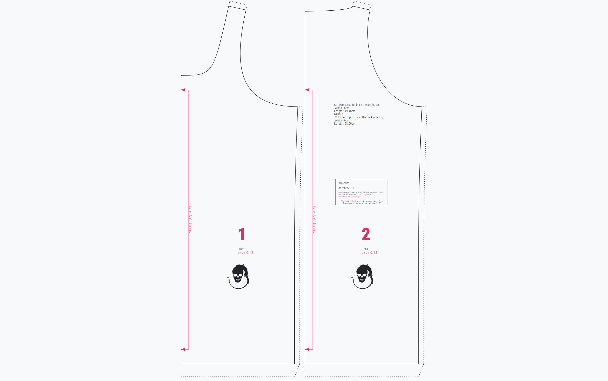

The `Render` component is componet that renders a FreeSewing pattern. It's an alternative to rendering patterns as SVG, allowing for more interactive use of our patterns in your frontend.

<Warning>

This component used to be named `Draft` but was renamed to `Render` to better
capture what the component does.

The name `Draft` is deprecated and will be removed in a future release.

</Warning>

## Example



## Props

|           Name |    Type    | Default | Description                                     |
| --------------:|:----------:|:-------:|:----------------------------------------------- |
|       *design* |   `bool`   | `false` | Whether or not to enable design mode            |
|        *style* |  `object`  |  `{}`   | Optional extra CSS for the SVG                  |
|        *focus* |  `string`  |         | The element to be in focus in design mode       |
|   *raiseEvent* | `function` |         | A method to pass events to the parent component |
|    *width* (*) |  `number`  |         | The SVG width                                   |
|   *height* (*) |  `number`  |         | The SVG height                                  |
| *settings* (*) |  `object`  |         | The [draft settings](/reference/settings/)      |
|    *parts* (*) |  `object`  |         | An object holding the drafted parts             |

<Note>

###### (*) Use `pattern.getRenderProps()` to get these props

The `width`, `height`, `settings`, and `parts` props are provided by the 
[getRenderProps()](/reference/api/pattern/#getrenderprops) method of 
the [Pattern](/reference/api/pattern/) object. 

They are typically uses as in the example below:

```js
<Render {...pattern.getRenderProps()} />
```

</Note>

