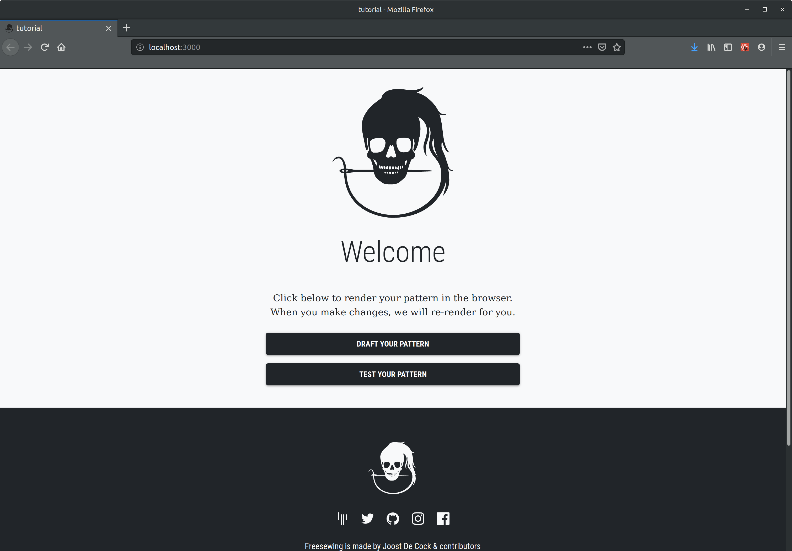

The `Workbench` component provides the FreeSewing development environment. It is a rather complex component, that is used as the entrypoint component for our development environment.<Fixme> Add more documentation for this component </Fixme>

## Example

