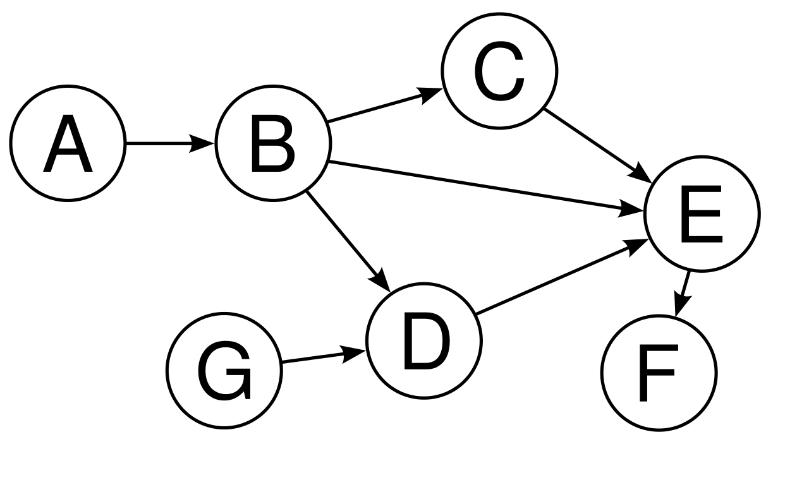
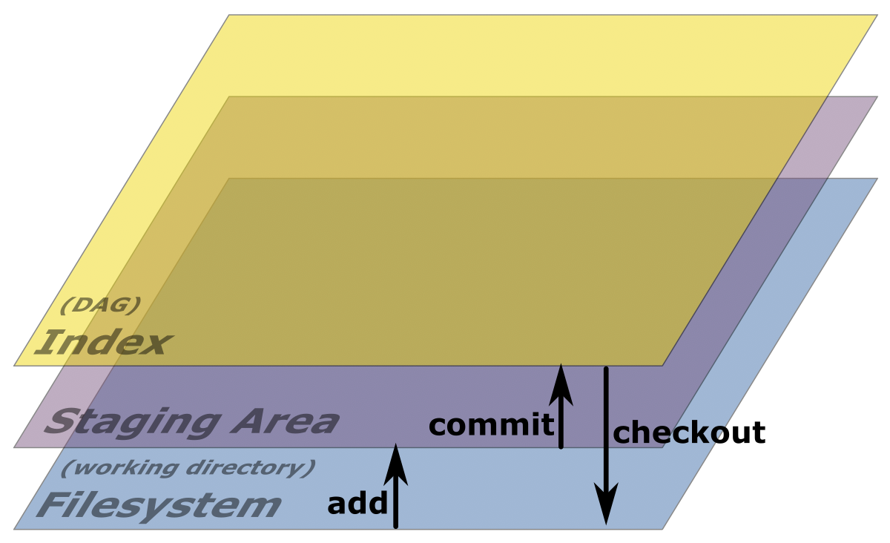
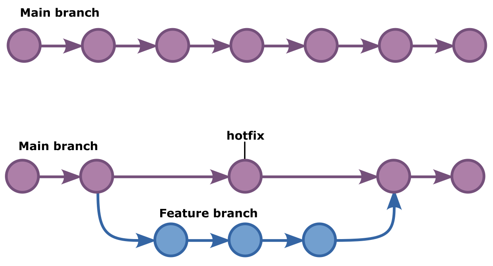
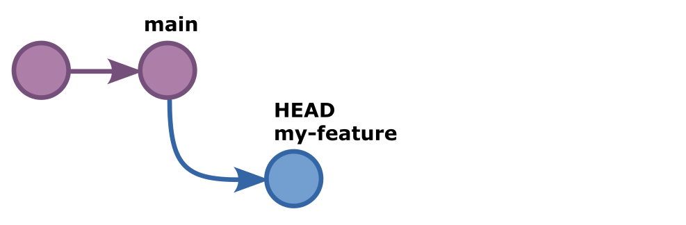
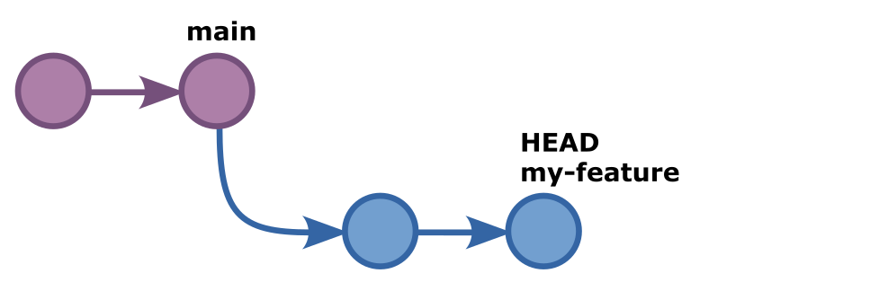
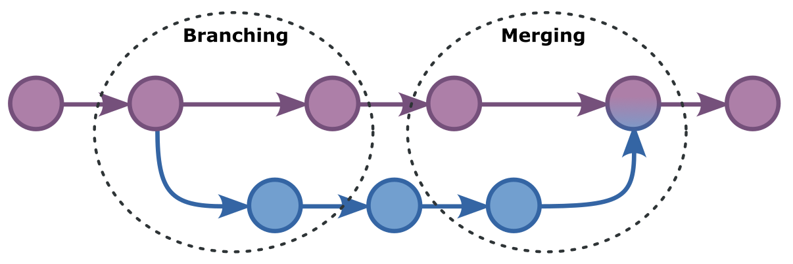
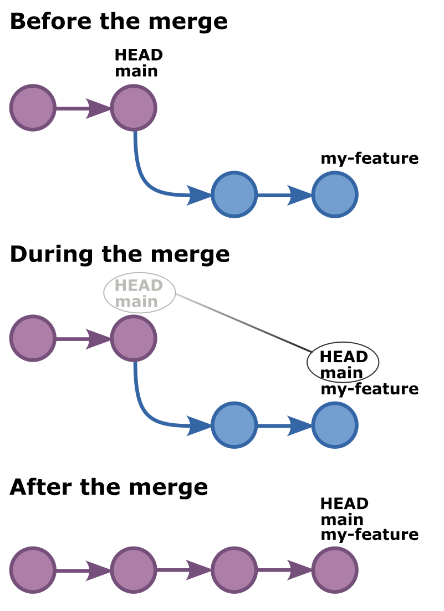
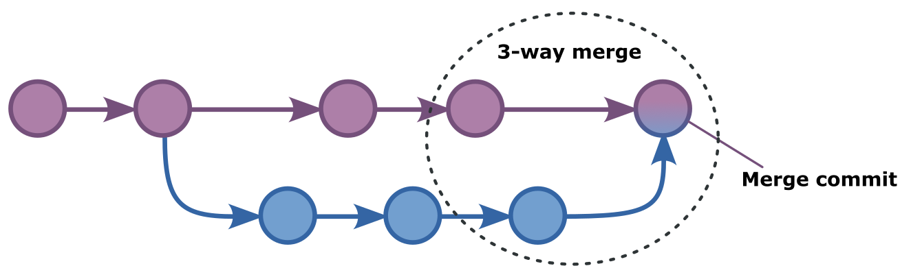

These are git training materials for people who would like to understand how
git works rather than try to memorize all of its commands without knowing what
they do.

It is divided into 45 chapters. You can read them back-to back, or pick out a
specific topic you are interested in.

This training does not cover everything there is to know about git.  Instead,
it aims to make you familiar with git in a way that will give you the
confidence to explore further on your own.

<Note>

This is the **long read** format (20k words).

This training is also available as a 1¾-hour **[audiobook][audio]**
or **[video series][video]** (todo).

</Note>

[text]: /training/git/
[audio]: /training/git/audio/
[video]: /training/git/video/


## Chapter 1: Welcome

Hello everyone and welcome to this **git** training.
My name is joost, and today I will explain git to you.

If that already sounds scary, then don't worry.
My goal today is to explain git in an approachable way that
requires no prior knowledge of, or experience with git.

By the end of this training, you should have a clear understanding
of what git is, what it does, and how it does it.

If that sounds like the kind of thing you would like to learn, then you've come
to the right place. Let's dive right in and learn about git.

## Chapter 2: What is git?

To understand what git is, let us start by explaining the problem it is trying
to solve.

The problem is that people don't always get it right from the first time. The
content of this git training didn't spring from my mind fully formed. It
started out as a list of bullet points of things I wanted to cover. Then it
was gradually turned into a rough draft over numerous edits and rewrites.
At some point, I also started to involve other people.
I asked them to proofread or provide input, which led to more changes.

Somehow, we need to keep track of all these changes. And ensure that at any
time we can go back to an earlier version. Or allow multiple people to work
on the same text without overwriting each other's changes.

If you've ever seen a folder with a file listing like this, you are already
familiar with this problem:

- `git-draft.md`
- `git-draft.02.md`
- `git-03.md`
- `git-03_comments-by-serge.md`
- `git-good.md`
- `git-good_final.md`

This is not an efficient way to keep track of different versions of a single file.
Let alone if we may have many different files, with different
collaborators working on them.

What we need is some sort of **system** to **control** all these different
**versions** somehow. Thankfully, such systems exist. And software that is created
specifically for this task are called **version control systems**.

Git is such a version control system, but there are others too.
So let's meet a few of them.

## Chapter 3: Version control systems

One of the first version control systems (or VCS) was `sccs`, which stands for
*Source Code Control System*. From its name, we can learn that the origins of
version control systems can be traced back to software developers. They were
the first group of people who not only faced this problem of working together
on a bunch of files, but also had the means to come up with a way to make it
more efficient.

SCCS was first released in 1973 which most likely means that version control
systems have been around for longer than you've been alive.

Almost 10 years later, in 1982, RCS was released. It stands for *Revision
Control System* and to this day, it is still maintained. Where RCS was intended
to be used locally on a computer system, new systems emerged that relied on a
centralized repository to allow people to collaborate from different systems.

The two most significant members of this second generation of the version
control systems were CVS (Concurrent Versions System) and Subversion.

For most people, these systems were good enough, and the market for version
control systems stalled somewhat, as it was considered a solved problem.

Except, not all software projects are the same size. Some people were
collaborating on so many files with so many different people that the second
generation of tools was not good enough for them.

One such project was the Linux kernel. Started in 1991 as a hobby project by a
Finnish student named Linus Torvalds, by 2002 the Linux kernel underpinned a
multibillion Linux market spearheaded by vendors such as Redhat, Suse, and
early adopters like IBM.

The Linux kernel itself though was and is an open source project. And while more
and more people worked on the kernel professionally, they were spread out not
only geographically but also throughout many different companies. Keeping track
of all the changes in the kernel was causing friction.

So in 2002, Linus Torvalds made a decision that would send shockwaves through
the open source world. He unilaterally announced that the Linux kernel would
switch to Bitkeeper as its version control system. Bitkeeper used a more
innovative approach to version control, and did not rely on a central
repository.  The announcement was controversial because Bitkeeper was a
closed-source product, that was only available under a commercial license. And
while BitMover -- the company behind the Bitkeeper product -- waived the
license fee for Linux kernel developers, many kernel developers objected out of
principle to having to use a closed-source product to contribute to the open
source Linux kernel.

This went on for a while until in 2005 BitMover -- the company -- grew
increasingly worried that the kernel developers would reverse engineer their
technology. So they imposed further restrictions which made it impossible for
kernel developers to use their product.

Faced with this dilemma, and in a move that would forever cement his reputation
as an exceptionally gifted software engineer, Linus Torvalds decided to take
matters into his own hands. He sat down and over the couple of a couple of
days wrote his own version control system: git.

A few years later, every major open source project had migrated from subversion
to git, and sites like GitHub and Gitlab sprung up to provide centralized git
hosting.

Today, git is a household name among developers, as well as the de facto
standard version control system on the planet. It's a remarkable success story
with many parallels to Linux itself. Both are not only free for people to use,
but their excellent technical foundations mean they have taken the world by
storm.

## Chapter 4: Git won't fall out of the sky

Knowing the history of git, and its origins as the version control system for
the Linux kernel, goes a long way to explain one of its more glaring
shortcomings: Why does it seem so damn hard to use?

The answer is, of course, that Linux kernel developers are rather comfortable
with all this complexity. They know exactly what git does under the hood, and
as a result all its numerous commands make sense to them.

People who've mastered git are like airline pilots.
To the laymen, all those dials and buttons in the cockpit seem like an
impenetrable wall of confusion. Without any insight into how an airplane works
and what keeps it in the air, trying to learn all these buttons is going to be
frustrating at best.

If you'd like to learn how to fly, the smart way to go about it is to first
understand what keeps a plane in the air. Likewise, if we want to learn git,
the smart way to do it, is to first understand how it keeps track of changes.

So let's start there. And keep in mind that unlike airplanes, git won't fall
out of the sky when we make a mistake.

## Chapter 5: Directed Acyclic Graph

Git is built on the combination of two concepts, and you're probably already
somewhat familiar with both of them.

The first concept is the so-called DAG. Which stands for *Directed 
Acyclic Graph*. A *graph* in computer science and mathematics alike is
a structure in which we can store not only information, but also relationships
between that information.

You may have heard of Facebook's *social graph*, which holds information about
Facebook's users, but also information about the relationships between those
users. Alice, Bob, Tony, Jim, and Sandra are all Facebook users.
In addition, Alice is a friend of Bob. Bob's father is Tony. Tony works at
McDonalds. Jim and Sandra also work at McDonalds.

We call this sort of data structure a *graph*. The users themselves are the
*nodes* of the graph. Each node holds the data for one user.
The relationships between users are the *edges* of the graph.

If we visualize this structure, the users or nodes of the graph would be
represented by points or little circles. The relationships between the user or
edges of the graph would be lines that we draw between the users to show
how they are connected to each other.


Git stores its data in a graph structure, but not one like Facebook's social
graph where connections can go all over the place and in all directions.
Instead, it uses a Directed Acyclic Graph or DAG which imposes two additional
constraints on the graph.

**Directed** means that relationships or edges are one-way only. In Facebook's
graph, Alice is a friend of Bob, and Bob can also be a friend of Alice. This
makes the relationship or edge between them bidirectional. In other words,
it's like a two-way street. In a directed graph like git uses, this is not
allowed. The edges are only ever going in one direction. Like a river.

**Acyclic** means that there can be no loops in the graph. In Facebook's
graph, Alice is a friend of Bob. If Bob is a friend of Jim and Jim in turn
is a friend of Alice, this creates a loop. Like a roundabout.
In an *acyclic graph* like git uses, this is not allowed. You can create as
many relationships of edges you want. But when they re-converge, they can only
do so downstream from the direction of the graph. Like a river.



So to summarize, a DAG or Directed Acyclic Graph is a graph where edges go
in one direction only (directed), and no loops are allowed (acyclic).

Like a river, a DAG can split into branches. Each of those branches can
further split, or they can join another branch further downstream.

But no matter how intricate our river delta gets, we can never go backwards. We
can never branch off and then somehow reconnect to a point before the one where
we branched off from and form a loop.

Water cannot run uphill.
If you can remember that, you know what a DAG is. And once you know what a DAG
is, it's easier to think about your data in git. All your changes are right
there, each version of your work represented by a node in the graph.


The question that remains is, how does git keep track of the edges, or the
relationship between the nodes?

So let's look at that in the next chapter.

## Chapter 6: Checksums

In the previous chapter, I mentioned that git is built on the combination of
two concepts. The first was the Directed Acyclic Graph or DAG. The second are
checksums.

A checksum is a way to reduce an arbitrary amount of data to a smaller amount
of data that can still uniquely identify it.

If that sounds overly complicated, don't despair because you are already
familiar with a perfect metaphor: The fingerprint.

The data stored in a fingerprint can never possibly contain all the data that
makes you you.  But that's not its purpose. Instead, your fingerprint behaves
as a checksum. Which means that we only need to verify the fingerprint to know
that it's you.

In computer science these fingerprints or checksums are calculated by a type of
cryptographic function that we call a hash function. For this reason,
checksums are often referred to as hashes. You may have already heard of some
of the more well known hashing methods, such as MD5 or SHA1.
The latter -- SHA1 -- is the hashing method git uses under the hood.

Git relies extensively on these checksums. So much so that each commit object
-- we'll talk about what exactly a commit or commit object is later, for now
let's just agree that the nodes in our graph are called commits in git parlor
-- so each commit has a checksum and this checksum is used as the commit ID. It
uniquely identifies the commit. Because of this checksum, you can never ever
have two commits with the same ID in git. If you had two commits with the same
ID it means they are identical in every way. And so they are not two commits,
but just the same commit.


So how does it work exactly? Well, each time we *commit* data to git and create
a commit object in the process, git will make a checksum of the *commit object*
which will end up being a node in our graph. The following data is included in
the commit object, which means it is used to calculate the checksum:

- The data itself
- The author of the commit
- The date of commit
- The log message that goes with the commit
- The checksum of the previous commit

So with the exception of the very first commit -- which is a bit like the
source of our river and the only node in our graph that does not have a direct
ancestor -- each commit has a reference to the commit it is based on. This
reference forms the relationship in our graph. It says, this commit right here
follows that commit over there with this ID.

Including the ID or checksum of the parent commit provides strong protection
against data tampering. If any commit object in our DAG is changed, it's
checksum and thus its ID will change. And all commits that stem from it will
have a parent commit ID that no longer matches. If we were to go in and
change that, it will in turn change the ID of that commit, and then the next
one would break and so on and so forth.

In other words, all of these commits are chained together with a cryptographic
checksum that makes it impossible to tamper with them.  If at this point, a
light goes off in your brain and you think *hey, haven't I heard this before
somewhere?*, then yes you most likely have heard about this sort of immutable
ledger because this is the exact same technology that underpins the blockchain.

At this point, I feel it's worth pointing out -- for the crypto-bros out there
-- that Satoshi Nakamoto's original bitcoin paper was published at the end of
October 2008. As we learned in chapter 2, Linus Torvalds wrote git in
2005, more than 3 years prior to that.
Which explains why some people think Linus is Satoshi. But he's not.

Enough about blockchain. While it's a useful crutch to explain how different
commits are linked together in git, it would be a distraction to talk about it
any further.

Especially since we're finally getting to the good stuff:
Let's start using git in the next chapter.

## Chapter 7: Installing git

Before we can gain some hands-on experience, we should make sure git is
installed on our system.

If you're on Windows, you should [download the git release for Windows from
the git website](https://git-scm.com/download/win) which is git-scm.com.

If you use MacOS, you can [download the git release for
macOS](https://git-scm.com/download/mac) from the same website. Or, you
can also install the Xcode command-line tools from Apple, as they include git.

If you run Linux, chances are git is already installed on your system.
Or if not, you can install it with your system's package manager.

Be it through `apt install git` on Debian-based systems such as Ubuntu.
Or through `yum install git` on Redhat-based systems such as Fedora.

In any case, installing git should be quick and painless. To verify it
worked, open a terminal window and type `git`. If you get a bunch of info,
we're good to go.

## Chapter 8: git init

The first thing you'll notice as we start using git, is that it does not
require any sort of central components or server. Those of you who have
trouble distinguishing between git itself and the popular git hosting
services such as Github or Gitlab, should take a moment to appreciate this.

You don't need anything to use git. You can use it on your own, without
collaborating with anyone. All you need to do is open up a terminal window.
And in the directory or folder where you want to keep track of your changes
or versions, you type:

```bash
git init
Initialized empty Git repository in /Users/joost/git-training/.git/
```

Congratulations, you have just created a **git repository**.
An empty repository for now, but a git repository nonetheless.

The English dictionary tells us that a repository is *a place where things are
stored*.  In git parlor, we use the word *repository* to refer to the top-level
folder where git is doing its magic of keeping track of our files.
In it, we can create as many files or subfolders as we like, and they are all
inside our repository.
If however, we go up one level, we are outside of our repository.

## Chapter 9: The .git folder

In the top-level folder of our repository, git has create a `.git` subfolder.
This folder is where git will write all of the data in our graph. It's where it
will store metadata, and anything else that is required for git to do what it
does.  There is no database, there is no server, it's all just a bunch of files
in this mysterious `.git` folder.

When working with git, you **never** venture in this folder. Doing so may not
only irreparably mess up your repository. It's also not required.

But, out of curiosity, let's have a look anyway.

```bash
ls -1 .git
HEAD
config
description
hooks
info
objects
refs
```

If you open this folder, you'll see a bunch of files and folders, the most
important of them are:

- The `HEAD` file (all uppercase) keeps a reference to where we are
  right now. If we think of our graph as a river, it is the equivalent of a
  **You are here** marker on a map of that river.
- The `objects` folder is where git will store our commit objects.
  It contains two subfolders, `objects/info` and `objects/pack`. Both of them
  are empty right now, but that will change soon enough.
- The `refs` folder is where git will store info about the various ways in
  which we decided to branch and split our river of data or graph.
  It also contains two subfolders, `refs/heads` and `refs/tags`.
  Both of which are also empty for now.

Let's not worry too much about this structure. Once again, you rarely if ever
need to venture into the `.git` folder. However, seeing how its content changes
when we run various commands can help us understand what git is doing behind
the scenes. So we will refer to these files and folders from time to time.

## Chapter 10: git status

For now, let's see what our current status is. To do so, type `git status`.

```bash
git status
On branch main

No commits yet

nothing to commit (create/copy files and use "git add" to track)
```

When we enter this command, git will tell us what the current status is.
For now git tells us that:

- We are on branch main. Each time we split our river of git data,
  this creates a branch. The main branch is the one we start from.
  The source of our river so to speak.
- There are no commits yet
- There is nothing to commit. But we could create files and use `git add`
  to track them

Ok, not much going on here, but git hints us that we should use `git add` to
start tracking files. So let's follow its advice in the next chapter.

## Chapter 11: git add

The `git add` command is the only command that can add our data to git.
Which is why it's called `git add`. Under the hood, this data will be stored
`.git` folder. ready to be added to the DAG later.

To add data, we first need some data. So let's create a file named `hello.md`
and add a line of text in it that says *Hello git*:

```md title="markdown.md"
Hello git
```

Now, if we run `git status` again, the output will be different.

```bash
git status
On branch main

No commits yet

Untracked files:
  (use "git add <file>..." to include in what will be committed)
        hello.md

nothing added to commit but untracked files present (use "git add" to track)
```

Git will still tell us that we are on branch main and that there are no
commits. But this time it will tell us that there are *untracked files*.
Specifically *hello.md*.

So git watches our repository and it knows there’s a file there we're not
keeping track of. It also hints us once again that we can start tracking
this file with the `git add` command.

So, let's do as it says. In our terminal, we type `git add hello.md`.

```bash
git add hello.md
```

Ok, that was a bit underwhelming because nothing happened. Git didn't say
anything and we don't even know whether it did anything. Let's run
`git status` again to see what's changed.

```bash
git status
On branch main

No commits yet

Changes to be committed:
  (use "git rm --cached <file>..." to unstage)
        new file:   hello.md
```

Hey, this is new. Git now tells us that there are changes to be committed.
It knows that there is a new file named `hello.md`.
It also tells us what command to run to *unstage* this file, which is some
nice foreshadowing for the next chapter.

But before we get to that, let's take another look at the `.git` folder where
git keeps our data.

```bash
ls .git/objects
0d      info    pack

ls .git/objects/0d
ec2239efc0bbfabe4078f5357705ca93b5475e.git/objects/0d/ec2239efc0bbfabe4078f5357705ca93b5475e

file .git/objects/0d/ec2239efc0bbfabe40
.git/objects/0d/ec2239efc0bbfabe4078f5357705ca93b5475e: zlib compressed data
```

If you look in the `.git/objects` folder you should see that it has changed.
A new folder and file appeared which holds a bunch of compressed data.

The reason I'm asking you to go digging through these files is because this is
an important thing that many people, even those rather familiar with git, don't
realize. And that is that **git add writes data**.

That's right. The only time you are adding your data to git is with the
`git add` command. All git's other commands deal with metadata, or how
to structure the graph and create relationships, branches, and so on.
But you putting your data in git is always via the `git add` command.

Now, let's see where we added this data, shall we? Because -- spoiler alert --
it was not added to the graph.

## Chapter 12: The staging area

When we think about how data is stored in git, there are essentially 3 things
that come into play.



At the lowest level we have **the file system**.
At the end of the day, git is just a bunch of files on disk, and all it does
is write to those files. When git refers to our own data on disk, not its
internal metadata, but the files and folders we are looking to keep track
of, git will refer to this as the **working directory**. So when you see
that, just think *oh right, the files on my disk right now*.

At the top level we have the **index**, which is just another word for the
DAG or graph in which git keeps track of our data.

In between these two sits the **staging area**. This is where git stores and
prepares data before adding it to our graph.

As we saw in the previous chapter, each time we use the `git add` command,
git writes our data. Specifically, it takes the data on disk and copies
it to the staging area. It will remain there until we *commit* it. Just
like `git add` is the only way to move data from disk to the staging area,
`git commit` is the only way to move data in the staging area permanently
onto the index, which is the DAG, or git's graph.

Understanding how data moves between these layers is crucial to understanding
git. For example, what if we add a file to the staging area with `git add`.
And then after adding the file, we make a change to it. What will happen?

If you can guess, great. If not, let's try it out.
Let's run git status again before we do anything to make it easy to compare.

```bash
git status
On branch main

No commits yet

Changes to be committed:
  (use "git rm --cached <file>..." to unstage)
        new file:   hello.md
```

Git tells us that we're on branch main, that there are no commits yet,
and that there are changes to be committed. Specifically a new file named
`hello.md`.

Now let's open this `hello.md` file and add some more text to it.
Let's change the line that says `Hello git` to `Hello git. How are you?`.
After saving the file, we run `git status` again.

```bash
On branch main

No commits yet

Changes to be committed:
  (use "git rm --cached <file>..." to unstage)
        new file:   hello.md

Changes not staged for commit:
  (use "git add <file>..." to update what will be committed)
  (use "git restore <file>..." to discard changes in working directory)
        modified:   hello.md
```

This time, git still tells us that we're on branch main, and that there's no
commits yet. It also reminds us that the `hello.md` file is staged to be
committed. But in addition, it now tells us that there are changes that are
not staged for commit. Changes to the `hello.md` file.

So, to recap. When we make changes to a file in our working directory, git
will notice this. If we **add** this file with `git add`, git will copy
our file to the staging area. If we then make further changes, git will
notice that the file in our working directory has changed again, and will
once again inform us about it. However, the version of the file that we
added with `git add` earlier is still in the staging area.

By now you should have learned how `git add` is how we tell git to write
our data to the staging area. But that's only half of the work. To make
sure our data is added to the DAG, we need to commit. Which is what we'll
do in the next chapter.

## Chapter 13: git commit

Now that we have covered the `git add` command, and know about the staging
area, the next step on our learning path is the `git commit` command.

The `git commit` command is how we tell git to take the data that is in
our staging area, and add it to the DAG. To do so, git will create a
commit object and add *labels* to it. It will calculate a checksum and
add it to the commit object in the dag to link it to its parent commit.

Git will also move the `HEAD` label (remember, `HEAD` is the equivalent of
a **your are here** marker) to point to our new commit. It will also
move the `main` label to our new commit to indicate that this is
the tip of the `main` branch.

But don't take my word for it, let's try it out by typing `git commit`.
When we do so, git will open an editor to allow us to write the commit
message. We'll talk about writing good commit messages later, for now let's
just write *My first commit* and then save and close the file.

```bash
git commit
[main (root-commit) 4506faf] My first commit
 1 file changed, 1 insertion(+)
 create mode 100644 hello.md
```

Git will show us some output, including the branch we are on (main) the first
couple of characters of the commit ID or checksum, as well as some other info.

If you pay close attention, you will see that right after the branch name it
says **root-commit**.  
That's because the commit we just added to the DAG is special.
It is -- and will forever be -- the only commit in our entire index (or
DAG if you will) that does not have a parent commit. This root commit is the
source of our river of data from which everything else will spring.

## Chapter 14: git log

We've already learned that the commit ID is very important in git. Later --
when you are a git guru and will ask it to do advanced stuff -- you will
often need to specify the commit ID.

Git keeps a log of all commits, and you can ask it to show this log with the
`git log` command.

```bash
git log
commit 4506fafad7b70ff2c44d7900d457f9a65133f7ed (HEAD -> main)
Author: Joost De Cock <joost@joost.at>
Date:   Tue Apr 4 15:32:20 2023 +0200

    My first commit
```

When we run `git log` it will show us a list of all commits starting with our
most recent commit, all the way back to the root commit. It will include the
commit ID as well as the author, date, and log message. In other words, the log
contains all the metadata.

That's it. That's the entire chapter. There are more things `git log` can do
but for now I just wanted to introduce the command, as we will be using it in
the next chapter, when we talk about labels in git.

## Chapter 15: Labels in git

Our DAG now consists of a single node. There is exactly one commit, and it
is not related to any other commits. But it does have labels. Labels are how
git keeps track of different branches, which is something we'll
take a closer look at in a later chapter.

For now, we have a single branch. It's called `main` which is the default
branch in git. And while one single branch is not very exciting, it is all
we need to understand how labels work.

To see the labels git uses, let's ask git to show us the commit log
with `git log`.

```bash
git log
commit 4506fafad7b70ff2c44d7900d457f9a65133f7ed (HEAD -> main)
Author: Joost De Cock <joost@joost.at>
Date:   Tue Apr 4 15:32:20 2023 +0200

    My first commit
```

Apart from the metadata about the commits themselves, git will also show the
various labels we are currently using.  If you look at the most recent commit
ID, you will see that it is followed by information between brackets. First it
will say `HEAD` and then a little arrow pointing to `main`.

Remember in chapter 8 where we went spelunking in the `.git` folder, we
learned that `HEAD` is like a *you are here* marker. In other words, git
will put the `HEAD` label on whatever commit it considers to be where we are
right now. So each commit we make will always become a child of whatever commit
the `HEAD` label is on.

While `git log` is certainly the user-friendly way to retrieve this
information, we can also figure out where HEAD is pointing to by looking into
the `.git` folder. If you look at the contents of the `.git/HEAD` file,
you will see it holds a reference to `refs/heads/main`.

```bash
cat .git/HEAD
ref: refs/heads/main
```

If in turn you looks into the `.git/refs/heads/main` file, you will see that
it holds the ID of our root commit.

```bash
cat .git/refs/heads/main
4506fafad7b70ff2c44d7900d457f9a65133f7ed
```

In other words, HEAD points to refs/head/main, which points to our commit.
So git knows that both the `HEAD` label and the `main` label
are both on this root commit.

Why this matters will become clearer when we talk about branching.
For now, what you should know is that each branch has its own label,
which should be on the last commit made on that branch.
The `HEAD` label is special. In that it always points to the
commit that will become the parent of the next commit we'll make.

## Chapter 16: git show

The `git show` command will show us what exactly what is included in any given
commit.

We've already made our first commit, the so-called root commit, but perhaps
it was Friday evening, we logged off, and now we're back on Monday morning and
we can't exactly remember where we left things.

The first thing to do in this scenario is to run `git status`.

```bash
git status
On branch main
Changes not staged for commit:
  (use "git add <file>..." to update what will be committed)
  (use "git restore <file>..." to discard changes in working directory)
        modified:   hello.md

no changes added to commit (use "git add" and/or "git commit -a")
```

Git tells us we're on the main branch, and that
we have changes that are not staged for commit.
Perhaps you have a good memory and remember that we changed
the contents of our file from `Hello git` to `Hello git. How are you?`.

But if you're anything like me, you don't remember this. And so you'd like
to see what the heck it was that you committed on Friday evening.

If we want to know that, we can just ask git to show us what's actually
in this commit. To do so, we use the `git show` command followed by the
ID of the commit we want to see. We don't actually have to include the
entire ID. All we need is the first 4 characters of the ID. If later we
have plenty of commits and there are multiple commit IDs that start with
these same 4 characters, git will show us a list of all matching commits
and ask us to be more specific. But for now, with only one commit, 4
characters is plenty.

```bash
git show 4506
commit 4506fafad7b70ff2c44d7900d457f9a65133f7ed (HEAD -> main)
Author: Joost De Cock <joost@joost.at>
Date:   Tue Apr 4 15:32:20 2023 +0200

    My first commit

diff --git a/hello.md b/hello.md
new file mode 100644
index 0000000..0dec223
--- /dev/null
+++ b/hello.md
@@ -0,0 +1 @@
+Hello git
```

Just as with the `git log` command, git will show us all the metadata of the
commit.  But this time around, it will also show us a diff. In other words,
what exactly this commit changed. And we can see that this was a new file and
that its contents are `Hello git`.

What we committed on Friday evening was what was in the staging area at that
time. Which was our file with `Hello git` in it. And not the current version
on disk which has `Hello git. How are you?` in it.

If we want to add this updated version of the file to the repository, we
should first add it to the staging area with `git add` and then add it to
the DAG with `git commit`.

```bash
git add hello.md
git commit -m "My second commit"
```

When you run the `git commit` command, git will open an editor to let you enter
the commit message. If you'd like, you can specify the commit message on the
command line with the `-m` flag, and then git will just use that.

If we now run `git status` again, git will tell us there are no changes.
It will say something like *nothing to commit, working tree clean*. And when you
hear *working tree* you should just think *working directory*. Git is telling
that the files that are in our working directory hold the exact same data as what
is stored in the DAG.

```bash
git status
On branch main
nothing to commit, working tree clean
```

If we run `git log` we now see two commits.

```bash
git log
commit 036776b2794a9ad3e21f8da83e6cfeca4d9fedb6 (HEAD -> main)
Author: Joost De Cock <joost@joost.at>
Date:   Tue Apr 4 16:22:48 2023 +0200

    My second commit

commit 4506fafad7b70ff2c44d7900d457f9a65133f7ed
Author: Joost De Cock <joost@joost.at>
Date:   Tue Apr 4 15:32:20 2023 +0200

    My first commit
```

If we run `git show` with the first 4 characters of the second commit, we can
see exactly what was changed.

```bash
git show 0367
commit 036776b2794a9ad3e21f8da83e6cfeca4d9fedb6 (HEAD -> main)
Author: Joost De Cock <joost@joost.at>
Date:   Tue Apr 4 16:22:48 2023 +0200

    My second commit

diff --git a/hello.md b/hello.md
index 0dec223..d6a72bb 100644
--- a/hello.md
+++ b/hello.md
@@ -1 +1 @@
-Hello git
+Hello git. How are you?
```

You probably won't be using the `git show` command that often.
However, it's good to know that once a commit is added to the DAG you can
identify it with its ID and ask git to tell you exactly what happened in
this commit with the `git show` command.

## Chapter 17: Branching in git

Before we dive into branching in git, which is where things become
really interesting, let's do a quick recap of the most important things
we have learned so far:

- We know that `git init` is how we initialize an empty repository
- We know that `git add` is how we copy files from our file system to the
  staging area which is where git prepares them so they are ready to be
  committed
- We know that `git commit` is how we take everything that's currently in the
  staging area and add it to the DAG
- We know that git uses the `HEAD` label to keep track of where we are, and
  there's also a label for each branch

Alright, so far so good. Now let's see how we can use what we've learned to
understand what git does when we start creating additional branches.

Note that we already have a branch. Everything needs to be on *some* branch,
so git starts us of with a default branch which is called `main`. On this
default branch, we have made two commits so far.

Before we look at how we can create a new branch, we should probably pause
for a moment to make sure we understand why you would want to make a
branch in the first place.

Remember in chapter two where we were talking about why we need version
control systems. Specifically this list of files:

- `git-draft.md`
- `git-draft.02.md`
- `git-03.md`
- `git-03_comments-by-serge.md`
- `git-good.md`
- `git-good_final.md`

If we were to manage this in git instead, the first couple of drafts would
probably just be additional commits on the same branch. But then there's this
file with the `_comments-by-serge` suffix, which probably means that this was
a colleague making changes to a file.

Well, this would be a good candidate to go on a different branch. Because
**branches in git are all about isolating your work**. If you are working on
your own on something that has a relatively linear progression from initial
idea to final outcome, you may only need one single branch.

But if you are working on things that progress at different speeds or need
to be kept apart, you will find that branches are going to be a life-saver.



As a practical example, imagine that you are maintaining a website. The
production code, the one that is deployed on the web server, is in the `main`
branch.  Last week you've started working on a new feature: the website will
now also have a dark mode. However, you were smart, so rather than do this in
the main branch, you've created a so-called *feature branch* for this, let's
say you've named it `dark-mode`.

Now your boss comes in and points out a small typo on the home page. It's not
a big deal, but your boss is a bit of a grammar nazi, so they want you to
drop what you're doing and fix it now.

If you had been doing your dark mode work on the `main` branch, you would be
in a real pickle right now. Because you would have mixed your new dark mode
work with the production code, and so fixing the typo would have had to wait
until you were ready with that, or you'd have to somehow undo the work you did
so far, or at least find a way to disentangle those changes from what was
there before.

Don't let this happen to you. Embrace branching in git. Branches are not hard
to understand, and we'll show you exactly how to make them in the next chapter.

## Chapter 18: git branch

To work with branches in git, we use the `git branch` command.
If we run it without any additional info, git will show us a list of current
branches. The active branch will have an asterisk in front of it.

```bash
git branch
* main
```

We only have one branch for now, the `main` branch. If we wanted to create
another branch, we could do so by specifying its name when running the `git
branch` command. So if we would run `git branch example` it would create
a new `example` branch.

```bash
git branch example

git branch
  example
* main
```

If we run `git branch` again, we can see that the `example` branch was created.
We also see that the current branch is still the `main` branch. In other words,
the `git branch` command only creates the branch. It does nothing else.

If we want to switch the active branch from `main` to our new `example` branch,
there's a command for that too, and it's `git switch`. We'll use that in the
next chapter, but first let's remove our example branch again.

To do so, use the `-d` flag, for delete followed by the branch name.
So the command to remove the `example` branch is `git branch -d example`.

```bash
git branch -d example
Deleted branch example (was 036776b).
```

Poof gone. Now let's look at some more efficient ways to not only create a
branch, but also make it active.

## Chapter 19: git switch

The `git switch` command switches between branches. In other words, it changes
which branch is currently active. In git, the active branch is whatever the
`HEAD` labels points to, so when we use the `git switch` command, git is
typically just moving the `HEAD` label to a different branch.

But, git switch can also create a new branch. For that, you should pass it the
`-c` flag (for create) followed by the branch name. So if we run `git switch
-c my-feature` git will not only create the `my-feature` branch, it will also
make it active by moving the `HEAD` label to it.

```bash
git switch -c my-feature
Switched to a new branch 'my-feature'

git branch
  main
* my-feature
```

If you're curious, you should look at the contents of `.git/HEAD` and you'll
find that it now contains a reference to `refs/heads/my-feature`.

When creating a branch, all git has done for now is created a new label with
the `my-feature` branch name, and added it to the `HEAD` commit.

We can verify this with the `git log` command and we'll see that where
previously `HEAD` pointed to the `main` branch. It now points to both the
`main` and the `my-feature` branch.

```bash
git log
commit 036776b2794a9ad3e21f8da83e6cfeca4d9fedb6 (HEAD -> my-feature, main)
Author: Joost De Cock <joost@joost.at>
Date:   Tue Apr 4 16:22:48 2023 +0200

    My second commit

commit 4506fafad7b70ff2c44d7900d457f9a65133f7ed
Author: Joost De Cock <joost@joost.at>
Date:   Tue Apr 4 15:32:20 2023 +0200

    My first commit
```

That's because `HEAD` sits on the commit that is the exact point where we
decided to branch off. In other words, this commit now marks a point where
our river splits in two and each branch can go its own way.

To illustrate this point, let's add a new file called `feature.md` and add
some data into it, let's add a line that says `This is a new feature`.

When we run `git status` git will tell us that there's a new file that is
not currently being tracked, and it suggests to use `git add` to track it.

```bash
git status
On branch my-feature
Untracked files:
  (use "git add <file>..." to include in what will be committed)
        feature.md

nothing added to commit but untracked files present (use "git add" to track)
```

Which is sweet of git, but we know that by now. So we add the file to the
staging area with `git add feature.md` and then commit it with `git commit
-m "Working on a new feature"`.

```bash
git add feature.md

git commit -m "Working on a new feature"
[my-feature cf32fd5] Working on a new feature
 1 file changed, 1 insertion(+)
 create mode 100644 feature.md
```

If we now check the commit log with `git log` we not only see our new commit,
we also see that for the very first time, not all our labels are on the same
commit. The `HEAD` and `my-feature` labels are on the last commit we just made.
But the `main` label is still on the previous commit.



If we add and commit another change -- say we that we update our file
to read `Started working on a new feature` rather than just `This is a new
feature` -- both the `HEAD` and `my-feature` labels would move to the new
commit as this is now the new tip of the `my-feature` branch.

To clarify why we made this change, we'll use `Manage expectations through
better phrasing` as our commit message. Because why not.

```bash
echo "Started working on a new feature." > feature.md
git add feature.md
git commit -m "Manage expectations through better phrasing"
```

If we run `git log` again, we will see that our latest commit is added and
has both the `HEAD` and `my-feature` labels connected to it. The `main` label
meanwhile is falling further behind. Our `my-feature` branch is now two commits
*ahead* of the `main` branch.

```bash
git log
commit 402793d176388b5d5da5f257eaa41b2eb4a19e54 (HEAD -> my-feature)
Author: Joost De Cock <joost@joost.at>
Date:   Wed Apr 5 08:44:20 2023 +0200

    Manage expectations through better phrasing

commit cf32fd562bb63b64361642a293d312b4d2449877
Author: Joost De Cock <joost@joost.at>
Date:   Tue Apr 4 17:40:02 2023 +0200

    Working on a new feature

commit 036776b2794a9ad3e21f8da83e6cfeca4d9fedb6 (main)
Author: Joost De Cock <joost@joost.at>
Date:   Tue Apr 4 16:22:48 2023 +0200

    My second commit

commit 4506fafad7b70ff2c44d7900d457f9a65133f7ed
Author: Joost De Cock <joost@joost.at>
Date:   Tue Apr 4 15:32:20 2023 +0200

    My first commit
```




## Chapter 20: git checkout

In the previous chapter, we used the `git switch` command to create a branch
and *switch* to it, or in other words, make it active by moving the `HEAD`
label to the tip of this branch.

We already mentioned that git only does a couple of things and the various
commands are typically just ways to combine those different things. And the
`git switch` command is a good example to illustrate this.

As we've learned in chapter 18, we can use `git branch` to create a branch.
However, we also learned that this does not make that branch *active*. In
other words, it does not move the `HEAD` label to it. Which is why `git
switch` is handy because it does that for us.

But `git switch` is not special. All it does is combine git's basic operations
in a way that saves us some typing. In the case of creating a branch and
*switching* to it, we can accomplish the same by executing 2 commands in a
row.

First, we run `git branch my-feature` to create the branch. Then we run `git
checkout my-feature` to make the branch active. It is that second command,
`git checkout` that we're going to talk about in this chapter because it's one
of git's core functionalities that you should really understand.


In chapter 12, when we learned about the staging area, we learned that `git
add` adds things to the staging area, while `git commit` adds them to the
DAG or index. But so far we have only learned how to *add* data to git. The
question of how to get it back out hasn't come up yet.

The `git checkout` command reads data from the DAG or index and puts it on our
filesystem. There is no staging area when we read from the DAG.
Only when we write does the staging area come into play. So whenever
 we want to go the other way, and have our local file system replicate a
 particular commit in our DAG, we use the `git checkout` command.

We're at a particularly good point to illustrate this because we're currently
on the `my-feature` branch which is 2 commits ahead of the `main` branch.
Furthermore, during those two commits, we created a new file called
`feature.md`. No such file exists in the main branch.

So before we do anything, let's do a quick `ls` to see what files are currently
on our file system.

```bash
ls
feature.md      hello.md
```

As expected, we have a `feature.md` file and a `hello.md` file. And yes,
the `.git` folder is also there, but that's a hidden folder that we know about
because we're quickly turning into git wizards here. But we don't take that
into account.

Alright, so now let's make the `main` branch active by issuing the command
`git checkout main`.

```bash
git checkout main
Switched to branch 'main'
```

Git will tell us something like *Switched to branch main* which is nice of git
and tells us that the `HEAD` label is now on the `main` branch.

But moving labels is not the only thing git has done. If you run `ls` again,
you would see that the `feature.md` file is gone.

```bash
ls
hello.md
```

All that we're left with is our `hello.md` file. Which on one hand might seem
scary that things can just disappear like that. On the other hand, when we
think about it, we've asked git to go back to the `main` branch. And the tip
of the `main` branch never had this file to begin with. So git reads from the
DAG and makes sure that our filesystem is exactly like it was when we made
that last commit on the `main` branch.

If we want to go back to the `my-feature` branch, we can do so with the
`git checkout my-feature` command. However, let's apply some of what we've
learned here and just use `git switch my-feature` instead.

```bash
git switch my-feature
Switched to branch 'my-feature'
```

Sure enough, git has *switched to* or activated the `my-feature` branch again
by moving the `HEAD` label to it. And if we run `ls` again, we once again
have two files, `hello.md` and `feature.md`.

```
ls
feature.md      hello.md
```

So, when we use `git switch` here, it calls `git checkout` under the hood,
because `git checkout` is the only command that will actually read data from
the DAG and make sure to restore the file system to the state it was in at that
point.

The `git checkout` command can not only check out branches. You can also check
out a specific commit -- by passing it a commit ID -- or a tag which is
something we haven't talked about yet, but we will later. For now, think of tag
as a label that does not need to be on the tip of branch, but can go anywhere.

One bonus feature that `git checkout` has up its sleeve is that it can also
create branches. To do so, use the `-b` flag followed by the branch name.

So when we used
```bash
git switch -c my-feature
```
earlier to create a branch with `git switch` and it's `-c` flag for create.
We could also have ran
```bash
git checkout -b my-feature
```
instead. The result would have been exactly the same. But ultimately,
only `git branch` can create a branch. All these other commands just
re-use the same trick by calling `git branch` under the hood.

Why is the flag to create a new branch `-c` when we use `git switch` and
`-b` when we use `git checkout`? I don't know. But what I do know is that this
is part of why people get frustrated with git. Because yes, it is not easy to
remember all of the commands and their feature flags. But if we start to
understand what git is doing under the hood, then it doesn't really matter all
that much.

When you want to create a branch, you can do so with whatever command you
like best. The choice is yours.

## Chapter 21: Merging in git

When we first discussed branching in git, we said that using branches is all
about *isolating our work*. And -- just to be clear on this -- this is true.
That's why we use branches.

However, isolation is almost always a temporary state. We don't want to isolate
our work in perpetuity. We want to go on a little journey to work on
something without having to worry about any other changes. But when we're
ready for it, we'd like to come back and contribute the fruits of our labor
somehow.

In git, we call this *merging* and it is the exact opposite of *branching*.
When we branch, our river splits in two. When we merge, we rejoin two
branches of our river so that they come together again.



Depending on how much our branches diverged, merging them back together can
be anything from straightforward to pretty complicated.
Git needs to somehow figure out how to reconcile all of the difference in
the two branches we are merging, and land on a situation that encapsulates
all changes in both branches.

Quite often, git will figure it out on its own. Sometimes though, it won't
be able to, and will rely on us to tell it what to do.

Before we get to that, let's start with some simpler examples of merging
in the next chapter.

## Chapter 22: git merge

To merge branches in git, we use the `git merge` command.

The `git merge` command will merge whatever branch we ask it to into the branch
that has the `HEAD` label.
Remember that the `HEAD` label is the equivalent of a *you are here* marker on
our DAG. So if we want to merge branch `my-feature` into branch `main`, then we
should first switch to branch `main` so that the `HEAD` label is on the `main`
branch. Now if we would run the `git merge my-feature` command, git would merge
the `my-feature` branch into wherever `HEAD` is, which is the `main` branch
because we made sure of that.

If that all sounds a bit confusing, just keep in mind that by default
`git merge` only expects one single argument, the name of the branch you
want to merge. So where should git merge that branch into? Well, into
whatever branch we're on right now. And `HEAD` always points to whatever
branch we're on right now.

In the next chapters, we'll look at some examples and different merging
scenarios.

## Chapter 23: Fast-forward merging

The simplest kind of merge git can perform is a so-called fast-forward merge.
A fast-forward merge can only occur when one of our two branches has seen
no changes since the moment we branched.

As it happens, this is the exact scenario we are in right now. We created
a new `my-feature` branch and have added 2 commits to it. However, our `main`
branch -- the one we branched off from to create our `my-feature` branch --
all this time has just been sitting there. Nothing has changed, nobody has
added any commits to the `main` branch.

So now, if we switch to the main branch and ask git to merge the `my-feature`
branch, all git really has to do is move the `HEAD` and `main` labels to the
tip of the `my-feature` branch. It doesn't even have to create a merge commit.
All it needs to do is move a bunch of labels, because these branches never
went in different directions. One went ahead and got 2 new commits, while the
other just sat there. And it can now just catch up.



To try this ourselves, we should first switch to the `main` branch using
the `git switch main` command. Then, we can merge the `my-feature` branch
with the `git merge my-feature` command.

```bash
git switch main
Switched to branch 'main'

git merge my-feature
Updating 036776b..402793d
Fast-forward
 feature.md | 1 +
 1 file changed, 1 insertion(+)
 create mode 100644 feature.md
```

Git will merge everything, and even tell us it's doing a fast-forward merge.

If we look at our commit log, with `git log` we can see that no commits have
been added to the log. The most recent commit is still the one with the
`Manage expectations through better phrasing` commit message, which was the
second commit we did on the `my-feature` branch.

```bash
git log
commit 402793d176388b5d5da5f257eaa41b2eb4a19e54 (HEAD -> main, my-feature)
Author: Joost De Cock <joost@joost.at>
Date:   Wed Apr 5 08:44:20 2023 +0200

    Manage expectations through better phrasing

commit cf32fd562bb63b64361642a293d312b4d2449877
Author: Joost De Cock <joost@joost.at>
Date:   Tue Apr 4 17:40:02 2023 +0200

    Working on a new feature

commit 036776b2794a9ad3e21f8da83e6cfeca4d9fedb6
Author: Joost De Cock <joost@joost.at>
Date:   Tue Apr 4 16:22:48 2023 +0200

    My second commit

commit 4506fafad7b70ff2c44d7900d457f9a65133f7ed
Author: Joost De Cock <joost@joost.at>
Date:   Tue Apr 4 15:32:20 2023 +0200

    My first commit
```

This confirms that all git had to do to merge this was move labels around.
But that's not the only thing git did though. If we run `ls` again, you will
find that the `feature.md` file is now present. So git not only moved labels,
it also used `git checkout` under the hood to make sure that our current
working directory is in sync with what is stored in the DAG.

```bash
ls
feature.md      hello.md
```

Every time we move `HEAD`, either explicitly or as a side effect of what we
asked git to do such as merging a branch in this case. Git will ensure that
our current folder is kept in sync with what the DAG tells it should be there.

## Chapter 24: 3-way merging

A 3-way merge in git is the default way of merging. Default in the
sense that all other merges either can only happen under specific circumstances
-- like the fast-forward scenario we discussed in the previous chapter -- or
you need to tell git explicitly that you want it to do some other type of merge.

If you just tell git to merge it will check whether a fast-forward merge is
possible, and if not will do a 3-way merge.

So that begs the question: *What is a 3-way merge?*   
And arguably a more
interesting question: *Why is it called a 3-way merge?*  
It is because [with a
honey the middle there's some
leeway](https://www.youtube.com/watch?v=Pi7gwX7rjOw)?

Sadly, no. It is called a 3-way merge because git needs 3 commits to make this
merge work.  The most recent commit of each of the two branches (the tip of the
branches) and a *merge commit* which is a special commit git will create and that
will have the two other commits as its ancestors.



When we ask git to merge something, we will immediately know whether git is
using a fast-forward merge or a 3-way merge. That is because in a fast-forward
merge git does not need to add a commit. It just moves labels. So it will do
the merge and that's the end of it.

However, if a fast-forward merge is not possible, git will need to create
a merge commit. And when we commit we need a commit message for the log.
So the moment we ask git to merge and it needs to do a 3-way merge, it
will prompt us for the commit message, which tells us that this will be
a 3-way commit.

To trigger a 3-way merge in our example repository, we first need to make
sure that our two branches each have changes or commits on them that are not
on the other branch.

We are currently on the main branch. But we could run

```bash
git switch main
```

to make sure we are.

```bash
git switch main
Already on 'main'
```

Now let's add an extra line to our `hello.md` file that says *Added in main.*.

```bash
echo "

Added in main." >> hello.md
```

If we run `git status` git will tell us that there are changes to the
`hello.md` file and suggest that perhaps we should stage them.

```bash
git status
On branch main
Changes not staged for commit:
  (use "git add <file>..." to update what will be committed)
  (use "git restore <file>..." to discard changes in working directory)
        modified:   hello.md

no changes added to commit (use "git add" and/or "git commit -a")
```

But we already knew that so let's add them to the staging area with
```bash
git add hello.md
```

Then, we can commit with

```bash
git commit -m "Commit on the main branch"
```

Now that we've added a commit to our `main` branch, let's do the same
on our `my-feature` branch. First, we switch to the branch with

```bash
git switch my-feature
```

Next let's add an extra line to our `feature.md` file that says *Added in
my-feature.*.

```bash
echo "

Added in my-feature." >> feature.md
```

Let's add and commit this change too:

```bash
git add feature.md

git commit -m "Commit on the my-feature branch"
```

Ok, we now have two branches that each have a commit on them that the other
branch does not have. This scenario cannot be merged with a fast-forward merge.

As a matter of fact, if we run `git log` now, we see something that is
interesting but at this point should not be surprising.

```bash
git log
commit 666ef4596af22ed63ba9d66e2627b991cb155197 (HEAD -> my-feature)
Author: Joost De Cock <joost@joost.at>
Date:   Wed Apr 5 12:16:59 2023 +0200

    Commit on the my-feature branch

commit 402793d176388b5d5da5f257eaa41b2eb4a19e54
Author: Joost De Cock <joost@joost.at>
Date:   Wed Apr 5 08:44:20 2023 +0200

    Manage expectations through better phrasing

commit cf32fd562bb63b64361642a293d312b4d2449877
Author: Joost De Cock <joost@joost.at>
Date:   Tue Apr 4 17:40:02 2023 +0200

    Working on a new feature

commit 036776b2794a9ad3e21f8da83e6cfeca4d9fedb6
Author: Joost De Cock <joost@joost.at>
Date:   Tue Apr 4 16:22:48 2023 +0200

    My second commit

commit 4506fafad7b70ff2c44d7900d457f9a65133f7ed
Author: Joost De Cock <joost@joost.at>
Date:   Tue Apr 4 15:32:20 2023 +0200

    My first commit
```

Remember, we are currently on the `my-feature` branch. And sure
enough, the commit log tells us that both the `HEAD` and
`my-feature` labels are on our most recent commit.

However, nowhere in the commit log can we see the `main` label.
It's like, it does not exist somehow.

It of course does exist. But it is not shown because by default, git log will
look at the DAG and will follow a trail from where `HEAD` is to its ancestor
commit, and then that commit's ancestor, and so on. Essentially peddling
upstream in our DAG river.

And so it will never come across the most recent commit on the
`main` branch. But if we do `git log --all` git will just show us all commits.

```bash
git log --all
commit 666ef4596af22ed63ba9d66e2627b991cb155197 (HEAD -> my-feature)
Author: Joost De Cock <joost@joost.at>
Date:   Wed Apr 5 12:16:59 2023 +0200

    Commit on the my-feature branch

commit 6a60eec85b16726b34ff0a8768c8d9e3a670c7d2 (main)
Author: Joost De Cock <joost@joost.at>
Date:   Wed Apr 5 12:13:37 2023 +0200

    Commit on the main branch

commit 402793d176388b5d5da5f257eaa41b2eb4a19e54
Author: Joost De Cock <joost@joost.at>
Date:   Wed Apr 5 08:44:20 2023 +0200

    Manage expectations through better phrasing

commit cf32fd562bb63b64361642a293d312b4d2449877
Author: Joost De Cock <joost@joost.at>
Date:   Tue Apr 4 17:40:02 2023 +0200

    Working on a new feature

commit 036776b2794a9ad3e21f8da83e6cfeca4d9fedb6
Author: Joost De Cock <joost@joost.at>
Date:   Tue Apr 4 16:22:48 2023 +0200

    My second commit

commit 4506fafad7b70ff2c44d7900d457f9a65133f7ed
Author: Joost De Cock <joost@joost.at>
Date:   Tue Apr 4 15:32:20 2023 +0200

    My first commit
```

Alright, now that we've established that this situation cannot be merged with
a fast-forward merge, let's switch to the `main` branch and ask git to merge
the `my-feature` branch.

```bash
git switch main
Switched to branch 'main'

git merge my-feature
Merge made by the 'ort' strategy.
 feature.md | 3 +++
 1 file changed, 3 insertions(+)
```

Sure enough, git will prompt us for a commit message, although it's being
helpful and has already provided a default message for us saying *Merge
branch 'my-feature'*.

If we inspect the commit log with `git log` we see that we once again
have all labels in the log.

```bash
git log
commit 147cc6189ebeba3315daf7ad2b2e4e719eb8a21f (HEAD -> main)
Merge: 6a60eec 666ef45
Author: Joost De Cock <joost@joost.at>
Date:   Wed Apr 5 12:31:42 2023 +0200

    Merge branch 'my-feature'

commit 666ef4596af22ed63ba9d66e2627b991cb155197 (my-feature)
Author: Joost De Cock <joost@joost.at>
Date:   Wed Apr 5 12:16:59 2023 +0200

    Commit on the my-feature branch

commit 6a60eec85b16726b34ff0a8768c8d9e3a670c7d2
Author: Joost De Cock <joost@joost.at>
Date:   Wed Apr 5 12:13:37 2023 +0200

    Commit on the main branch

commit 402793d176388b5d5da5f257eaa41b2eb4a19e54
Author: Joost De Cock <joost@joost.at>
Date:   Wed Apr 5 08:44:20 2023 +0200

    Manage expectations through better phrasing

commit cf32fd562bb63b64361642a293d312b4d2449877
Author: Joost De Cock <joost@joost.at>
Date:   Tue Apr 4 17:40:02 2023 +0200

    Working on a new feature

commit 036776b2794a9ad3e21f8da83e6cfeca4d9fedb6
Author: Joost De Cock <joost@joost.at>
Date:   Tue Apr 4 16:22:48 2023 +0200

    My second commit

commit 4506fafad7b70ff2c44d7900d457f9a65133f7ed
Author: Joost De Cock <joost@joost.at>
Date:   Tue Apr 4 15:32:20 2023 +0200

    My first commit
```

However, there's some interesting things to take note of here.

For one thing, the `HEAD` and `main` labels are now on the merge
commit, which is the one git created. But the `my-feature` label remains
on the last commit in the `my-feature` branch.

This is because we merge the `my-feature` branch **into** the `main` branch.
In other words, no changes whatsoever were made to the `my-feature` branch,
the only changes -- the new merge commit -- were made on the `main` branch
because that's the one we're merging into.

Let's have a look at this *merge commit* that git created. We have its ID
right there in the log, so we can use `git show` to show it in detail.

```bash
git show 147cc
commit 147cc6189ebeba3315daf7ad2b2e4e719eb8a21f (HEAD -> main)
Merge: 6a60eec 666ef45
Author: Joost De Cock <joost@joost.at>
Date:   Wed Apr 5 12:31:42 2023 +0200

    Merge branch 'my-feature'
```

What we can see is that there are no real changes in this commit.
It's essentially an empty commit, it has a log message, an author, and a date,
but it did not record any changes.

What it does include is the IDs of the commits that it merged.
If we check these IDs against our log, we can see that they were, at the time of
the merge, the most recent commits on each of the merged branches.
In other words, these IDs together with the merge commit itself, make up the
3 commits that together form a 3-way commit.


Some people -- let's call them git purists -- do not like this kind of empty
merge commit. Which is why git also provides different ways to merge things.

We'll have a look at such an alternative merging strategy in the next chapter.

## Chapter 25: Squash merging

A squash merge is a merging strategy where rather than try to merge a bunch of
new commits from one branch into another, git will instead take this bunch of
new commits, and stage them as a single ready-to-go commit that will have the
same effect.

It is essentially telling git *Hey git, I did a bunch of work here in this branch,
now can we pretend I did all of that in one sitting and just make it a single
commit as if there was never a branch at all*.

An example will make this more clear, but before doing so, let me quickly go
back to the point before our merge. Yes, you can do that. No I won't show you
how until a later chapter. For now, let me just quickly do that.

Ok, we now have two branches again, and they are not merged. Each of them has
one commit on them that the other does not have. To make this example more
meaningful, we are now going to add two more commits to the `my-feature` branch.

```bash
git switch my-feature
Switched to branch 'my-feature'

echo "
This is extra commit 1." >> feature.md

git add feature.md

git commit -m "Extra commit 1"
[my-feature 4b23e6e] Extra commit 1
 1 file changed, 2 insertions(+)

echo "
This is extra commit 2." >> feature.md

git add feature.md

git commit -m "Extra commit 2"
[my-feature d987de0] Extra commit 2
 1 file changed, 2 insertions(+)
```

If we check the commit log with `git log` we can see that we now have 3 commits
in our `my-feature` branch that are not in the `main` branch.

```bash
git log
commit d987de06e624d0ffaf23678f317b97c85dd10989 (HEAD -> my-feature)
Author: Joost De Cock <joost@joost.at>
Date:   Wed Apr 5 12:51:35 2023 +0200

    Extra commit 2

commit 4b23e6e68f510f7ff12a8aa83ec879475301854a
Author: Joost De Cock <joost@joost.at>
Date:   Wed Apr 5 12:51:11 2023 +0200

    Extra commit 1

commit 666ef4596af22ed63ba9d66e2627b991cb155197
Author: Joost De Cock <joost@joost.at>
Date:   Wed Apr 5 12:16:59 2023 +0200

    Commit on the my-feature branch

commit 402793d176388b5d5da5f257eaa41b2eb4a19e54
Author: Joost De Cock <joost@joost.at>
Date:   Wed Apr 5 08:44:20 2023 +0200

    Manage expectations through better phrasing

commit cf32fd562bb63b64361642a293d312b4d2449877
Author: Joost De Cock <joost@joost.at>
Date:   Tue Apr 4 17:40:02 2023 +0200

    Working on a new feature

commit 036776b2794a9ad3e21f8da83e6cfeca4d9fedb6
Author: Joost De Cock <joost@joost.at>
Date:   Tue Apr 4 16:22:48 2023 +0200

    My second commit

commit 4506fafad7b70ff2c44d7900d457f9a65133f7ed
Author: Joost De Cock <joost@joost.at>
Date:   Tue Apr 4 15:32:20 2023 +0200

    My first commit
```

Next, we will ask git to squash-merge these commits into the `main` branch.

To do so, we first switch to the `main` branch, and then use the
`--squash` flag in our merge command to tell git we want to
squash-merge.

```bash
git switch main
Switched to branch 'main'

git merge --squash my-feature
Squash commit -- not updating HEAD
Automatic merge went well; stopped before committing as requested
```

Git is being explicit here and telling us that it did not update `HEAD` and
it did not commit, as requested.

So what did it do. Well, if we run `git status` we see that it has staged
changes to be committed.

```bash
git status
On branch main
Changes to be committed:
  (use "git restore --staged <file>..." to unstage)
        modified:   feature.md
```

And if we run `git log` we can see that `HEAD` is still on the most recent
commit of the `main` branch. Nothing has been changed by the merge.

```bash
git log
commit 6a60eec85b16726b34ff0a8768c8d9e3a670c7d2 (HEAD -> main)
Author: Joost De Cock <joost@joost.at>
Date:   Wed Apr 5 12:13:37 2023 +0200

    Commit on the main branch

commit 402793d176388b5d5da5f257eaa41b2eb4a19e54
Author: Joost De Cock <joost@joost.at>
Date:   Wed Apr 5 08:44:20 2023 +0200

    Manage expectations through better phrasing

commit cf32fd562bb63b64361642a293d312b4d2449877
Author: Joost De Cock <joost@joost.at>
Date:   Tue Apr 4 17:40:02 2023 +0200

    Working on a new feature

commit 036776b2794a9ad3e21f8da83e6cfeca4d9fedb6
Author: Joost De Cock <joost@joost.at>
Date:   Tue Apr 4 16:22:48 2023 +0200

    My second commit

commit 4506fafad7b70ff2c44d7900d457f9a65133f7ed
Author: Joost De Cock <joost@joost.at>
Date:   Tue Apr 4 15:32:20 2023 +0200

    My first commit
```

That is, of course, because technically, we haven't really merged anything.
Git has prepared the staging area in such a way that when we commit this, it
will have the same effect as merging our feature branch.

But no merge ever occurred. There is no empty merge commit. It looks as if
all the work in the `my-feature` branch was done in one regular commit on the
`main` branch.

Some people prefer this way of merging. If you don't have a personal
preference, you can mostly forget about squash-merging. But it's good to
know the option is there should you ever feel like you'd want to use it.

## Chapter 26: git diff

In this chapter, we are going to look at how git can help us compare different
versions of our files.

The way to do that is with the `git diff` command -- which you should write with
double `f` because it stands for *difference*. By default, the command will
compare your working directory -- that is the files on your file system right
now -- with the staging area.

We don't have any changes right now, which we can confirm by running `git
status` so if we would run `git diff` right now, it would not give us any info.

```bash
git status
On branch main
nothing to commit, working tree clean

git diff
```

So let's quickly make a change by opening the `feature.md` file and change
the `This is extra commit 2.` line to `This is extra commit 3.`.

If now we run `git status` git will tell us that there are changes in
`feature.md` that have not been staged. Ok, good to know. But what *exactly*
has changed? If we run `git diff` git will tell us.

```bash
git diff
diff --git a/feature.md b/feature.md
index 5a862ad..b65b93d 100644
--- a/feature.md
+++ b/feature.md
@@ -5,4 +5,4 @@ Added in my-feature.

 This is extra commit 1.

-This is extra commit 2.
+This is extra commit 3.
```

The output is formatted like the `diff` command on Unix and Linux systems.
If you've never heard of diff, then this will take some getting used to, but
it's not that hard to figure out.

The diff does not show the entire file, only the differences.
Lines preceded by a `-` sign have been removed. Whereas lines preceded by a `+`
sign were added.

As I mentioned, by default `git diff` will compare the working directory
with the staging area. If you would instead like to compare the staging area
to the DAG (specifically, to `HEAD`), pass it the `--cached` flag.
Why cached? Because in git the staging area is also referred to as the cache.

If we run `git diff --cached` now, we will get nothing. Because we have not
staged anything, so there is no difference between the staging area and the DAG.

```bash
git diff --cached
```

However if we were to stage a change, the results would be different.
So if we run

```bash
git add feature.md
```

We now have changes in our staging area.

Let's first run `git diff` again

```bash
git diff
```

We get no output. Because there are no changes between our working copy and
the staging area (or cache).

If we run `git diff --cached` on the other hand, we will once again see a diff
of the changes we've made. But now those changes are between the staging area
and `HEAD`.

```bash
git diff --cached
diff --git a/feature.md b/feature.md
index 5a862ad..b65b93d 100644
--- a/feature.md
+++ b/feature.md
@@ -5,4 +5,4 @@ Added in my-feature.

 This is extra commit 1.

-This is extra commit 2.
+This is extra commit 3.
```

If you have changed many files, you limit the scope of the command by including
a file or folder name. Like `git diff feature.md`. You can also compare between
branches, or even commits. Check the output of `git diff --help` if you're
curious about all possibilities.

## Chapter 27: Git and the network

So far, all of our work has been done in our very own repository that only
exists on our computer.  That's great, I actually use this often myself when
I'm just looking to avoid losing changes or keeping track of things.

However, the more common use case is that we are collaborating with others.
That we are working on something together with friends or colleagues and we
want to share our changes with them.

Fueled by the rise of git hosting sites like
[Github](https://github.com) and [Gitlab](https://gitlab.com/)
this scenario has become so popular that today many people don't fully
comprehend the difference between let's say *git* and *github*.

Not you of course. You're on chapter 27 and are probably eager to find out
how we get git to talk to the network.

The first thing to know is that git will only ever talk to the network when you
tell it to. That's perhaps something to appreciate for a moment in today's
world of cloud services, subscriptions, telemetry, and so on.

Git will not do any networking unless you ask it to.

So how do you ask it? Well, these are the relevant commands:

- First up is `git clone` which you can think of as the networked version of
`git init`.
- Second is `git fetch` which downloads remote data but makes no local changes.
- As an alternative, there is `git pull` which also downloads, but merges changes locally.
- And finally there's `git push` which does the opposite and pushes our local
  changes to the remote server.

Let's look at each of these in detail over the next 4 chapters.

## Chapter 28: git clone

If you've ever used git before, chances are `git clone` was the very first
command you used. That is because unlike `git init` which creates a repository
locally, `git clone` will set up a local copy of a pre-existing repository
that exists *somewhere else*.

This *somewhere else* can be many different things. It can be another folder
on your computer, a shared drive, or network mount, a remote location that
you access over SSH or another tunnel, or the most common scenario, a
git hosting service like Github or Gitlab.

No matter where we are cloning from, git refers to the source repository
that we are cloning from as the **remote**.

To make this all a bit more hands-on, let's practice by cloning a repository
from Github.
There are, of course, millions of repositories on Github but
I have set up a repository for this purpose, so let's use that one.
It will be our remote, and you can find it
at [github.com/joostdecock/git-training/](https://github.com/joostdecock/git-training/).

Git can use several protocols to talk to the remote. When cloning a
repository from Github, the very first choice we have to make is
choosing the protocol we want to use. Since this will influence the URL that
we have to pass to the `git clone` command.

The URL can be found on the repository page of the hosting service. Github has
a big green **Code**  button, whereas Gitlab has a big blue **Clone** button.
Both of them give you a drop-down that lists the URLs to clone with either
SSH or HTTPS.

When possible, you should always pick SSH. It has a number of benefits,
and it's what we'll use in the examples below. However, you should know
that you need to [setup your SSH keys to do
so](https://docs.github.com/en/authentication/connecting-to-github-with-ssh).
Check the documentation of your git hosting provider of choice for more
details.

Alright, so to clone a repository, we run `git clone` followed by the URL.
In our case, to clone with SSH we run:

```bash
git clone git@github.com:joostdecock/git-training.git
Cloning into 'git-training'...
remote: Enumerating objects: 3, done.
remote: Counting objects: 100% (3/3), done.
remote: Compressing objects: 100% (2/2), done.
remote: Total 3 (delta 0), reused 0 (delta 0), pack-reused 0
Receiving objects: 100% (3/3), done.
```

If we don't specify anything else, git will create a folder in the current
directory that has the same name as the repository we are creating,
`git-training` in this case.

But if we want to use a different name, we can specify it after the URL:

```bash
git clone git@github.com:joostdecock/git-training.git other-name
Cloning into 'other-name'...
remote: Enumerating objects: 3, done.
remote: Counting objects: 100% (3/3), done.
remote: Compressing objects: 100% (2/2), done.
remote: Total 3 (delta 0), reused 0 (delta 0), pack-reused 0
Receiving objects: 100% (3/3), done.
```

Congratulations, you have cloned your first repository. If you enter
the directory, you will find the familiar `.git` folder there that
holds all of git's internals.

This repository will behave just like the local one we created earlier.
But there are subtle differences that can tell you this repository was cloned
from a remote repository.

One place you will see a difference is when you run `git log`.

```bash
git log
commit 15e0732ee970875938bf26c78b5522958cdc1d0c (HEAD -> main, origin/main, origin/HEAD)
Author: Joost De Cock <joost@joost.at>
Date:   Wed Apr 5 16:58:09 2023 +0200

    Initial commit
```

We can see the `HEAD` and `main` labels on the most recent commit, as expected,
but in addition there are two other labels: `origin/HEAD` and `origin/main`.

The location of the `origin/HEAD` and `origin/main` labels indicate where the
`HEAD` and `main` labels are in the origin repository. Or more accurately,
where they were last time git talked to the origin.

Another way you can confirm that this repository was cloned from a remote
is by running `git remote`:

```bash
git remote
origin
```

It will tell you `origin` which isn't all that useful. But if we add the `-v`
flag (for verbose) it will give us a bit more info:

```bash
git remote -v
origin  git@github.com:joostdecock/git-training.git (fetch)
origin  git@github.com:joostdecock/git-training.git (push)
```

We can see that git has not one but 2 URLs for our origin.
One to **fetch** and one to **push**. So let's look at what *fetch* is all
about in the next chapter.

## Chapter 29: git fetch

The `git fetch` command is like a careful version of `git pull`.
When you run `git fetch`, it will connect to the origin and download new or
updated data, but it won't make any changes to the DAG locally.

To fully appreciate what exactly `git fetch` does would lead us too far down
a rabbit hole. But essentially it is a non-intrusive version of `git pull`.
So it will download, it will make sure everything is available locally, but
it won't actually change anything.

If you want the changes to be applied, you should merge then explicitly. To do
so, you insert the `origin` keyword between the `git merge` command and the
branch name to merge.

If I make a change to the repository on GitHub, you can see that `git fetch`
will download a bunch of data, and `git merge origin main` will then merge it.

```bash
git fetch
remote: Enumerating objects: 5, done.
remote: Counting objects: 100% (5/5), done.
remote: Compressing objects: 100% (2/2), done.
remote: Total 3 (delta 0), reused 0 (delta 0), pack-reused 0
Unpacking objects: 100% (3/3), 682 bytes | 113.00 KiB/s, done.
From github.com:joostdecock/git-training
   15e0732..8e13092  main       -> origin/main

git merge origin main
Updating 15e0732..8e13092
Fast-forward
 README.md | 4 +++-
 1 file changed, 3 insertions(+), 1 deletion(-)
```

Using `git fetch` is the careful approach because you first download the
remote changes, and then merge them. This gives you the option to take a moment
between steps to inspect what has changed and decide whether you want these
changes to be added to your local repository or not.

But realistically, you're most often going to use `git pull` instead.
And as it happens, that's what we'll be looking at in the next chapter.

## Chapter 30: git pull

The `git pull` command is the more brave way to update from a remote.
It will not only download changes, it will also merge them so that your local
repository is in sync with the remote.

If I make another change on the remote, we can see that running `git pull`
will download and merge in one fell swoop.

```bash
git pull
remote: Enumerating objects: 5, done.
remote: Counting objects: 100% (5/5), done.
remote: Compressing objects: 100% (2/2), done.
remote: Total 3 (delta 0), reused 0 (delta 0), pack-reused 0
Unpacking objects: 100% (3/3), 688 bytes | 114.00 KiB/s, done.
From github.com:joostdecock/git-training
   8e13092..a2bbbde  main       -> origin/main
Updating 8e13092..a2bbbde
Fast-forward
 README.md | 3 ++-
 1 file changed, 2 insertions(+), 1 deletion(-)
```

Because `git pull` does downloading and merging for you, it's faster than
`git fetch`. The downside is that you cannot press pause before merging and
make sure that you actually want these changes.

As such, `git pull` is best used when you trust the remote and the people who
have write access to it. If, on the other hand, you are not so sure everything
in the remote is kosher, use `git fetch` instead.

## Chapter 31: git push

The last of the git networking commands is `git push`. It does the opposite
of `git pull`, which downloads changes from the remote and ensures your local
repository is in sync with the remote.

In contrast, `git push` uploads your changes to the remote, and ensures that
the remote is in sync with your local repository.

To try this out, we will first make a change to the `README.md` file,
then add it to the staging area, and finally commit it.

```bash
echo "
- This is change 3" >> README.md
git add README.md
git commit -m "change 3"
```

Now if we run `git log` we will see that our `main` branch is one commit ahead
of `origin/main`.

```bash
git log
commit 1c5b1fc6d687c985341fb05c4b54252216cfa7bf (HEAD -> main)
Author: Joost De Cock <joost@joost.at>
Date:   Wed Apr 5 18:21:44 2023 +0200

    change 3

commit a2bbbde96deb36c70c772dda06279b87c345e43b (origin/main, origin/HEAD)
Author: Joost De Cock <joost@joost.at>
Date:   Wed Apr 5 18:16:02 2023 +0200

    Update README.md

commit 8e130929ab044aa3616821f46d67927ea4673ab5
Author: Joost De Cock <joost@joost.at>
Date:   Wed Apr 5 18:14:09 2023 +0200

    Update README.md

commit 15e0732ee970875938bf26c78b5522958cdc1d0c
Author: Joost De Cock <joost@joost.at>
Date:   Wed Apr 5 16:58:09 2023 +0200

    Initial commit
```

So, let's bring origin up to date with our local change by running `git push`.

```bash
git push
Enumerating objects: 5, done.
Counting objects: 100% (5/5), done.
Delta compression using up to 8 threads
Compressing objects: 100% (2/2), done.
Writing objects: 100% (3/3), 281 bytes | 281.00 KiB/s, done.
Total 3 (delta 1), reused 0 (delta 0), pack-reused 0
remote: Resolving deltas: 100% (1/1), completed with 1 local object.
To github.com:joostdecock/git-training.git
   a2bbbde..1c5b1fc  main -> main
```

And sure enough, if we run `git log` again, we can see that the `origin/main`
label is now on the most recent commit, which shows that the `main` branch of
the remote was updated.

```bash
git log
commit 1c5b1fc6d687c985341fb05c4b54252216cfa7bf (HEAD -> main, origin/main, origin/HEAD)
Author: Joost De Cock <joost@joost.at>
Date:   Wed Apr 5 18:21:44 2023 +0200

    change 3

commit a2bbbde96deb36c70c772dda06279b87c345e43b
Author: Joost De Cock <joost@joost.at>
Date:   Wed Apr 5 18:16:02 2023 +0200

    Update README.md

commit 8e130929ab044aa3616821f46d67927ea4673ab5
Author: Joost De Cock <joost@joost.at>
Date:   Wed Apr 5 18:14:09 2023 +0200

    Update README.md

commit 15e0732ee970875938bf26c78b5522958cdc1d0c
Author: Joost De Cock <joost@joost.at>
Date:   Wed Apr 5 16:58:09 2023 +0200

    Initial commit
```

## Chapter 32: Amending the most recent commit

Mistakes happen. Fortunately, git has various ways that you can fix mistakes
big and small after the fact.

A common mistake is a typo in the commit message. Or perhaps you forgot to
add one particular file to the staging area before committing.

In a situation like this, `git commit --amend` is your friend. It allows
you to update the most recent commit. Or more accurately, the commit that
currently has the `HEAD` label on it.

To illustrate this, I've initialized a brand new repository with `git init`
and I have added and committed one file. If we look at the commit log, we
can see only one commit.

```bash
git log
commit 7594ef965914a5437d6101eb5f707a47022640c7 (HEAD -> main)
Author: Joost De Cock <joost@joost.at>
Date:   Wed Apr 5 18:33:55 2023 +0200

    My firts commit
```

However, and this is a bit embarrassing. For the commit message I wrote
*My firts commit* when it should have been *My first commit*.

This is not that big a deal perhaps, but I don't want my first commit to
forever be plagued by a typo in the commit message. But, I can amend it
by running:

```bash
git commit --amend -m "My first commit"
```

I can choose to pass the new commit message in the command, using the `-m`
flag, or I can just let git open an editor for me to write the commit message.

However way we decide to go, if we run `git log` again, we can see that the
commit message has been updated, and our typo is fixed.

```bash
git log
commit 148e3d998ad516d75821b2e192281e7d47f2cdb3 (HEAD -> main)
Author: Joost De Cock <joost@joost.at>
Date:   Wed Apr 5 18:33:55 2023 +0200

    My first commit
```

We can also see that the commit date has not changed. Which goes to show that
we did not somehow create a new commit and replaced the old one. Instead, we
updated the existing commit with a new commit message.

However, if we pay even closer attention, we can see that the commit message is
not the only thing that has changed. The commit ID has also changed.

Which should not come as a surprise because in chapter 6 we learned that git
uses the commit data, the author, the date, and the log message as input to
create the commit checksum. So when we change the commit's log message, the
commit checksum will also change. There is no way around that.

This brings us to an important point to take into consideration whenever you
are tempted to go and change something about git's history.
Important enough to warrant its own chapter.

## Chapter 33: A warning about rewriting history

In the previous chapter, we got our first taste of how we can *rewrite
history* in git. In the next chapters, we'll see more ways that we can go back
and make changes to the DAG, the structured data where git keeps all our work.

However, there's an important caveat that you should keep in mind whenever you
want to change git's history. And that is that **checksums don't lie**.

You can go back in git's history and change things. That's not a problem.
But keep in mind that when you change either the commit data, the author,
the date, or the log message, the commit checksum/ID will change.

Why does this matter? Well, it may very well not. As long as the history you
are changing only exists in your local copy -- in other words, on your
computer -- things will be fine.

But if you are rewriting a shared history, for example by cloning a repository,
then rewriting a bunch of its history and then pushing back those changes,
things will not end well. Because now you and other contributors will have a
different idea of what the git history is, and the entire DAG will unravel.

So, as a rule of thumb, **make sure to only ever rewrite your own history and
never rewrite any history that you have shared with others**.

With that warning out of the way, let's look at some more ways we can rewrite
our own history.

## Chapter 34: git reset

The `git reset` command allows you to reset to an earlier state of the DAG or --
in its more gentle mode with the `--soft` flag, merely move the `HEAD` label to
a different spot than the tip of a branch.

If you do not specify what to reset to, git assumes you want `HEAD`. So if you
run this command without any arguments, it will reset to the current `HEAD`.

To make that a bit more tangible, imagine you have a git repository. If you
make some changes to a file, and then add it to the staging area with `git add`
you now have things in the staging area that are not in `HEAD`.

If you run `git reset` at this moment, the changes will be removed from the
staging area. However, the files on disk will keep their changes. Git will only
concern itself with the DAG and staging area.

```bash
git status
On branch main
nothing to commit, working tree clean

echo "changed" >> readme.md

git status
On branch main
Changes not staged for commit:
  (use "git add <file>..." to update what will be committed)
  (use "git restore <file>..." to discard changes in working directory)
	modified:   readme.md

no changes added to commit (use "git add" and/or "git commit -a")

git add readme.md

git status
On branch main
Changes to be committed:
  (use "git restore --staged <file>..." to unstage)
	modified:   readme.md

git reset
Unstaged changes after reset:
M	readme.md

git status
On branch main
Changes not staged for commit:
  (use "git add <file>..." to update what will be committed)
  (use "git restore <file>..." to discard changes in working directory)
	modified:   readme.md

no changes added to commit (use "git add" and/or "git commit -a")
```

But the use of `git reset` is not limited to clearing out the staging area.
You can also reset an earlier state of the DAG. Either by referencing a
specific commit or -- as it's used rather often -- by telling it how many
steps to *go back* from `HEAD`.

This should be easier to understand when we use an example.  Let' say you are
working on solving a bug. You've created a branch for this, and you've finally
fixed the bug and would now like to submit your fix for somebody else to merge.
However, you didn't fully understand the bug at first, and you tried to fix it
three times without success, before finally nailing it on your fourth attempt.

So now you have these 4 commits that document how it took you repeated attempts
to find and fix this bug. Which is perhaps not a problem, but maybe you would
just feel better if the commit log showed a single commit where you went in like
a ninja, fixed the bug without touching anything else.

For this sort of ninja-level git log, you have two options: You either get
everything perfect from the first attempt. Or -- if you are a merely human like
myself -- you learn to use `git reset` and simply rewrite history and cast
yourself in the leading role of ninja git master.

Let's say it took us 4 commits to fix this bug. We've made changes, used
`git add` and then `git commit` 4 times in a row, and now we've finally got it
right. At this point, our commit log will have these 4 recent commits at the
top, with the `HEAD` label pointing to the most recent one.

```bash
commit 33f7eeee7e842cd615096e2670c218d580a1e7af (HEAD -> main)
Author: Joost De Cock <joost@joost.at>
Date:   Tue Apr 11 08:51:14 2023 +0200

    bugfix commit 4

commit 51f2e1834332415c15bcf586d48a329b02c47534
Author: Joost De Cock <joost@joost.at>
Date:   Tue Apr 11 08:51:10 2023 +0200

    bugfix commit 3

commit 68b7b9e925bc1bf0cad512c4ec2f1150359bc33b
Author: Joost De Cock <joost@joost.at>
Date:   Tue Apr 11 08:51:06 2023 +0200

    bugfix commit 2

commit 6ed8335d1b67843da8920be539314eac7ee277a3
Author: Joost De Cock <joost@joost.at>
Date:   Tue Apr 11 08:50:51 2023 +0200

    bugfix commit 1

commit 148e3d998ad516d75821b2e192281e7d47f2cdb3
Author: Joost De Cock <joost@joost.at>
Date:   Wed Apr 5 18:33:55 2023 +0200

    My first commit
```

Now if we use `git reset --soft HEAD~4` we are telling git to soft reset
HEAD to 4 commits earlier.

```bash
git reset --soft HEAD~4

git log
commit 148e3d998ad516d75821b2e192281e7d47f2cdb3 (HEAD -> main)
Author: Joost De Cock <joost@joost.at>
Date:   Wed Apr 5 18:33:55 2023 +0200

    My first commit

git status
On branch main
Changes to be committed:
  (use "git restore --staged <file>..." to unstage)
	modified:   readme.md
```

The effect of this is that the most recent 4 commits are undone. They are
removed from the DAG, but the result of their combined changes is preserved
in the staging area.

Which means that we can now commit what's in the staging area, and this commit
will hold the work done in the 4 commits we just reset or rolled back.
In the commit log though, it will for always appear that we did all of this
work in one single commit.

```bash
git commit -m "Fixed a bug like a boss"
[main 7645b32] Fixed a bug like a boss
 1 file changed, 4 insertions(+)

git log
commit 7645b322297796f82de5dac44a2c9c1be8e0d7dd (HEAD -> main)
Author: Joost De Cock <joost@joost.at>
Date:   Tue Apr 11 08:56:37 2023 +0200

    Fixed a bug like a boss

commit 148e3d998ad516d75821b2e192281e7d47f2cdb3
Author: Joost De Cock <joost@joost.at>
Date:   Wed Apr 5 18:33:55 2023 +0200

    My first commit
```

You probably noticed that I used the `--soft` flag after the `git reset`
command. Which begs the question *what is a soft reset, and is there also a hard
reset?*. The answer is yes. Let's look at the various types of resets in the
next chapter.

## Chapter 35: Soft, mixed, and hard resets in git

The default mode of `git reset` is to do a so-called *mixed* reset, which
personally I think should be called *firm* reset because it's in
between a soft and a hard reset.

A soft reset will reset changes from the DAG but will leave them in the
staging area.

A mixed reset will reset changes from the DAG and the staging area, but
will keep the changes in the working directory (as in, the files on your
disk).

A hard reset will reset changes from the DAG and from the staging area
and from the working directory. In other words, a hard reset will discard
your work with no way to retrieve it.

For this reason, you should go with a `--soft` reset if you would like to
keep your changes in the staging area. Typically this means you want to
re-commit them again, you are simply bundling some commits into one.

You should use a `--mixed` reset -- which is the default, so you don't have
to specify it -- if you want the commits undone and also
removed from the staging area. Perhaps you made some changes that in
retrospect were not a good idea. Typically this means you want to *undo*
commits entirely.

You should only ever use a `--hard` reset if you know what you are doing,
you are not afraid of losing your work, or you learn best by suffering.

## Chapter 36: git tag

By now we've learned how git uses labels to reference specific commits.
We've also learned that the `HEAD` label is special because it acts like a
*you are here* marker on our DAG telling us where we are at any moment.

But git also creates labels for each branch, and even adds labels for
remote branches.

You can leverage the same functionality to add your own labels. This can be
done with the `git tag` command which adds a tag to a commit.
Such a tag is a label created by you rather than one that git manages
internally. It also will never move, unlike the way git automatically
moves its internal labels to keep track of things.

Tagging commits like this is a way to sort of *bookmark* a commit so you can
refer to it in a simpler way than by using its checksum ID.  One use case
where tagging is used extensively is to track releases throughout the
lifecycle of a project.

To tag a commit, you use the `git tag` command followed by the tag name.
For example, if you are releasing version 1.1.0 of the software you are
working on, you could tag the latest commit with `git tag v1.1.0`.

```bash
git tag v1.1.0

git log
commit 7645b322297796f82de5dac44a2c9c1be8e0d7dd (HEAD -> main, tag: v1.1.0)
Author: Joost De Cock <joost@joost.at>
Date:   Tue Apr 11 08:56:37 2023 +0200

    Fixed a bug like a boss

commit 148e3d998ad516d75821b2e192281e7d47f2cdb3
Author: Joost De Cock <joost@joost.at>
Date:   Wed Apr 5 18:33:55 2023 +0200

    My first commit
```

Now at any moment in time, you can easily restore your working directory in
the state it was when version 1.1.0 came out by running `git checkout v1.1.0`.

If you do so right away, nothing special will happen. But if you do it further
down the line when more commits have been added you will find that git freaks
out a bit because you are now in a *detached HEAD* state.

We will cover what exactly such a *detached HEAD* state is in a later chapter.
For now, let's just agree that it sounds equal parts scary and funny.

## Chapter 37: git stash

Earlier, in chapter 12, we learned that there are 3 areas to keep in mind
when working with git:

- The index or DAG
- The staging area
- The working directory, in other words, the files on our disk

Since you're a bit of a git pro by now, it's probably time to let you know that
there is a 4th area where you can put things called the `stash`.
The stash is a like a little pocket dimension where you can temporarily put
what you are current working on. It's implemented like a stack, so you can
push several states to it.

This comes in handy when you are working on something and you have a
bunch of staged files or local changes, and now you suddenly have to
switch to a different branch to work on some urgent bugfix, for example.

The problem is that you are probably not ready to commit your current work
because it's sort of halfway finished. In a scenario like this, you can use
`git stash` to bundle up your work in progress and put it in on the stash,
which is a stack-like structure that you can push data to.

When you run `git stash` is has the same effect as

```bash
git stash push
```

In other words, push is its default behavior.

Here too, git is merely recycling the things it does well. When you run this
command, git will essentially add your changes to a commit object. But it
won't actually commit anything, but instead push this commit object on the
stash stack.

After doing this, it will ensure that your working directory is *clean* again,
in other works in sync with `HEAD`.

If, at any moment, potentially after `HEAD` points to a new commit, you
want to re-apply these changes, you can do so with

```
git stash apply
```

To see the different entries on the stash stack, you can run:

```
git stash list
stash@{0}: WIP on main: e127d62 Merge branch 'mathieu-add-iocs' into 'main'
stash@{1}: On main: image-src-plugin
stash@{2}: WIP on main: 0f96791 Feat: Easy export of the oauth token
stash@{3}: WIP on main: 9918d55 fix: Delay gitlab API action until localstorage is ready
```

You will notice that by default, git will use the commit message of wherever
`HEAD` is pointing to to identify this entry in the stash stack.

If you'd rather specify your own message, you can do so with the `-m` switch:

```bash
git stash push -m "Halfway through working on the scroll bug"
```

The `git stash` command provides a handle little storage area where you can
put your half-finished work when you have to switch from one task to another
in git. You can learn more by running `git stash --help`.

## Chapter 38: The .gitignore file

By default, git will look for any changes in the folder holding your repository
and eagerly nudge you to add and commit them.

But sometimes, that's not what you want. You typically want to keep track of
only those files that matter, and not things like dependencies, build
artifacts, error logs, or those pesky `.DS_Store` files on mac.

Fortunately, git has a standard way to tell it to *ignore* certain files
or folders and that is through a `.gitignore` file.
A `.gitignore` file is typically added to the top-level folder of a repository
although it's worth pointing out that you can also add one in a subfolder.

The file is a simple text file where each line holds a name or pattern of files
or folders to match. Those matching files will then be ignored. For example, if
you're doing NodeJS development on MacOS you should probably at least have the
following in your `.gitignore` file:

```
# Keep dependencies out of the repository
node_modules

# Don't track debug logs
npm-debug.log*

# Ugh Mac, you are the worst
.DS_Store
```

You should then add and commit this file so that others collaborating with
you can also benefit from it.

You can add comments to this file by starting the line with the `#` sign.
For more details, run `man gitignore`.

## Chapter 39: You've detached HEAD, now what?

If at any time you checkout something that is not the tip of a branch -- for
example an older tag or commit ID -- you will get a message from git that reads
something like:

```bash
You are in 'detached HEAD' state.
```

The reason git gets nervous is because you have placed `HEAD` in the middle of
the DAG somewhere and you are not on the tip of any branch. As a result, if you
were to make changes now and commit them, such a commit would be accessible by
its checksum ID only.

Remember that git uses labels internally to keep track of where things are, and
each branch has a label that points to its most recent commit, in other words,
the tip of the branch.

You've now moved the `HEAD` label to a commit that does not have any branch
label on it. So from git's point of view, you are not currently on a branch
and if you were to make changes here they would be added to the DAG but
without a label you could only ever reference them by their internal ID.

To get out of this situation, you have two options. You can checkout any other
branch which will move the `HEAD` label to the tip of that branch, which in
turn means that `HEAD` is no longer detached.

Or you can create a branch where you are right now, which will mean `HEAD`
will now be on the tip of your newly created branch and thus will also no
longer be detached.

Whichever option you choose, a *detached HEAD* state is not a good place to
make changes. So if you want to just have a look around without changing
anything, that's fine. But if you plan to add commits, you should really
start by creating a branch first.

## Chapter 40: References in git

A *reference* in git is an umbrella term for anything that points to a given
commit in the DAG.

A reference can be a commit ID, a label or tag like `HEAD`, a branch name,
or a remote.

In most git commands, these various types of references are interchangeable.
For example, when you use `git checkout` it expects a reference. So it can
be any of these.

It is not super important to know exactly what a reference is. But it can help
you understand why git commands can take various types of input. It's because
under the hood, they are all references.

## Chapter 41: Objects in git

We've talked about the DAG in git, and how various commits are linked together.
But we have not really delved into how git keeps track of things under the
hood. In other words, how is all this information stored in the `.git` folder.

Git provides a *content-addressable filesystem*. Which is a fancy word to throw
around, but really just means that git acts as a big key-value store. You give
it something to store, and it will hand you back a key to retrieve it with.
This key is, of course, the checksum that we've mentioned earlier.

We already covered that git uses this to store commits. We've also mentioned
that git really only knows how to do a few tricks, but manages to combine them
in various ways to provide a lot of functionality.

The same is true here. The way commits are stored is not unique to commits.
Git has 4 types of objects that it stores, and commits are only one of them.

So called **blob-objects** are what store your actual data. If you add a file to
git, the contents of that file will go in a *blob-object*. You give it the
file contents, you get an ID in return. Done.
This has the nice side effect that no two identical files will ever be stored
in git. Let's say you keep your documentation in git -- which would be a smart
thing to do -- and you use an image to clarify something on page A and the same
image on page B. Even if you stored that image on-disk in two locations in your
repository, git will only create one blob-object for it in the `.git` folder
because the checksum of both images are the same, so there is only one key and
only one value to retrieve for that key.

Another object type in git are called **tree-objects**. A tree object addresses
some shortcomings of the blob-objects. For example, we need to be able to
store the filename somehow. Which is different from the file contents. And if
we add a bunch of files together, we need to keep track that these files belong
together. This sort of information is stored in *tree-objects* in git.

Then, there are the **commit-objects**. These are, of course, the objects we've
been paying most attention to so far. In chapter 6 we explained that a commit
object holds the data itself, the author, the date, the log message, and the
checksum of the parent commit.

Well, when we wrote *the commit data itself* what that means under the hood is
the ID of the *tree-object* that holds the information about the data stored for
this commit.

The last type of object that git uses are for *annotated tags*. We've seen
before how you can attach your own label to any commit with the `git tag`
command. What we didn't get into is that you can add more info to the tag
such as a message or you can even cryptographically sign a tag. Git needs
a place to store this additional information, and so there is an object type
to specifically deal with this. However, the use of `git tag` that we
demonstrated will only create the label, and not create an object in git.

## Chapter 42: Commit message structure

Writing good commit messages in git is a bit of an art. Some people have
strong feelings on the matter, others see the commit messages as a nuisance
and put in whatever just to make git happy.

There have been efforts to create rules for commit messages that people should
adhere to, such as the *Conventional Commits* specification which you can read
about at [conventionalcommits.org](https://www.conventionalcommits.org/). But
at the end of the day, how you write your commit messages depends a lot on
context. Is it a project you work on alone, or do you work together with
others, and so on.

However one thing that you should know about is how git treats different parts
of the commit message differently, and how that impacts how you should write
the commit message.

You see, each time git launches an editor to write the commit message, that
message is potentially made up of two parts:

- The first line, which should be followed by an empty line
- The rest of the message

The first line should be short, and should hold a terse summary of why the
commit was made.

Then, you can add more info by leaving a blank line, followed by
a lengthy message going into the fine details of the how/what/why of your
commit.

You don't have to do this. If one line is all you need, then that's fine.
Just keep in mind that if you want to provide more info, you should split it
up between a terse summary on the first line, and the rest of the info starting
from line 3.

## Chapter 43: Dealing with merge conflicts

While the *detached HEAD* state you might find yourself in may sound scary,
the situation that most git users would like to avoid is having to deal with
a merge conflict.

A merge conflict occurs when we attempt to merge branches, and git is not
able to figure out how to merge all changes without losing some information.
This is almost always the result of two commits in different branches changing
not only the same file, but the same line within that file.

At this point, git will attempt to do as much as it can to resolve the
situation. But for those files where it can't figure out what to do on its own,
it will ask us to sort it out ourselves. Which really isn't that big a deal for
us because by now we have a good idea of how git works. But for the casual user
who suddenly find themselves with a half-completed merge, merge conflicts can
be rather dispiriting.

On the plus side, learning to deal with and solve merge conflicts will cement
your reputation as a git guru. So for practice, let's cause a merge conflict
and see how we can resolve it.

For this scenario, we are going to create a new git repository (with `git init`)
and quickly create a merge conflict by:

- Adding and committing a `conflict.md` file that holds:
```md title="confict.md"
I will cause murge conflict
I will not
```
- Creating a new branch named `notmain`
- On the `notmain` branch, update the `conflict.md` file so that it holds:
```md title="confict.md"
I will cause a merge conflict
I will not
```
and then add and commit that change.
- On the `main` branch, update the `conflict.md` file so that it holds:
```md title="confict.md"
I will cause merge conflict
I will not
```
and then add and commit that change too.
- Finally, we switch to the `main` branch and attempt to merge with the `git
merge notmain` command.

Spoiler alert, it won't work.

```bash
git merge notmain
Auto-merging conflict.md
CONFLICT (content): Merge conflict in conflict.md
Automatic merge failed; fix conflicts and then commit the result.
```

Git is asking us to *fix conflicts and then commit the result*.
If we run `git status` at this point, it will also say that there is a merge
conflict and ask us to either fix the conflict and then run `git commit` or
abort the merge with `git merge --abort`.

```bash
git status
On branch main
You have unmerged paths.
  (fix conflicts and run "git commit")
  (use "git merge --abort" to abort the merge)

Unmerged paths:
  (use "git add <file>..." to mark resolution)
	both modified:   conflict.md

no changes added to commit (use "git add" and/or "git commit -a")
```

So let's first take a moment to appreciate that while we now have a merge
conflict on our hands, git already told us that we can simply back out of this
situation by aborting the merge with `git merge --abort`.

Which is nice of git, but we're not scared by a little merge conflict.
Instead, let's fix the conflict. And to do so, we essentially have 3 options:

- Option 1 is to pick the changes in the `main` branch as the winner, and
discard the changes in the `notmain` branch.
- Option 2 is the opposite of that: pick the changes in the `notmain` branch
as the winner, and discard the changes in the `main` branch.
- Option 3 is to investigate the conflict in more detail and demonstrate that
for now we are still smarter than git and can find a solution that keeps
all changes.

The third option is almost always what you want, but if you are certain the
changes in one branch can be discarded, you can just load the latest version
of the file from the winning branch. By now you should know that `git checkout`
is the only command to get data out of the DAG, so let's say we want the
`notmain` branch to win, then we could solve this merge conflict with:

```bash
git checkout main conflict.md
```

Or, if you wanted to keep the version in the `notmain` branch, you could
run

```bash
git checkout notmain conflict.md
```

instead.

If we run `git status` after this, git will inform us that all conflicts are
resolved. However, we still need to commit to finalize the merge. That's
because we're doing a 3-way commit here, and so the merge is not complete
until the merge commit happens.

```bash
git status
On branch main
All conflicts fixed but you are still merging.
  (use "git commit" to conclude merge)
```

However, we took the easy way out here, and that's no fun. So let's abort
our efforts to merge this here with

```bash
git merge --abort
```

And just like that we are back to the point before we triggered our
merge conflict. So let's simply try to merge again, which will land us
in the same situation. To do so, we run

```bash
git merge notmain
Auto-merging conflict.md
CONFLICT (content): Merge conflict in conflict.md
Automatic merge failed; fix conflicts and then commit the result.
```

Sure enough, git reliably drops us back into the same merge conflict state we
were before. This time around, let's look into the contents of `conflict.md`:

```md title=conflict.md
<<<<<<< HEAD
I will cause merge conflict
=======
I will cause a merge conflict
>>>>>>> notmain
I will not
```

If you do this, you will see that git has included the changes from both
branches into the file, and denoted with lesser than (`<<<<<<<`), equal
(`=======`) and greater than (`>>>>>>>`) symbols which line belongs to which
branch.  In our case, only the first line has a conflict, the rest of the file
(which is only one line) does not. However, it's possible that there are
multiple conflicts in a single file, so you should search the file for
`=======` just to make sure.

For each merge conflict, you need to make a choice of how to reconcile
the changes from the different branches, and then update the file making
sure to remove the extra markup git added.

We also are not limited to picking one option over the other. We are using
the same git functionality as before, so anything goes.
In our example, let's update the first line to read `I am no longer a
merge conflict` and remove the markup git added.

```md title=conflict.md
I am no longer a merge conflict
I will not
```

After you've resolved all conflicts -- whether it is through looking into
the file and implementing your own solution, or by picking one branch's
version over the other -- you should add the file or files that had the
merge conflict in them, and then commit them.

In our example, we run

```bash
git add conflict
git commit
```

And with that, we have successfully resolved the merge conflict, and
merged the two branches.

Git put everything that it could figure out on its own in the staging area,
asking us only to take care of those files where it could not figure out
how to merge them. So we updated that file, and after adding it to the staging
area, we could complete the merge by doing the merge commit.

Nothing we used is new to us. If you know how git does what it does, merge
conflicts should no longer scare you.

## Chapter 44: Tips and best practices

Now that you know everything you need to know about git and then some, here
are some tips and best practices to not only make working with git more
enjoyable, but also facilitate working with others.

- Branches or free. Use them.
- Make many small commits, rather than 1 massive commit.
- Adding things to the staging area is a good way to do a *soft-save*
  before you're ready to commit.
- Write commit messages that focus on why you did something, not what you did.
- Update your prompt to show what branch you are on. You can [download a script
  for this from the git project's repository on
  Github](https://github.com/git/git/blob/master/contrib/completion/git-prompt.sh).
- Use `.gitignore` to keep files that should not be subject to version control
  out of your repository.
- Use the inline documentation. There's loads of it. Use `git command --help`
  to access it.

## Chapter 45: Where to go from here

We've covered a lot of ground and hopefully you'll walk away from this series
with a good understanding of git's basic principles, as well as some hands-on
examples and commands to guide you through the most common use-cases.

That being said, there's a lot to git that we did not cover yet, or that we
did not cover in detail. Things like rebasing or reflog, cherry-picking or
the infamous octopus merge.

Thankfully, git has a ton of inline documentation, and there's a wealth of
information out there on the internet for when you want to learn about the more
advanced corners of git.
There's also a bunch of GUI tools that can help you visualize the git DAG such
as [gitx](https://github.com/gitx/gitx/releases) or [gitkraken](
https://www.gitkraken.com/jc).

My goal throughout this series was not to provide you with the ultimate git
training. Instead, I wanted to show you that when it comes to git, there's
nothing to be afraid of.

If you've made it this far, I am cautiously optimistic that it worked.
Which is great news, because I really believe that my life is better because
of git.

So hopefully after all this, your life will be better too.
