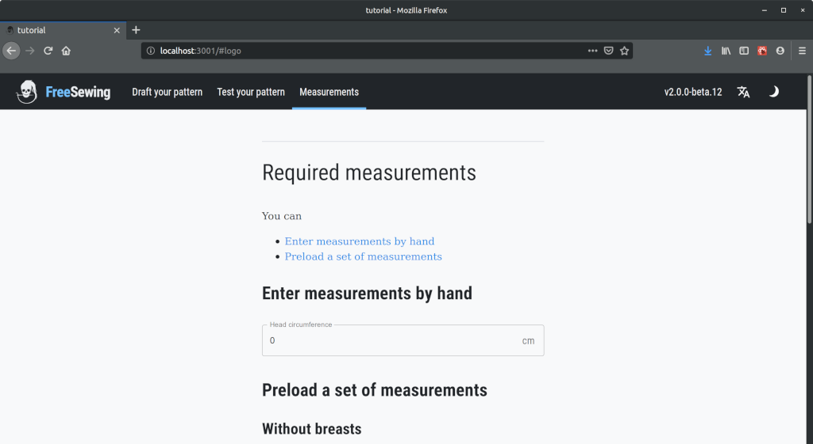

FreeSewing is all about _made-to-measure_ sewing patterns;
we are going to draft our pattern according to the measurements provided to us.

Which begs the question, which measurements?

It is we, as the pattern designers, who decide which measurements are used
to draft our pattern. For our bib, the only measurement we need is the
_head circumference_.

So let's add it as a required measurement.

## Adding required measurements

In our `design/src/bib.mjs` file, on the `bib` object, there is a key called
`measurements` (line 121) that will hold a list (an array) of all required measurements
for this part.

We are going to use [*the official name* of the measurement](/reference/measurements). For head
circumference, that name is `head`.

```design/src/bib.mjs
function draftBib({ part }) {
  return part
}

export const bib = {
  name: 'tutorial.bib',
  draft: draftBib,
  from: false,
  hide: {
    self: false,
    from: false,
    after: false
  },
  options: {},
  // start-highlight
  measurements: ['head'],
   // end-highlight
  optionalMeasurements: [],
  plugins: []
}
```

Now everybody knows this part requires the `head` measurement.

This change will also get picked up by the development environment, and we'll now see this screen:



Since it's just one measurement, let's simply enter a value by hand.
For example `38` as 38 cm is a realistic head circumference measurement for a baby.

Enter `38` in the box, and click on **Draft Design** in the sidebar under the **View** heading.
This brings us back to our work in progress:


## Notes

### Why using standard measurements names matters

In principle, we can use any name we want for our measurements.
Our core library really doesn't care.

However, if everybody uses their own (names for) measurements, then people
aren't able to re-use their measurements across designs.

So if you have any intention at all to play nice with the FreeSewing ecosystem,
please make sure to re-use the names of existing measurements, rather than
invent your own.

See our [best practices](/guides/best-practices/reuse-measurements) on this
topic for details.
