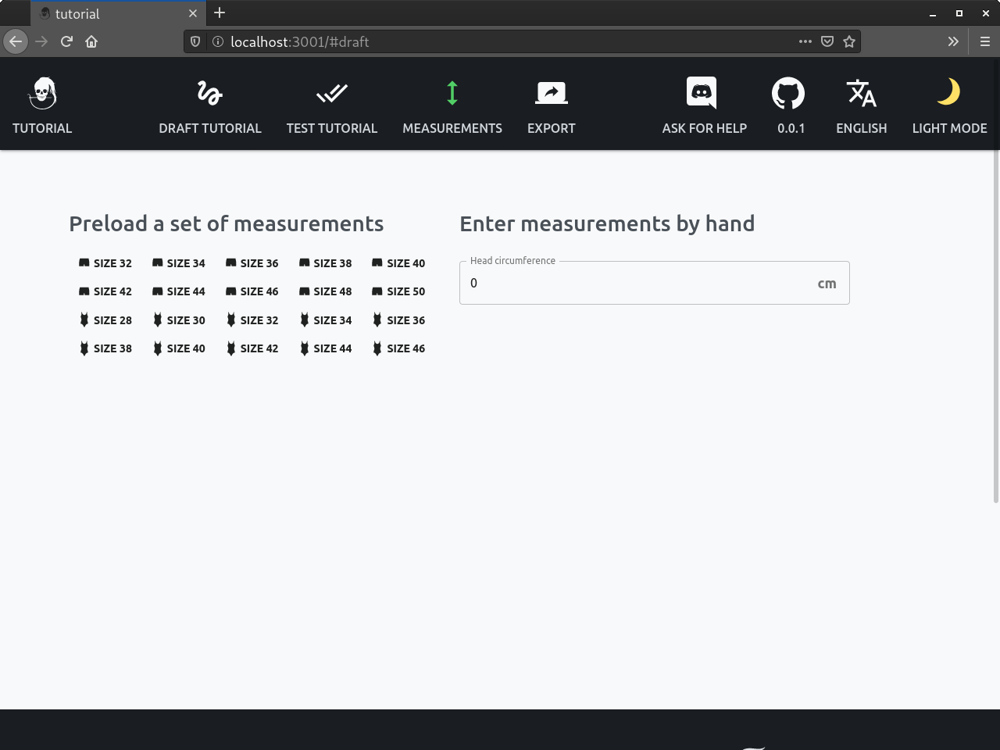

FreeSewing is all about *made-to-measure* sewing patterns; We are going to draft our pattern according to the measurements provided to us.

Ce qui nous amène à cette question : quelles mesures ?

C'est vous, en tant que concepteur de patron, qui décidez de quelles mesures vont être requises pour ébaucher votre patron. For our bib, the only measurement we need is the baby's *head circumference*.

Alors ajoutons-le comme mesure nécessaire.

## Ajouter les mesures nécessaires

Ouvrez le fichier de configuration à l'adresse `config/index.js` et mettez à jour le tableau `measurements` avec le nom des mesures requises :

```js
measurements: ["head"],
```

<Tip>

Assurez-vous d'employer les noms de mesures existantes, plutôt que d'inventer les vôtres.

See our [best practices](/guides/best-practices/names#re-use-measurements) on this topic for details.

</Tip>

A présent tout le monde sait que votre patron a besoin de la mesure `head`.

Ce changement sera également repris par l'environnement de programmation, et vous verrez alors à l'écran :



Etant donné qu'il n'y a qu'une seule mesure, rentrons simplement une valeur à la main. Par exemple, `38` pour 38 cm est une mesure de tour de tête réaliste pour un bébé.

Enter `38` in the box, and click on **Draft your pattern** in the top navigation bar to get back to your draft which for now still looks like this:

<Example pattern="tutorial" part="step1" caption="Nothing has changed, yet" />
