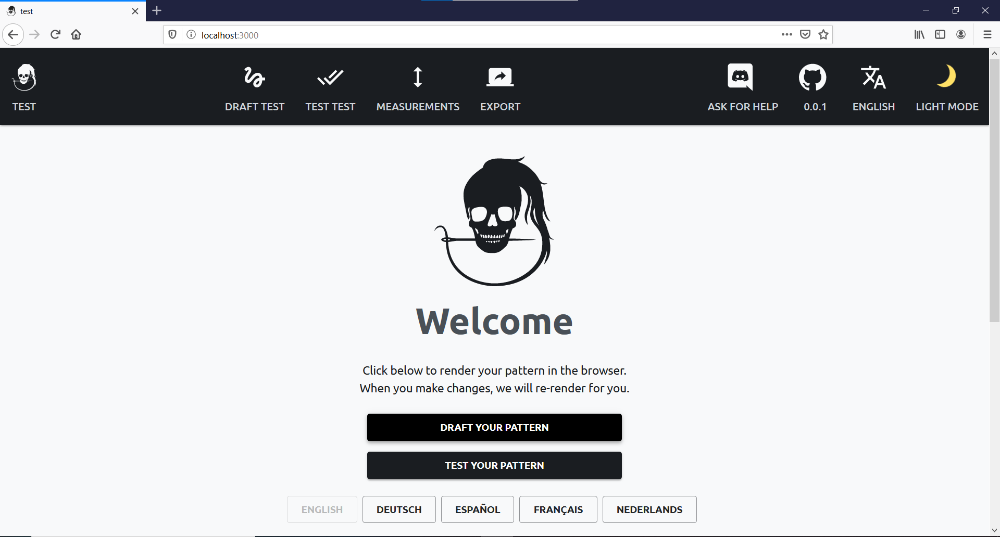

<Note>

###### Already did the Getting started tutorial?

If you already set up the FreeSewing development environment and created a pattern, you can use that pattern and skip these steps. You can move on to [Your first part](/tutorials/pattern-design/your-first-part/).

</Note>

Open a terminal and enter the following command:

```bash
npx create-freesewing-pattern
```

This will load a few dependencies, and then ask you the following questions:

-   **Language**: Use the arrow keys to select the language of your choice
-   **Pattern name**: Enter `tutorial`
-   **description**: Enter `The FreeSewing tutorial`
-   **Pattern type**: Use the arrow key to select `Pattern`
-   **Department**: Use the arrow keys to select `Accessories`
-   **Author**: Enter your GitHub username
-   **GitHub repository**: This will be prefilled for you, so just hit Enter
-   **Package manager**: Use the arrow to choose. Pick `npm` if you're not sure.

After you've answered these questions, the default template will be copied, after which all dependencies will be installed.

<Note>

This will take a few minutes because we're loading some software for your development environment.

</Note>

When it's ready, enter the directory that was just created for our `tutorial` pattern and navigate to the `example` subfolder. There, start the development environment:

```bash
cd tutorial/example
npm start
```

Or if you chose to use Yarn as package manager:

```bash
cd tutorial/example
yarn start
```

If all goes well, your browser will open and show the following landing page:



<Note>

###### Need help?

If you run into any issues, join [our chatroom](https://discord.freesewing.org/) and
we'll figure it out together.

</Note>
