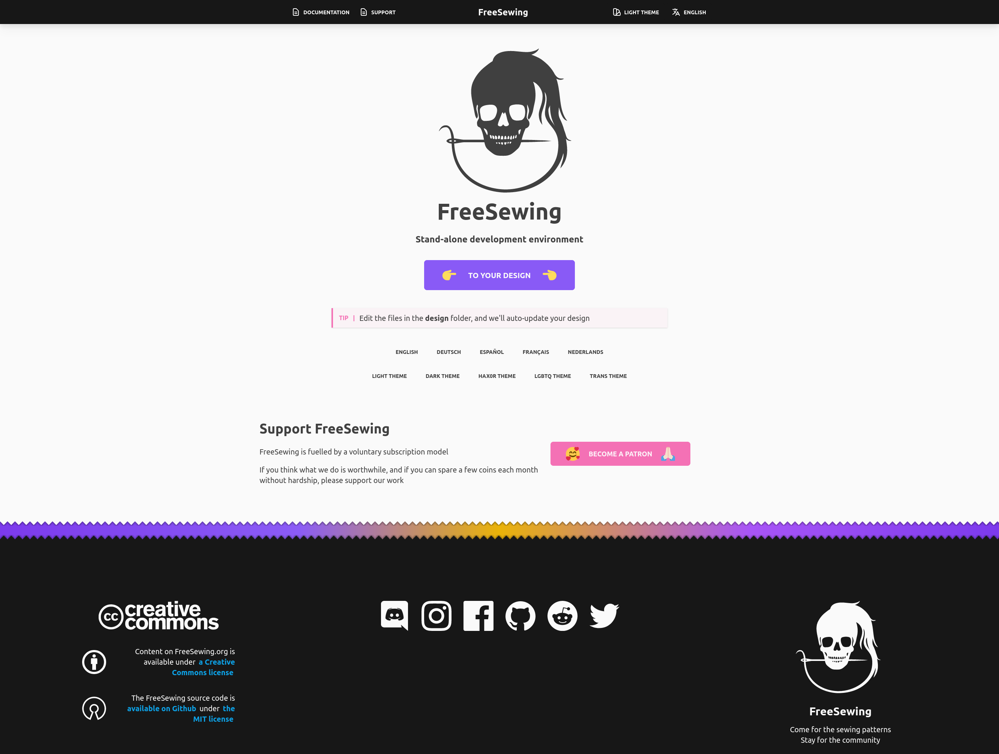

Open a terminal and enter the following command:

```bash
npx @freesewing/new-design
```

You'll be asked some questions, use these answers:

- **What template would you like to use?**: Pick the default `From scratch`
- **What name would you like the design to have**: Enter `bib`
- **What package manager do you use?**: Pick `npm` unless you are certain you have `yarn` installed

After you've answered these questions, files will be copied, dependencies installed, and components downloaded.

<Note>

This will take a few minutes because we're loading some software for your development environment.

</Note>

When it's ready, enter the `bib` directory that was just created and run `npm run dev`:

```bash
cd bib
npm run dev
```

Or if you chose to use Yarn as package manager:

```bash
cd bib
yarn start
```

Now open your browser at http://localhost:8000

If all goes well, you should see this landing page:



<Note>

###### Need help?

If you run into any issues, join [our chatroom](https://discord.freesewing.org/) and
we'll figure it out together.

</Note>
