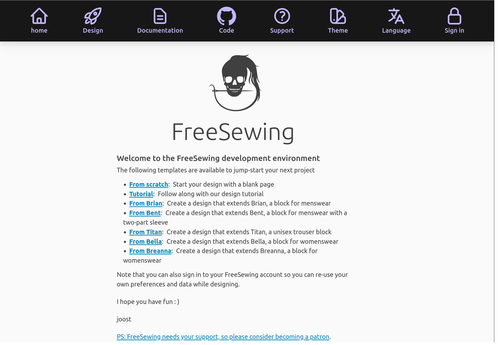

FreeSewing provides a development environment that visualizes your design for
you. This tutorial is for the stand-alone development environment, not the
monorepo development environment (which you may have set up if you followed a
getting started tutorial).

To set it up, I will open a terminal and enter the following command:

```sh
npx @freesewing/new-design
```

It will ask if it is ok to install the development environment in a new folder
named `freesewing`. You can accept the default, or pick a different folder name
if you prefer.

It will also ask what package manager you would like to use. 
Here too the default (`npm`) is fine., unless you are certain you have **yarn** installed.

After answering these questions, files will be downloaded, dependencies installed,
and it will also initialize a git repository for you (if you have git on your system).

<Note>

This will take a few minutes because the development environment has a number
of dependencies that need to be downloaded.

</Note>

When it's ready, you can enter the `freesewing` directory that was just created and run `npm run dev`:

```sh
cd freesewing
npm run dev
```

Or if you want to use yarn as package manager:

```sh
cd freesewing
yarn dev
```

Now open a browser and go to http://localhost:8000

If all goes well, we'll should see this landing page:



<Tip>

##### More detailed setup tutorials are available

This pattern design tutorial contains only an abbreviated overview
of the setup process.
For more detailed instructions, please refer to one of our setup tutorials:

- [Getting started on Linux](/tutorials/getting-started-linux)
- [Getting started on Mac](/tutorials/getting-started-mac)
- [Getting started on Windows](/tutorials/getting-started-windows)

</Tip>

<Tip>

##### Need help?

If you run into any issues, head over to [FreeSewing.org/support](https://next.freesewing.org/support)
which lists the various ways in which you can get help.

</Tip>
