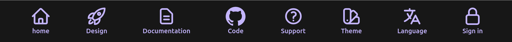
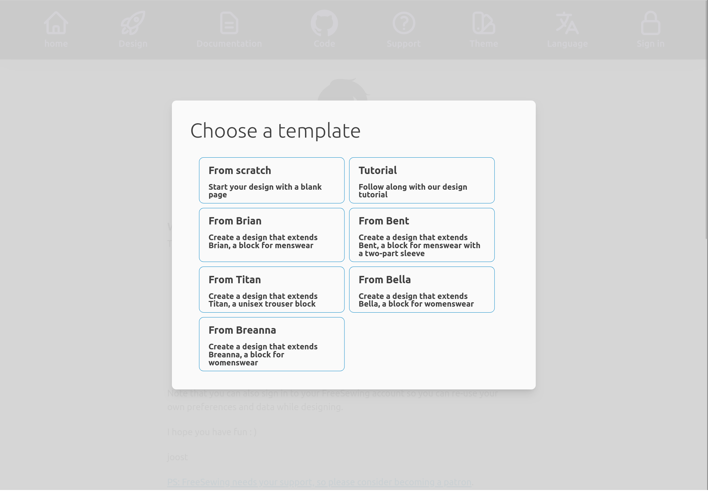

If you have been to FreeSewing.org the FreeSewing development environment will look familiar.
That's because under the hood, it re-uses the same building blocks.

At the top of the page is the header with a row of icons that lay out what is available to you.

From left to right you can see:

- **Home** will take you to the home page / welcome page
- **Design** will offer you a list of templates to start a design from (more on this below)
- **Documentation** will show a page with links to our documentation
- **Code** will show a page with links to our source code
- **Support** will show a page with the various ways you can get help
- **Theme** allows you to change the theme (in other works the color scheme)
- **Language** allows you to change the language
- **Sign In** allows you to sign in to your FreeSewing account so you can use
  your (and our) measurements sets while designing

## Design templates

If you click the **Design** icon it will show this menu:

It allows you to choose a design template to start from. The following templates are included:

- **From scratch**: Start with an (almost) empty design
- **Tutorial**: Start with the end result of this very tutorial
- **From Brian**: Start with a design that extends [Brian](https://freesewing.org/designs/brian)
- **From Bent**: Start with a design that extends [Bent](https://freesewing.org/designs/bent)
- **From Titan**: Start with a design that extends [Titan](https://freesewing.org/designs/titan)
- **From Bella**: Start with a design that extends [Bella](https://freesewing.org/designs/bella)
- **From Breanna**: Start with a design that extends [Breanna](https://freesewing.org/designs/breanna)

For the following along this tutorial, you have two options:

- Pick **Tutorial** if you prefer to read along, make small changes, and see how they affect the design.
- Pick **From scratch** if you prefer to actively participate by recreating the design in this tutorial.

I recommend the latter. You will learn (and remember) a lot more if you are actively engaging.

