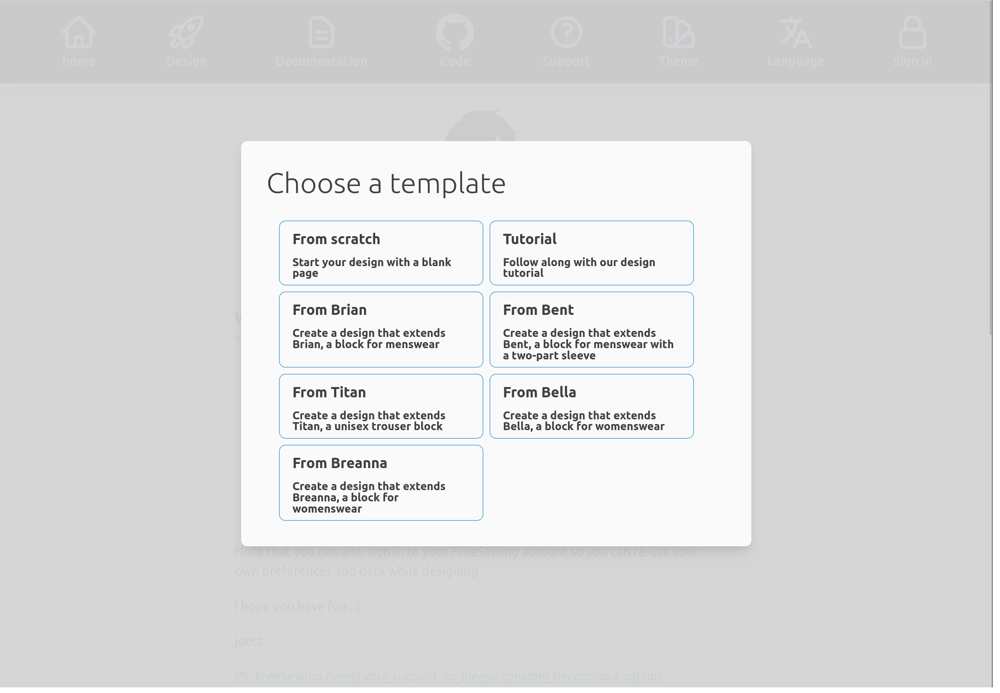

Inside the `freesewing` folder -- which might have a different name if that is
the choice you made -- you will find a bunch of files and folders.  

The one that matter is the `design` folder. In it, you will find the followin
subfolders:

- `from-bella`
- `from-bent`
- `from-breanna`
- `from-brian`
- `from-scratch`
- `from-titan`
- `tutorial`

Remember when you click the **Design** icon in the header it would bring up
this menu:

As you might have guessed by now, each of these options is contained in its
own subfolder under `designs`. 

You can edit the files under `designs/[template]/src/` and the changes you make
will be reflected in the development environment.

Don't take my word for it though. Let's start doing exactly that 
in [Part 2](/tutorials/pattern-design/part2).
