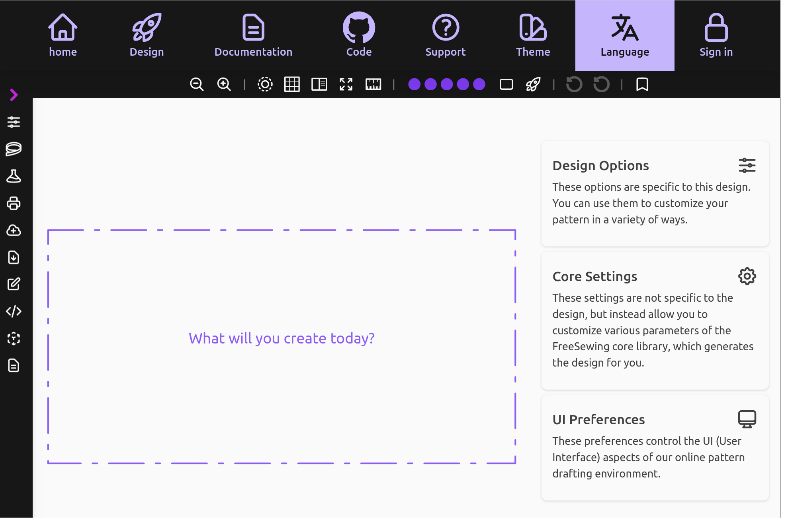
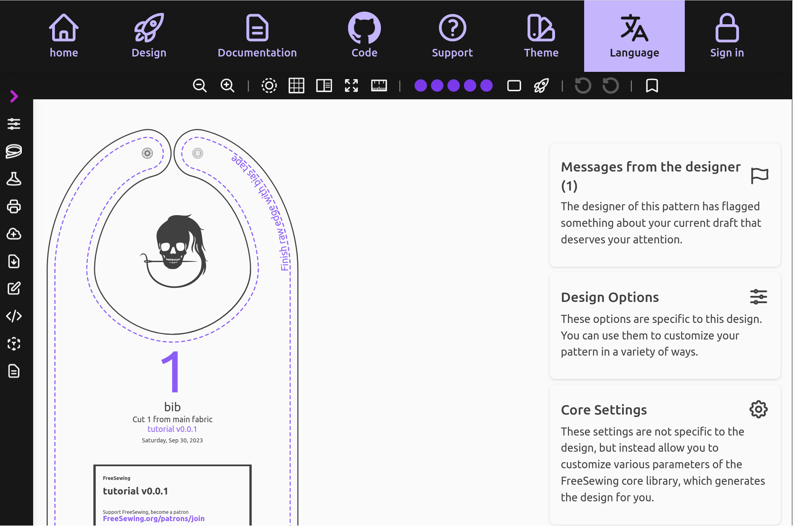

Welcome to part 2 of this FreeSewing pattern design tutorial.
In this part I will show you how to design a bespoke
sewing pattern, start to finish.

<Tip>
##### Before you start

This tutorial assumes you are familiar with the following:

- Scalable Vector Graphics
- The coordinate system
- Units in FreeSewing
- Cubic Bézier curves

Which is a lot to assume. So if you'd like you can take a quick detour
via our [Before you start guide](/guides/prerequisites). \
It's very short, but covers some basic
terminology and concepts that we'll use throughout this guide.
</Tip>

## Pick a template

The FreeSewing development environment ships with several templates you
can start from. I recommend you start **From scratch** as you'll learn the most
that way. But you can also start from the **Tutorial** template in which case
you will already have the end result we are aiming for today:

Depending on the choice you made, you will need to edit files in a different folder.

- Edit files in `design/from-scratch` if you are using the **From scratch** template
- Edit files in `design/tutorial` if you are using the **Tutorial** template

You can choose either, or even switch back and forth between both.

To follow along step-by-step with the tutorial, go to the `design/from-scratch` folder.