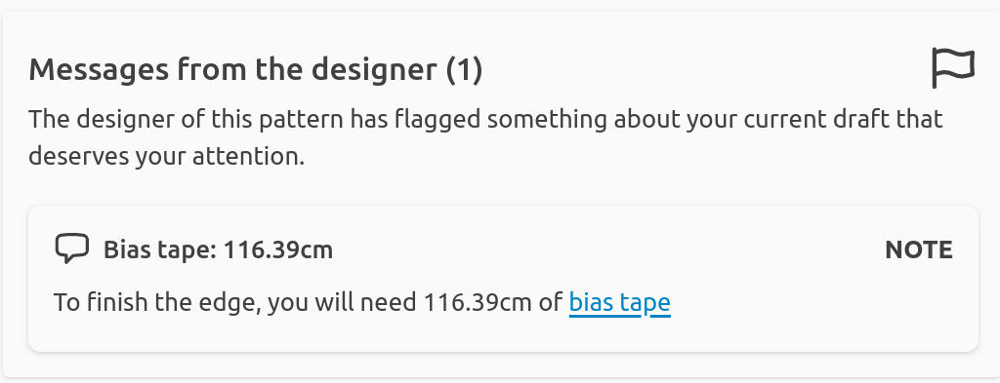

As a designer, there are times you want to bring something to the attention of
the user.  I am not talking about generic information that can go in the
documentation, but rather a message that is tailored specifically to this
pattern, much like this pattern is specifically tailored to the user.

Doing so is possible with the various `store.flag` methods, and below is
our updated bib making use of this. It's important to realize that things
will look the same here. But if you load this pattern in the development
environment (or on FreeSewing.org for that matter) the user will see this:



It's a simple example, but I hope it gets the point across.

Finally, keep in mind that we are now straddling the world of the core library
and frontend integration. These messages won't do anything unless you have a
frontend the shows them.

<Example previewFirst tutorial caption="We flagged something for the user">
```design/src/bib.mjs
function draftBib({
  Point,
  points,
  Path,
  paths,
  utils,
  store,
  measurements,
  options,
  macro,
  Snippet,
  snippets,
  complete,
  // highlight-start
  units,
  // highlight-end
  part,
}) {

  /*
    * Construct the neck opening
    */
  const target = (measurements.head * options.neckRatio) / 4
  let tweak = 1
  let delta
  do {
    points.right = new Point((tweak * measurements.head) / 10, 0)
    points.bottom = new Point(0, (tweak * measurements.head) / 12)

    points.rightCp1 = points.right.shift(90, points.bottom.dy(points.right) / 2)
    points.bottomCp2 = points.bottom.shift(0, points.bottom.dx(points.right) / 2)

    paths.neck = new Path()
      .move(points.right)
      .curve(points.rightCp1, points.bottomCp2, points.bottom)

    delta = paths.neck.length() - target
    if (delta > 0) tweak = tweak * 0.99
    else tweak = tweak * 1.02
  } while (Math.abs(delta) > 1)

  points.rightCp2 = points.rightCp1.flipY()
  points.bottomCp1 = points.bottomCp2.flipX()

  points.left = points.right.flipX()
  points.leftCp1 = points.rightCp2.flipX()
  points.leftCp2 = points.rightCp1.flipX()

  points.top = points.bottom.flipY()
  points.topCp1 = points.bottomCp2.flipY()
  points.topCp2 = points.bottomCp1.flipY()

  /*
    * Construct the outline
    */
  let width = measurements.head * options.widthRatio
  let length = measurements.head * options.lengthRatio

  points.topLeft = new Point(width / -2, points.top.y - (width / 2 - points.right.x))
  points.topRight = points.topLeft.shift(0, width)
  points.bottomLeft = points.topLeft.shift(-90, length)
  points.bottomRight = points.topRight.shift(-90, length)

  points.edgeLeft = new Point(points.topLeft.x, points.left.y)
  points.edgeRight = new Point(points.topRight.x, points.right.y)
  points.edgeTop = new Point(0, points.topLeft.y)

  points.edgeLeftCp = points.edgeLeft.shiftFractionTowards(points.topLeft, 0.5)
  points.edgeRightCp = points.edgeLeftCp.flipX()
  points.edgeTopLeftCp = points.edgeTop.shiftFractionTowards(points.topLeft, 0.5)
  points.edgeTopRightCp = points.edgeTopLeftCp.flipX()

  /*
    * Round the end of the straps
    */
  let strap = points.edgeTop.dy(points.top)

  points.tipRight = points.edgeTop.translate(strap / 2, strap / 2)
  points.tipRightTop = new Point(points.tipRight.x, points.edgeTop.y)
  points.tipRightBottom = new Point(points.tipRight.x, points.top.y)

  /*
    * Macros will return the auto-generated IDs
    */
  const ids1 = {
    tipRightTop: macro('round', {
      id: 'tipRightTop',
      from: points.edgeTop,
      to: points.tipRight,
      via: points.tipRightTop,
    }),
    tipRightBottom: macro('round', {
      id: 'tipRightBottom',
      from: points.tipRight,
      to: points.top,
      via: points.tipRightBottom,
    }),
  }

  /*
    * Create points from them with easy names
    */
  for (const side in ids1) {
    for (const id of ['start', 'cp1', 'cp2', 'end']) {
      points[`${side}${utils.capitalize(id)}`] = points[ids1[side].points[id]].copy()
    }
  }

  /*
    * Rotate straps so they don't overlap
    */
  let rotateThese = [
    'edgeTopLeftCp',
    'edgeTop',
    'tipRight',
    'tipRightTop',
    'tipRightTopStart',
    'tipRightTopCp1',
    'tipRightTopCp2',
    'tipRightTopEnd',
    'tipRightBottomStart',
    'tipRightBottomCp1',
    'tipRightBottomCp2',
    'tipRightBottomEnd',
    'tipRightBottom',
    'top',
    'topCp2',
  ]

  while (points.tipRightBottomStart.x > -1) {
    for (let p of rotateThese) points[p] = points[p].rotate(1, points.edgeLeft)
  }

  /*
    * Add points to anchor snaps on
    */
  points.snapLeft = points.top.shiftFractionTowards(points.edgeTop, 0.5)

  /*
    * Mirror points to the other side
    */
  points.edgeTopRightCp = points.edgeTopLeftCp.flipX()
  points.topCp1 = points.topCp2.flipX()
  points.tipLeftTopStart = points.tipRightTopStart.flipX()
  points.tipLeftTopCp1 = points.tipRightTopCp1.flipX()
  points.tipLeftTopCp2 = points.tipRightTopCp2.flipX()
  points.tipLeftTopEnd = points.tipRightTopEnd.flipX()
  points.tipLeftBottomStart = points.tipRightBottomStart.flipX()
  points.tipLeftBottomCp1 = points.tipRightBottomCp1.flipX()
  points.tipLeftBottomCp2 = points.tipRightBottomCp2.flipX()
  points.tipLeftBottomEnd = points.tipRightBottomEnd.flipX()
  points.snapRight = points.snapLeft.flipX()

  /*
    * Round the bottom of the bib
    * Radius is fixed, but you could use an option for it)
    *
    * Macros will return the auto-generated IDs
    */
  const ids2 = {
    bottomLeft: macro('round', {
      id: 'bottomLeft',
      from: points.topLeft,
      to: points.bottomRight,
      via: points.bottomLeft,
      radius: points.bottomRight.x / 4,
    }),
    bottomRight: macro('round', {
      id: 'bottomRight',
      from: points.bottomLeft,
      to: points.topRight,
      via: points.bottomRight,
      radius: points.bottomRight.x / 4,
    }),
  }
  /*
    * Create points from them with easy names
    */
  for (const side in ids2) {
    for (const id of ['start', 'cp1', 'cp2', 'end']) {
      points[`${side}${utils.capitalize(id)}`] = points[ids2[side].points[id]].copy()
    }
  }

  /*
    * Construct the path
    */
  paths.seam = new Path()
    .move(points.edgeLeft)
    .line(points.bottomLeftStart)
    .curve(points.bottomLeftCp1, points.bottomLeftCp2, points.bottomLeftEnd)
    .line(points.bottomRightStart)
    .curve(points.bottomRightCp1, points.bottomRightCp2, points.bottomRightEnd)
    .line(points.edgeRight)
    .curve(points.edgeRightCp, points.edgeTopRightCp, points.tipLeftTopStart)
    .curve(points.tipLeftTopCp1, points.tipLeftTopCp2, points.tipLeftTopEnd)
    .curve(points.tipLeftBottomCp1, points.tipLeftBottomCp2, points.tipLeftBottomEnd)
    .curve(points.topCp1, points.rightCp2, points.right)
    .curve(points.rightCp1, points.bottomCp2, points.bottom)
    .curve(points.bottomCp1, points.leftCp2, points.left)
    .curve(points.leftCp1, points.topCp2, points.tipRightBottomEnd)
    .curve(points.tipRightBottomCp2, points.tipRightBottomCp1, points.tipRightBottomStart)
    .curve(points.tipRightTopCp2, points.tipRightTopCp1, points.tipRightTopStart)
    .curve(points.edgeTopLeftCp, points.edgeLeftCp, points.edgeLeft)
    .close()
    .attr('class', 'fabric')

  /*
    *
    *  Annotations
    *
    */

  // highlight-start
  /*
    * Let the user know about the bias tape and fabric requirements
    */
  store.flag.note({
    msg: 'tutorial:biasTapeLength',
    replace: {
      l: units(paths.seam.length()),
    },
  })
  // highlight-end

  /*
    * Cut list
    */
  store.cutlist.addCut({ cut: 1, from: 'fabric' })

  /*
    * Add the snaps
    */
  snippets.snapStud = new Snippet('snap-stud', points.snapLeft)
  snippets.snapSocket = new Snippet('snap-socket', points.snapRight).attr('opacity', 0.5)

  /*
    * Add the bias tape
    */
  if (complete)
    paths.bias = paths.seam
      .offset(-5)
      .addClass('note dashed')
      .addText('finishWithBiasTape', 'center fill-note')

  /*
    * Add the title
    */
  points.title = points.bottom.shift(-90, 45)
  macro('title', {
    at: points.title,
    nr: 1,
    title: 'bib',
    align: 'center',
    scale: 0.8,
  })

  /*
    * Add the scalebox
    */
  points.scalebox = points.title.shift(-90, 65)
  macro('scalebox', { at: points.scalebox })

  /*
    * Add the logo
    */
  points.logo = new Point(0, 0)
  snippets.logo = new Snippet('logo', points.logo)

  /*
    * Add dimensions
    */
  macro('hd', {
    id: 'wFull',
    from: points.bottomLeftStart,
    to: points.bottomRightEnd,
    y: points.bottomLeft.y + 15,
  })
  macro('vd', {
    id: 'hBottomToOpeningBottom',
    from: points.bottomRightStart,
    to: points.bottom,
    x: points.bottomRight.x + 15,
  })
  macro('vd', {
    id: 'hBottomToOpeningCenter',
    from: points.bottomRightStart,
    to: points.right,
    x: points.bottomRight.x + 30,
  })
  macro('vd', {
    id: 'hTotal',
    from: points.bottomRightStart,
    to: points.tipLeftTopStart,
    x: points.bottomRight.x + 45,
  })
  macro('hd', {
    id: 'wOpening',
    from: points.left,
    to: points.right,
    y: points.left.y + 25,
  })
  macro('ld', {
    id: 'wStrap',
    from: points.tipLeftBottomEnd,
    to: points.tipLeftTopStart,
    d: -15,
  })

  return part
}
```
</Example>

Now the first thing you should know is: **core does not care**. We are
