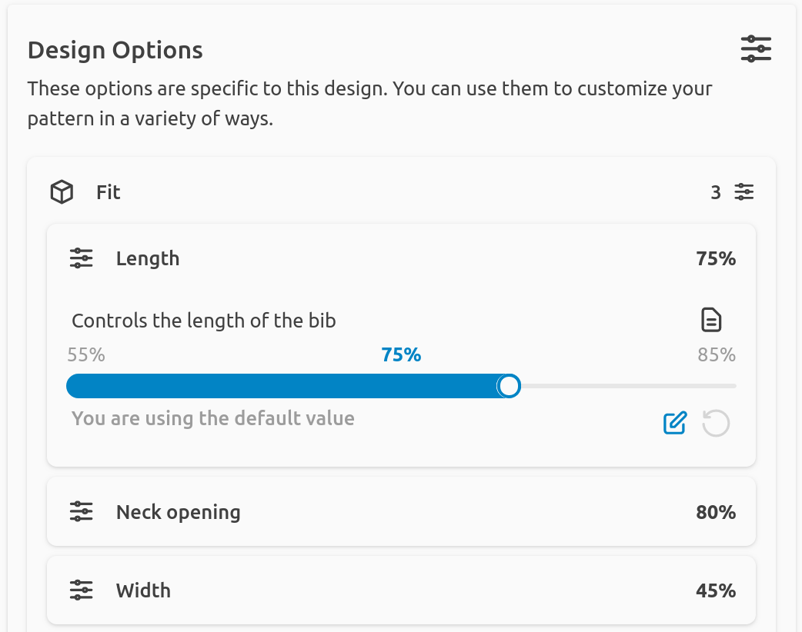

Strictly speaking, this tutorial is about learning to use FreeSewing's core
library to do parametric design, and we made great strides in that regard.

But FreeSewing is a lot more than its core library, and you might be wondering
how your pattern options magically end up in the development environmnt under
**Design options**:



To make this happen, we add extra information to the options configuration.
You can add anything you want, here is a made-up example:

```mjs
options: {
  shipWith: {
    dflt: 'pickUp',
    list: ['pickUp', 'post', 'courier'],
    menu: 'shipping',
    extraNote: 'Pick-up Monday to Friday 10:00, to 19:00'
  },
}
```

It's just a silly example, but there's two important take-aways here:

- You don't have to use options in your design. You can add options for things
  that are not about the desing, but that you still want to capture the user's
  input for (like shipping preferences in this case).
- You can add extra properties to an option. Each option type has it's required
  properties. But you can add more and use them as you see fit.

Which is exactly what we do at FreeSewing, so I'd like to mention the `menu` one:

## Setting `menu` on your option

If you set a `menu` property on your option, the FreeSewing frontend will use
this to organize your various options in a menu structure.

### Sub menus
You can a nested menu structure with dot-notation. So `style.pockets` will
create a `pockets` submenu under the `style` menu and put your option there.

### Hiding options

If your `menu` property holds a falsy value, the option will be hidden from the
menu.

### Hiding options conditionally

If the `menu` property of your option holds a function, that function will be called with the following signature:

```mjs
function(
  settings, // The settings provided by the user
  mergedOptions, // The user-provided options merged with the defaults
) {
 // return menu value here
}
```

This is typically used to hide options conditionally.

<Fixme compact>Include example</Fixme>
