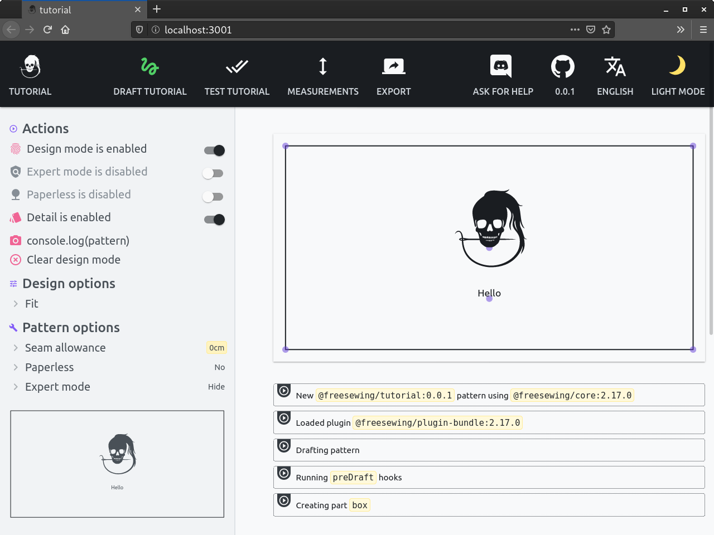

Much like garments themselves, patterns are made up of _parts_.

Most patterns will have multiple parts. A sleeve, a back part, the collar, and so on.
Our pattern is very simple, and only has one part: the bib.

The pattern that's been created for us also just has one part to get you started.
It's called **box** and it draws a box. If you click on the **To your design**
button in your browser, you'll get to see it:



Since we only need one part, we'll rename this _box_ part, and call it _bib_.

## Rename the box part to bib

First, update the configuration file in `design/config.js`.
Update the **parts** array with `bib`, rather than `box`:

```js
parts: ['bib'],
```

<Note>

##### Don't worry about the big red error

This will (temporarily) cause en error to appear in your development environment, because the rest of the code is still expecting to find a part named `box`, but we will fix this in the next steps.

</Note>

When that's done, rename the `design/src/box.js` file into `design/src/bib.js`.

Then, in the `design/src/index.js` file, change the import accordingly:

```js
// Change this line
//import draftBox from "./box"

// Into this
import draftBib from "./bib"
```

Finally, still in the `design/src/index.js` file, update the draft method:

```js
// Change this line
//Design.prototype.draftBox = draftBox

// Into this
Design.prototype.draftBib = draftBib
```

<Tip>

###### Always use draftPartname

FreeSewing will expect for each part to find a method named Draft\_Partname\_.

If you have a part named `sleeve` you should have a method called `draftSleeve()` that drafts that part.

In our case, we have a part named `bib` so we're using `draftBib()` as the method that drafts it.

</Tip>

Congratulations, your pattern now has a `bib` part, rather than a `box` part.
It still looks the same though:

<Example pattern="tutorial" part="step1">
Our bib part, which is the renamed box part
</Example>

This `bib` part is where we'll do some real work. But first, we have some more configuration to do.
