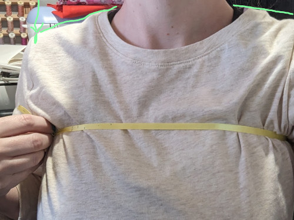

Each of our [measurements](https://freesewing.org/docs/measurements) is documented with a description and two visuals. Referencing these resolves most issues.

We are working on QA functionality that detects possible issues and brings them to the user's attention in a way that *makes sense*.

In the meantime, here are some places to start looking if you're having trouble with your measurements.

### General notes

Trouser problems are almost always caused by vertical measurements that determine the room we have to construct the pants top. For example, waist to upper leg *must* be longer than waist to seat; otherwise there is negative room to construct the pants.

The waist measurement is an important vertical plane of reference. It doesn't matter that much where you take it, as long as you consistently measure all vertical measurements (waist to seat, waist to hips, HPS to waist, waist to floor, ...) from that same horizontal plane.

### Trouble measurements

There are a few measurements we've noticed tend to cause problems.

#### Waist to armpit

The [waist to armpit](https://freesewing.org/docs/measurements/waisttoarmpit) is a straight vertical measure, not curvilinear (following the curve of the body). It should be at the bottom edge of your armpit, only as high as a shirt would be comfortable sitting (not digging in).

 

The waist to armpit measurement is used to calculate where the bottom
of the sleeve opening is located. An incorrect, too-large
waist to armpit measurement can result in a too-small sleeve opening
and too-narrow sleeves.

#### High point shoulder (HPS)

[HPS](https://freesewing.org/docs/sewing/hps), which is used in several measurements, is one of the harder spots to get perfect.

Here are two approaches.

One way is to take a pencil, pen, or small dowel to find the point where your neck meets your shoulder, as well as the highest point as that's where the pencil or dowel will touch the shoulder. If you use that method, you ideally want the tool you're using to be parallel with the floor so you can find that high point.

 

Another way is with a ribbon. Take a longer ribbon and put it over your neck/shoulder like a cross body bag. It helps to be able to feel where the neck ends and the shoulder begins with a small amount of pressure on the ribbon. You'll need to determine where the shoulder seam should sit, but the ribbon will tell you where the HPS should sit once you have the shoulder seam determined as it will be where the two lines cross.

 

#### High bust

[High bust](https://freesewing.org/docs/measurements/highbust) is a horizontal measurement that does not need to be perfectly horizontal. It should go around your torso at the narrowest part of the upper chest, over the bust, under the arms, and across the back, but does not need to be parallel to the ground all the way around.

 

 

#### Shoulder slope

Many have had luck using an inclinometer app on a smartphone to measure [shoulder slope](https://freesewing.org/docs/measurements/shoulderslope).

Another way to measure shoulder slope is to take a photo.
1. Measure the shoulder slope angle directly on the photo, or
2. Use photo-editing software to rotate the photo until the
shoulder is horizontal. The software should tell you how many degrees
of rotation was used.

#### Seat and hips

Sometimes people have [seat](https://freesewing.org/docs/measurements/seat) and [hips](https://freesewing.org/docs/measurements/hips) reversed.

In FreeSewing terms, hips is measured at the upper point of the hip bones. Some other sources call this the "high hip".

Seat is across the fullest part of your butt. Some other sources call this the "hip".

#### Waist

The [waist](https://freesewing.org/docs/measurements/waist) measurement
is important, and unfortunately it is also one of the most difficult
measurements to take correctly.

The location of the waist is not related to where the waistband on pants
or trousers sits.
Most trousers waistbands are located much lower than the actual waist.

Instead, the waist is the location on the body that is sometimes known as
the "natural waist".
- It is sometimes described as the narrowest part of your torso.
- Other times it is described as the point where the upper body bends
when you bend sideways.
- Often it is higher up on the torso than people expect, closer to the
ribcage than it is to the hips.

Try bending sideways and noting the point where your body creases. (For bonus points, put your hand on your waist and sing "I'm a little teapot".)

Or, take a length of 3/4-inch wide elastic and sew the ends together
into a band that is slightly smaller than your waist circumference.
Slip the elastic band around your torso and start bending, moving, and
walking around.
The elastic band should naturally slip into place at your waist.
(Keep wearing this elastic band as you take other measurements, as
a reference for where your waistline is located.
It will make it easier to take other waist-related measurements.)
