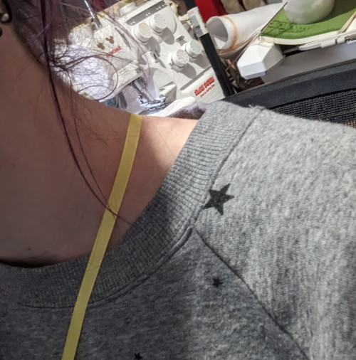

Chacune de nos [mesures] (https\://freesewing.org/docs/measurements) est documentée par une description et deux visuels. S'y référer résout la plupart des problèmes.

Nous travaillons sur une fonctionnalité d'assurance qualité qui détecte les problèmes éventuels et les porte à l'attention de l'utilisateur d'une manière qui _a du sens_.

En attendant, voici quelques endroits pour commencer à chercher si tu as des problèmes avec tes mesures.

### Remarques générales

Les problèmes de pantalon sont presque toujours causés par les mesures verticales qui déterminent l'espace dont nous disposons pour construire le haut du pantalon. Par exemple, la longueur de la taille a la cuisse _doit_ être supérieure à celle de la taille à l'assise, sinon il y a un espace négatif pour construire le pantalon.

La mesure de la taille est un plan de référence vertical important. L'endroit où tu le prends n'a pas beaucoup d'importance, tant que toutes les mesures verticales sont cohérentes (de la taille au siège, de la taille aux hanches, des HPS à la taille, de la taille au sol, ...) avec ce plan horizontal.

### Probèmes de mesures

Nous avons remarqué que certaines mesures ont tendance à poser des problèmes.

#### De la taille à l'aisselle

La mesure [de la taille à l'aisselle] (https\://freesewing.org/docs/measurements/waisttoarmpit) est une mesure verticale droite, et non curviligne (qui suit la courbe du corps). It should be at the bottom edge of your armpit, only as high as a shirt would be comfortable sitting (not digging in).

#### High point shoulder (HPS)

[HPS](https://freesewing.org/docs/sewing/hps), which is used in several measurements, is one of the harder spots to get perfect.

Here are two approaches.

One way is to take a pencil, pen, or small dowel to find the point where your neck meets your shoulder, as well as the highest point as that's where the pencil or dowel will touch the shoulder. If you use that method, you ideally want the tool you're using to be parallel with the floor so you can find that high point.

Another way is with a ribbon. Take a longer ribbon and put it over your neck/shoulder like a cross body bag. It helps to be able to feel where the neck ends and the shoulder begins with a small amount of pressure on the ribbon. You'll need to determine where the shoulder seam should sit, but the ribbon will tell you where the HPS should sit once you have the shoulder seam determined as it will be where the two lines cross.

#### Tour de buste supérieur

[High bust](https://freesewing.org/docs/measurements/highbust) is a horizontal measurement that does not need to be perfectly horizontal. It should go around your torso at the narrowest part of the upper chest, over the bust, under the arms, and across the back, but does not need to be parallel to the ground all the way around.

#### Pente d'épaule

Many have had luck using an inclinometer app on a smartphone to measure [shoulder slope](https://freesewing.org/docs/measurements/shoulderslope).

#### Seat and hips

Sometimes people have [seat](https://freesewing.org/docs/measurements/seat) and [hips](https://freesewing.org/docs/measurements/hips) reversed.

In FreeSewing terms, hips is measured at the upper point of the hip bones. Some other sources call this the "high hip".

Seat is across the fullest part of your butt. Some other sources call this the "hip".

##### Waist

Where you take the [waist](https://freesewing.org/docs/measurements/waist) measurements is not necessarily connected to where, for instance, a waistband is.

Try bending sideways and noting the point where your body creases. (For bonus points, put your hand on your waist and sing "I'm a little teapot".)
