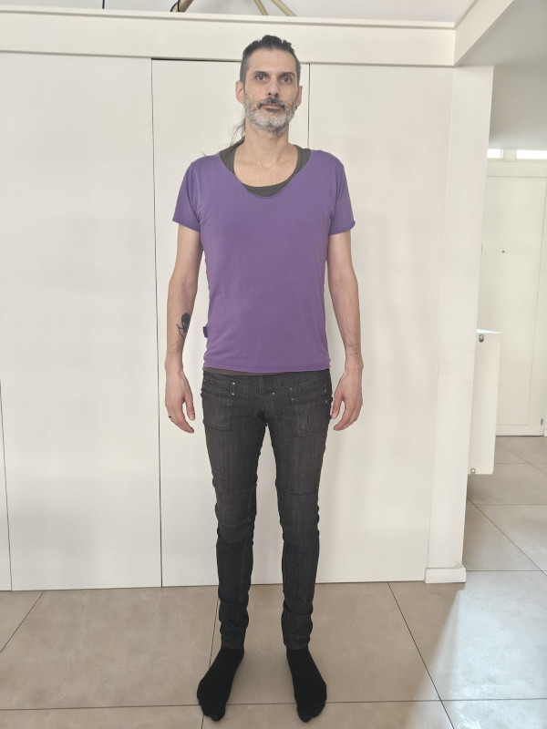

FreeSewing's **curated measurements sets** are a collection of
measurements sets that represent real people.

These sets are used by designers to test their designs on a variety of bodies, as
well as by FreeSewing users to test the platform.

## History

FreeSewing is all about made-to-measure sewing patterns, so perpetuating the 
myth of *standard sizes* was never something we wanted to be part of.

In reality, having to take measurements prior to even being able to try the
platform adds a lot of friction to the onboarding of new users. So at one
point, we added a sizing table with a variety of measurements/sizes so
people could see what generating a pattern looked like without having to
start measuring themselves. 

With the release of version 3 of FreeSewing, we wanted to move away from these
*made up* measurements and instead work with the data of real people to test
our platform. 

We now no longer present users who want to try out the site a range of 
*standard sizes* but rather a collection of measurements sets where they can 
pick the one that best represents their own body.

## Suggesting a measurements set for curation

We rely on our community to submit measurements sets for curation. 
If you have a public measurements set on the site, you can suggest it for curation.

To be part of our curated measurments sets collection, you should provide the following:

- **All measurements** of the person. We do not accept incomplete sets as that would mean some designs would not work with them.
- **The height** of the person. This helps users select a measurements set closest to their own body.
- **A picture** of the person to be featured [in our line-up of curated measurements sets](/curated-sets). See below for tips.

## Tips for line-up pictures

We present measurements sets in a line-up style, so the picture should be a
full frontal picture where you are standing straight and relaxed with your arms
beside your body. 

Below are some tips on how to get good results:

### Don't stand too close to the camera

For best results, ask a friend to take a picture from further away and zoom in.
This helps avoid the *fisheye* effect that you get when taking a picture from up close.

The picture on the left is taken from (too) close.
There's nothing really wrong with this picture, but it looks weird. 
That's because this is taken with a mobile phone and the wide angle on these types of cameras gives you this subtle fish eye effect.

The picture on the right was take further away with zoom.
This is a much better representation of reality and the pose looks natural because the fish eye effect is neutralized.

#### Stand in front of a white background

We will edit out the background of your picture like this:

So you can make that step a lit easier for us if you can pose in front of a white or plain background.

