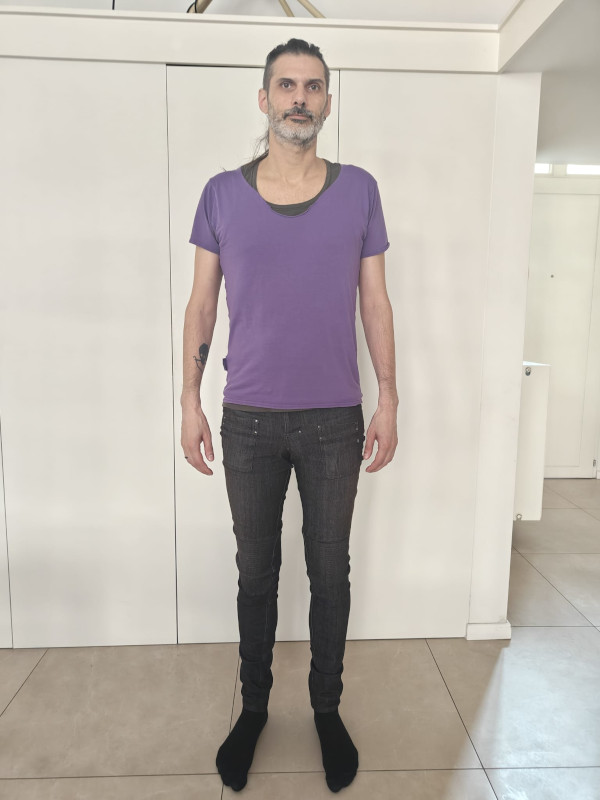
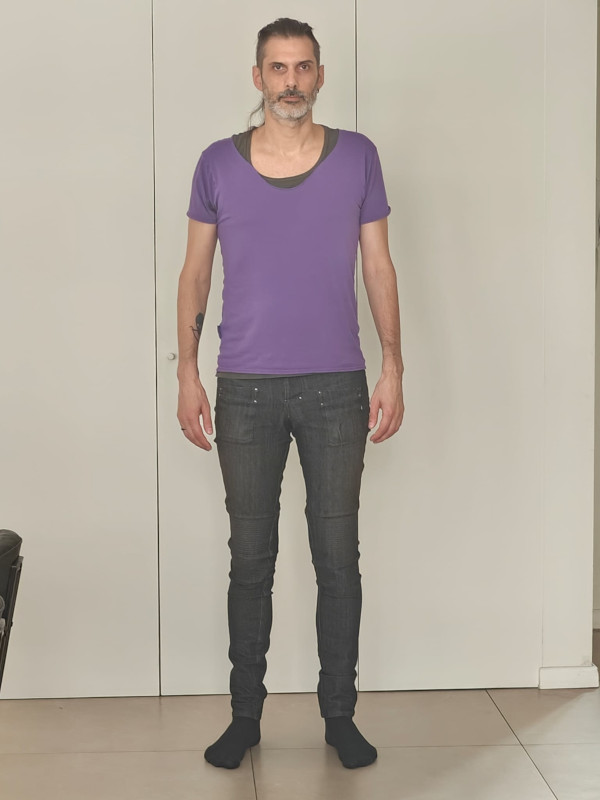
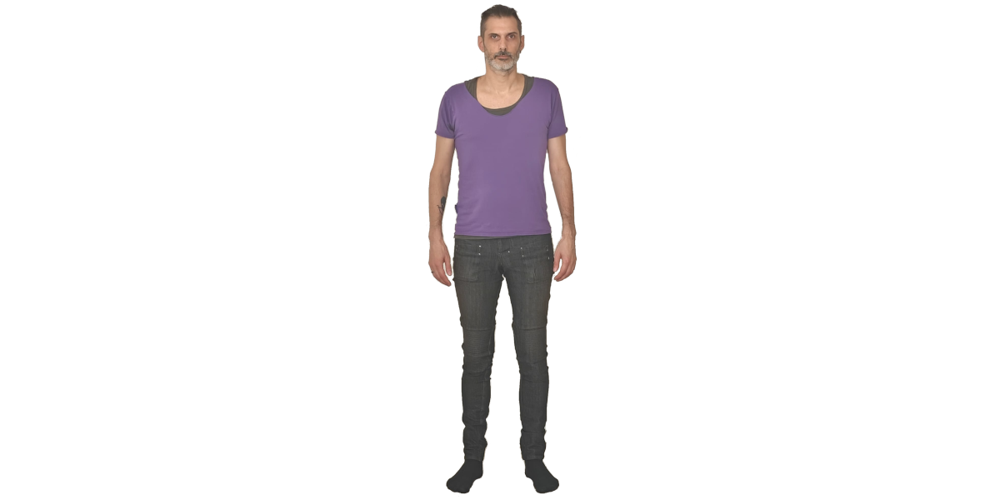

Les **sets de mesures curatés** de FreeSewing sont une collection d'ensembles de mesures qui représentent des personnes réelles.

Ces ensembles sont utilisés par les designers pour tester leurs patrons sur une variété de corps, ainsi que par les utilisateurs de FreeSewing pour tester la plateforme.

## Historique

FreeSewing se consacre aux patrons de couture sur mesure, alors perpétuer le mythe de *des tailles standard* n'a jamais été quelque chose dont nous voulions faire partie.

En réalité, le fait de devoir prendre des mesures avant même de pouvoir essayer la plateforme ajoute beaucoup de frictions à l'accueil des nouveaux utilisateurs. Ainsi, à un moment, nous avons ajouté un tableau des tailles avec une variété de mesures/tailles pour que les personnes puissent voir à quoi ressemble la création d'un modèle sans avoir à commencer par se mesurer elles-mêmes.

Avec la sortie de la version 3 de FreeSewing, nous voulions nous éloigner de ces mesures *inventées* et travailler plutôt avec les données de vraies personnes pour tester notre plateforme.

Désormais, nous ne présentons plus aux utilisateurs qui veulent essayer le site une gamme de *tailles standard* mais plutôt une collection d'ensembles de mesures où ils peuvent choisir celle qui représente le mieux leur propre corps.

## Suggérer un ensemble de mesures pour la curation

Nous comptons sur notre communauté pour soumettre des ensembles de mesures à la curation. Si tu as un ensemble de mesures publiques sur le site, tu peux le suggérer pour la curation.

Pour faire partie de notre collection de jeux de mesures curatées, tu dois fournir les éléments suivants :

- **Toutes les mesures** de la personne. Nous n'acceptons pas les sets incomplets, car cela signifierait que certains designs ne fonctionneraient pas avec eux.
- **La taille** de la personne. Cela aide les utilisateurs à sélectionner un ensemble de mesures le plus proche de leur propre corps.
- **Une photo** de la personne qui sera présentée [dans notre série de mesures](/curated-sets). Tu trouveras ci-dessous des conseils.

## Conseils pour les photos en lignes

Nous présentons les jeux de mesures sur une ligne, la photo doit donc être une photo de face où tu te tiens droit et détendu avec tes bras à côté de ton corps.

Tu trouveras ci-dessous quelques conseils pour obtenir de bons résultats :

### Ne te tiens pas trop près de l'appareil photo

Pour de meilleurs résultats, demande à un ami de prendre une photo de plus loin et de zoomer. Cela permet d'éviter l'effet *fisheye* que l'on obtient lorsqu'on prend une photo de près.

La photo de gauche est prise de (trop) près. Il n'y a rien de vraiment mauvais dans cette photo, mais elle a l'air bizarre. C'est parce que cette photo a été prise avec un téléphone portable et que le grand angle de ce type d'appareil photo te donne cet effet subtil d'œil de poisson.

La photo de droite a été prise plus loin avec le zoom. C'est une bien meilleure représentation de la réalité et la pose semble naturelle car l'effet œil de poisson est neutralisé.

#### Place-toi devant un fond blanc

Nous allons éditer l'arrière-plan de ta photo comme ceci :

Tu peux donc nous faciliter cette étape en posant devant un fond blanc ou uni.

