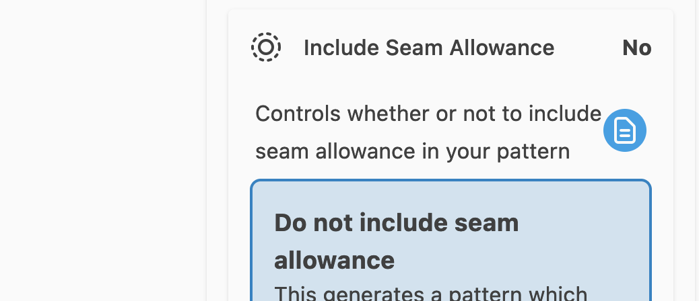

Generating custom sewing patterns based on your measurements is the flagship feature of our website.
We provide an online environment that allows you to customize various aspects of your pattern.

This environment provides a wide range of features, and on these pages we will explain all of them.

<ControlTip />

## The editor 

Below is a screenshot of FreeSewing's pattern editor in **kiosk mode** which hides the site header and footer and lets the editor take up the entire screen. It also has the **View menu** (on the left) expanded. By default you will only see the icons, and not the text of the menu on the left.

### The view menu

The **View menu** on the left allows you to select the view. Each view serves a different purpose. The different views are:

- **Pattern editor**: This is where you can tweak your pattern
- **Pattern measurements**: This is where you can choose which measurements set to use to generate the pattern, or tweak measurements manually
- **Pattern tests**: Allows you to test the pattern. This is an advanced feature.
- **Print layout**: Allows you to manually arrange the pattern parts to optimize the layout for printing
- **Save pattern as...**: Allows you to save the pattern to your account
- **Export pattern**: Allows you to export the pattern as PDF or SVG
- **Edit settings by hand**: Allows you to -- you guessed it -- edit the settings to generate the pattern by hand. This is an advanced feature.
- **Pattern logs**: This shows the logs generated when drafting the pattern. This is an advanced feature.
- **Pattern inspector**: Allows pattern designer to inspect various aspects of the pattern. This is an advanced feature.
- **Documentation**: Provides links to the documentation.

Feel free to check out the other views, but our focus here is on the **Pattern editor**.

### The settings menu

On the right side of the screen is the **Settings menu** which in turn is made up of four sections:

- **Messages from the designer**: Holds information the designer of the pattern flagged for your attention. Note that these are not generic remarks about the design in general (those go in the documentation), but rather information specific to this very pattern. Make sure to check them out. As such, these messages will be different for every user, measurements set, or even combination of design options.
- **Design options**: Holds all the different options the designer has added that allow you to tweak your pattern. These options will be different for each design. Refer to the design documentation for a list of all available options, or check the inline documentation.
- **Core settings**: These are settings that are not provided by the design(er) but rather by FreeSewing's core library. As such, the settings you'll find here are the same accross all designs as they all use the same core library. Refer to [Core Settings](/docs/about/site/draft/core-settings) for all details, or check the inline documentation.
- **UI settings**: And finally, these settings do not control the pattern as such, but rather the user interface. For example, here you can enable kiosk mode or tweak the user experience setting to see more or less features. Like the core settings, the UI settings are the same for every design. Refer to [UI Settings](/docs/about/site/draft/ui-settings) or check the inline documentation.

### The header menu

At the top is a header with icons to give you quick access to both Core settings and UI settings. There is also an icon to clear your settings, clear both settings and measurements, or to bookmark the current pattern.

### The inline documentation

Most, if not all, settings or options that you will tweaks have a little documentation icon next to it (shown in blue in the screenshot below).

You you can click that icon to open the inline documentation.
This allows you to quickly verify the specific role of a setting or option without having to leave the editor.

## Editor modes

<Fixme>Complete these docs</Fixme>
