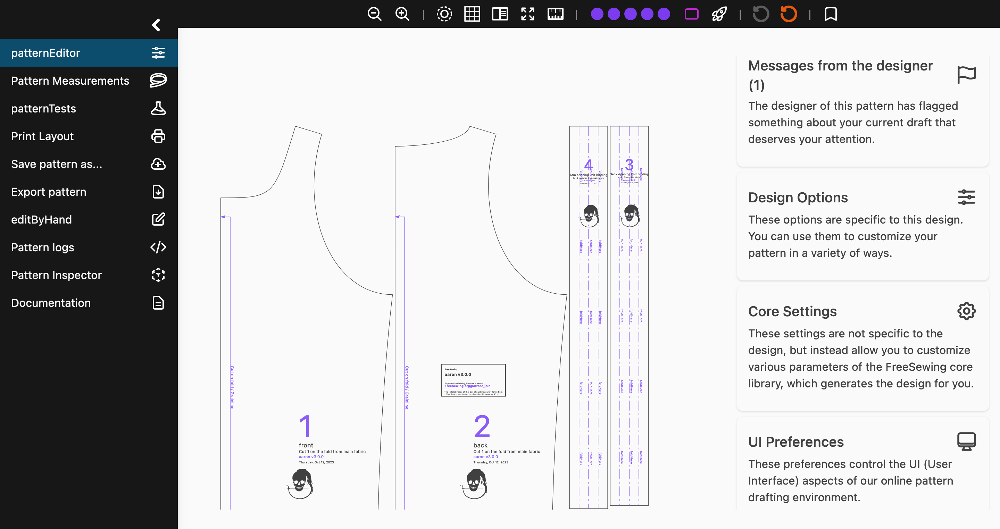
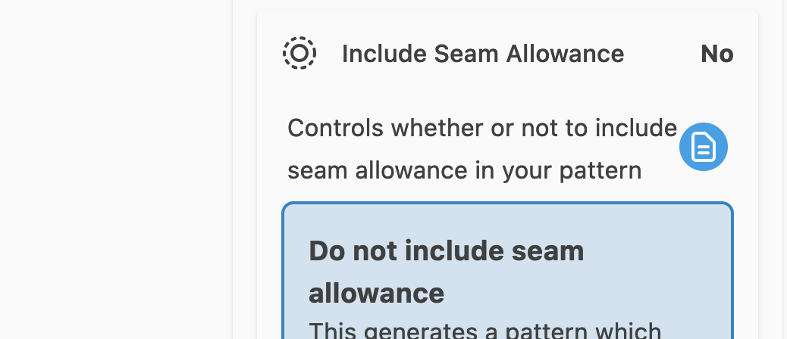

La création de patrons de couture personnalisés sur la base de vos mesures est la fonction phare de notre site web. Nous proposons un environnement en ligne qui vous permet de personnaliser divers aspects de votre patron.

Cet environnement offre un large éventail de fonctionnalités, qui seront toutes expliquées dans ces pages.

<ControlTip />

## L'Éditeur

Tu trouveras ci-dessous une capture d'écran de l'éditeur de patrons de FreeSewing en [mode kiosque ](/docs/about/site/draft/ui-settings/kiosk), qui masque l'en-tête et le pied de page du site et permet à l'éditeur d'occuper tout l'écran. Le menu **View** (à gauche) est également développé. Par défaut, tu ne verras que les icônes, et non le texte du menu de gauche.

### Le menu d'affichage

Le menu **d'affichage** à gauche te permet de sélectionner la vue. Chaque vue a un but différent. Les différentes vues sont :

- **Éditeur de patron**: c'est ici que tu peux modifier ton patron
- **Mesures du patron**: Tu peux ici choisir le jeu de mesures à utiliser pour générer le patron, ou modifier les mesures manuellement
- **Tests de patron**: permet de tester le patron. Il s'agit d'une fonction avancée.
- **Mise en page d'impression**: permet de disposer manuellement les parties du patron afin d'optimiser la mise en page pour l'impression
- **Enregistrer le patron sous...**: Permet d'enregistrer le patron dans ton compte
- **Exporter le patron**: permet d'exporter le patron au format PDF ou SVG
- **Modifier les paramètres à la main**: te permet - tu l'as deviné - de modifier les paramètres pour générer le patron à la main. Il s'agit d'une fonction avancée.
- **Journaux de patron**: Ceci montre les journaux générés lors de l'élaboration du patron. Il s'agit d'une fonction avancée.
- **Inspecteur de patron**: permet au concepteur de patron d'inspecter divers aspects du patron. Il s'agit d'une fonction avancée.
- **Documentation**: Fournit des liens vers la documentation.

N'hésite pas à consulter les autres vues, mais nous nous concentrons ici sur **l'éditeur de patron**.

### Le menu des réglages

Sur le côté droit de l'écran se trouve le menu **paramètres** qui est à son tour composé de quatre sections :

- **Messages du créateur**: Contient des informations que le créateur du patron a signalées à ton attention. Note qu'il ne s'agit pas de remarques génériques sur la conception en général (elles figurent dans la documentation), mais plutôt d'informations spécifiques à ce patron. N'oublie pas de les consulter. Ainsi, ces messages seront différents pour chaque utilisateur, ensemble de mesures ou même combinaison d'options de design.
- **Options de design**: contient toutes les différentes options que le concepteur a ajoutées et qui te permettent de modifier ton patron. Ces options seront différentes pour chaque design. Reporte-toi à la documentation de design pour obtenir une liste de toutes les options disponibles, ou consulte la documentation en ligne.
- **Paramètres de base**: Il s'agit de paramètres qui ne sont pas fournis par lae designer mais plutôt par la bibliothèque de base de FreeSewing. Ainsi, les paramètres que tu trouveras ici sont les mêmes pour tous les design, car ils utilisent tous la même bibliothèque de base. Reporte-toi à [Paramètres de base](/docs/about/site/draft/core-settings) pour plus de détails, ou consulte la documentation en ligne.
- **Paramètres de l'interface utilisateur**: Enfin, ces paramètres ne contrôlent pas le motif en tant que tel, mais plutôt l'interface utilisateur. Par exemple, tu peux ici activer le mode kiosque ou peaufiner le paramètre de l'expérience utilisateur pour voir plus ou moins de fonctionnalités. Comme les paramètres de base, les paramètres de l'interface utilisateur sont les mêmes pour chaque design. Reporte-toi à [Paramètres de l'interface utilisateur](/docs/about/site/draft/ui-settings) ou consulte la documentation en ligne.

### Le menu d'en-tête

En haut se trouve un en-tête avec des icônes qui te permettent d'accéder rapidement aux paramètres principaux et aux paramètres de l'interface utilisateur. Il y a aussi une icône pour effacer tes réglages, effacer à la fois les réglages et les mesures, ou pour marquer le patron actuel.

### La documentation en ligne

La plupart, sinon la totalité, des paramètres ou des options que tu vas fignoler ont une petite icône de documentation à côté (en bleu dans la capture d'écran ci-dessous).

Tu peux cliquer sur cette icône pour ouvrir la documentation en ligne. Cela te permet de vérifier rapidement le rôle spécifique d'un paramètre ou d'une option sans avoir à quitter l'éditeur.

## Modes d'édition

<Fixme>Complète ces documents</Fixme>
