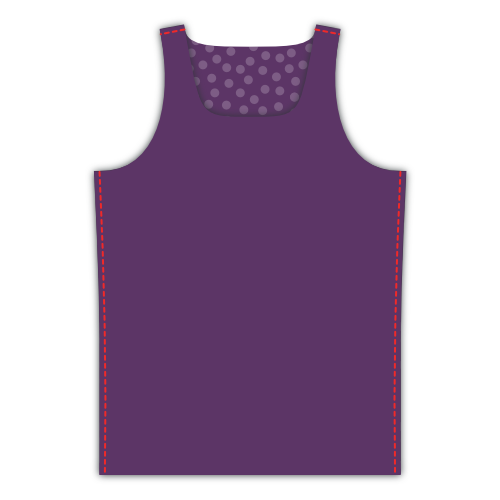
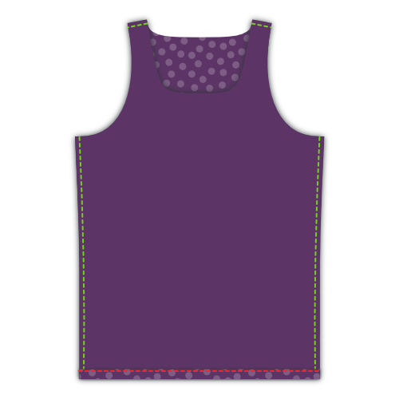
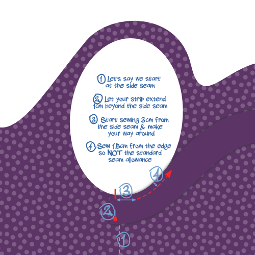
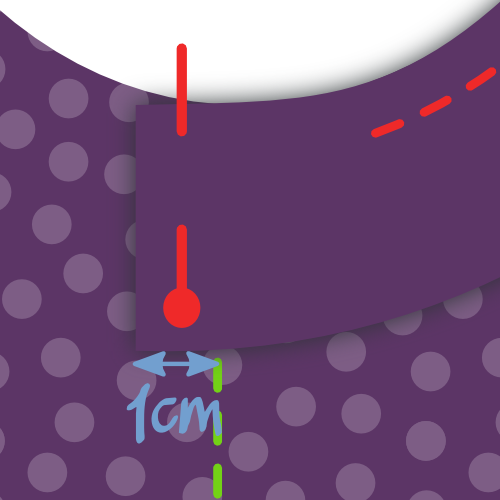
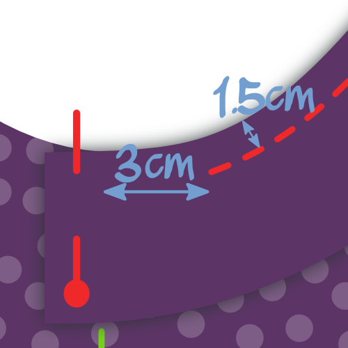
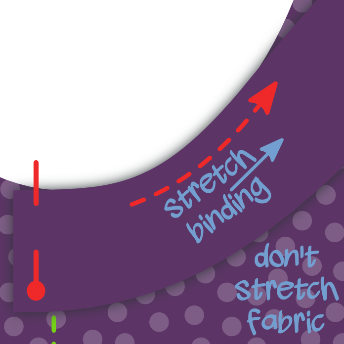
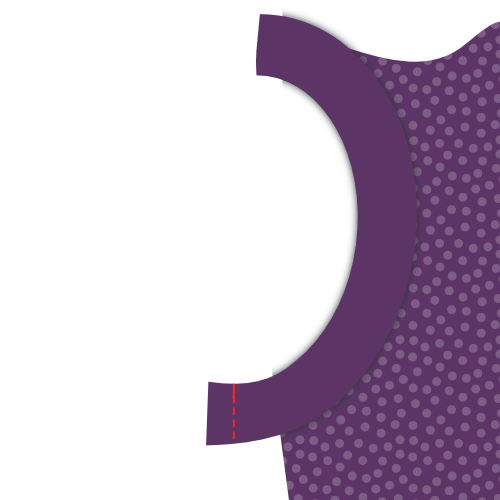
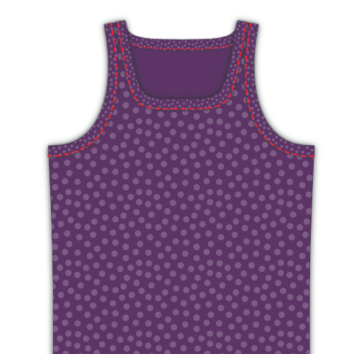
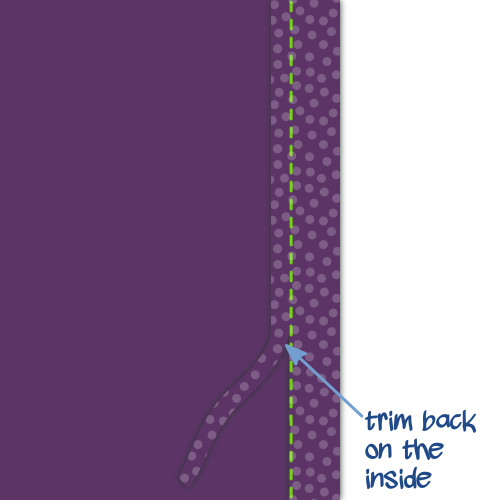

- - -
title: "Aaron A-Shirt: Nähanleitung"
- - -

## Schritt 1: Nähte schließen

Lege Vorder- und Rückseite mit den _rechten Seiten zusammen_ übereinander. Nähe die Seitennähte zusammen und die kurzen Nähte an den Schulterträgern. Wenn du eine Overlock besitzt, ist dies ein guter Moment um sie zu verwenden. Wenn nicht, versäubere deine Nähte auf eine andere Art und Weise.

## Schritt 2: Saum versäubern

Falte den Saum nach oben und nähe ihn fest. Wenn du eine Coverlock hast, verwende sie. Falls nicht, verwende eine _Zwillingsnadel_ oder einen _Zickzackstich_, um die Naht dehnbar zu halten.

<Note>

##### Nur einmal falten, um dicke Stellen zu vermeiden

Maschenware franst nicht aus, deswegen nur einmal umklappen und festnähen, danach die Nahtzugabe zurückschneiden.

</Note>

## Schritt 3: Bringe das Einfassband an der Vorderseite an

<Note>

##### Über Einfassbänder

Wenn dir [Einfassbänder](/docs/sewing/knit-binding) unbekannt sind, kannst du [diese Seite zum Thema](/docs/sewing/knit-binding) lesen.

###### Wiederhole Schritte 3 und 4 für beide Armlöcher und die Halsöffnung

Das unten beschriebene Verfahren gilt sowohl für die Armlöcher als auch für die Halsöffnung. Mit anderen Worten: Du musst das dreimal machen.

###### Beginne mit der einfachsten Öffnung

Ich würde dir anraten, mit der Öffnung zu beginnen, die die einheitlichste Krümmung hat. Standardmäßig sind dies die Armlöcher, aber wenn du die Schnittmusteroptionen geändert hast (zum Beispiel zu einem Racerback), ist dies möglicherweise nicht der Fall.

So oder so, je weniger scharfe Kurven du hast, desto einfacher wird es sein. Beginne also mit diesen, um dich an das Verfahren zu gewöhnen, bevor du dich an die komplexeren Stellen wagst.

</Note>

Wir werden die Armlöcher und die Halsöffnung mit einem [Einfassband](/docs/sewing/knit-binding) versäubern (Anmerkung: kein Bündchen. Es gibt einen Unterschied, und der wird [hier](/docs/sewing/knit-binding) erklärt).

<Note>

Dies ist der einzige Schritt beim Anfertigen dieses A-Shirts, der etwas Übung erfordert. Keine Sorge, du musst das nur ein paar Mal gemacht haben und du wirst in kürzester Zeit ein Profi sein.

</Note>

### Wähle eine Stelle

Das Erste, was wir tun müssen, ist, zu entscheiden, wo wir unser Einfassband ansetzen bzw. stoppen wollen. Ich schlage Folgendes vor:

- Für die Armlöcher: an der Seitennaht. Dies wird unsere Naht unter dem Arm verbergen
- Für die Halsöffnung: die Mitte des Halsrückens. Möglicherweise möchtest du dies mit einer Stecknadel markieren

### Platziere den Beginn deines Bandes

Lege dein A-Shirt mit der guten Seite nach oben und platzieren das Einfassband mit der guten Seite nach unten (also gute Seiten zusammen).

Lege die lange Kante deines Streifens an die Kante deines Stoffes, sodass der Streife auf dem Stoff liegt (und nicht in der Öffnung). Platziere die Ecke an deinem Startpunkt.

Schiebe nun das Einfassband 1cm über den Anfangspunkt hinweg. Dieser Zentimeter macht das spätere Zusammennähen der beiden Enden möglich.

### Vergewissere dich, dass du weißt, wo du nähen möchtest

Wir werden 1.5 cm von der Kante entfernt nähen. Sei also vorsichtig, denn dies ist nicht die reguläre Nahtzugabe.

<Tip>

Der einfachste Weg, diese 1.5 cm Distanz einzuhalten, ist mit einem Abstandhalter.
Oder mache, was ich tue: platziere ein Stück Klebeband auf deiner Nähmaschine und markiere eine Linie 1.5cm von deiner Nadel entfernt.
Dann musst du nur den Rand deines Stoffes an dieser Linie ausrichten.

</Tip>

Außerdem beginnen wir nicht bei unserem Startpunkt, sondern wir überspringen die ersten 3cm. Diesen Spielraum brauchen wir später um die Enden unserer Einfassung zu verbinden.

### Nähe das Einfassband fest

Nähe dein Einfassband fest und dehne ihn dabei, ohne den Hauptstoff zu dehnen. Pass dabei auf, die letzten 3cm nicht festzunähen, sondern lasse diese genauso übrig wie am Anfang.

Du wirst etwas Übung brauchen, um den Dreh rauszubekommen.

> Achte darauf, deinen Einfassstreifen mehr zu dehnen, wenn du eine schärfere Kurve nähst. Lies meine Anmerkungen zu [Einfassbändern](/docs/sewing/knit-binding) für weitere Informationen.

### Ende der Einfassung markieren

Es ist an der Zeit, die Enden des Bandes zusammenzunähen, bevor wir unseren Kreis mit den letzten 6cm vollenden.

Nimm eins der Enden und dehne es entlang der 3cm ab den Startpunkt, wie du es beim Nähen tun würdest.

Markiere die Einfassung, wo sie den Startpunkt erreicht. Tu das Gleiche für das andere Ende.

### Nähe den Einfassstreifen zusammen

Falte dein A-Shirt so, dass es am einfachsten ist die guten Enden des Einfassbandes mit rechts auf rechts an der Markierung zusammenzubringen. Nähe die Einfassstreifen auf der Markierung zusammen.

> 6 cm sind nicht viel, aber sollte ausreichen, um beide Enden bequem mit der Nähmaschine zusammen zu nähen.

### Beende die letzten 6 cm Bindung

Jetzt wo die Enden deines Einfassbands verbunden sind, ist es an der Zeit, die letzten 6cm zu nähen. Nähe das Band fest, mit 1.5cm Abstand zur Kante wie bisher.

## Schritt 4: Falte den Einfassstreifen nach hinten und nähe ihn fest.

### Falte deine Bindung über die Stoffkante auf die Rückseite

Falte den Einfassstreifen um den Hauptstoff deines A-Shirts nach hinten. So nähen wir es jetzt fest.

> Während der Stoff doppelt geklappt ist (Verstecke den Stoffrand im Prozess), ist das auf der Rückseite nicht nötig. Wir werden später nur noch den Rand zurückschneiden, da der Strickstoff nicht ausfranst. Wenn wir den Stoff auch auf der Rückseite umschlagen würden, würde es zu dick werden.

### Nähe dein Einfassband fest

Von der rechten Seite des Stoffes nähst du entlang der Innenkante deines Einfassbandes entlang (am weitesten von der Kante entfernt), während du darauf achtest, das Band auf der Rückseite mitzunähen.

<Note>

Wenn Sie eine Coverlock Maschine haben, wäre das perfekt für diese Naht

</Note>

Du musst deine Einfassung noch einmal etwas dehnen, während du dies tust. Dieses Mal gibt es eine zusätzliche Sache zu beachten.

<Note>

##### Vorsicht vor dem ungleichmäßigen Transport

Während du deine Einfassung annähst, zieht der Transporter der Nähmaschine die untere Schicht (also den Einfassstreifen unten) schneller vorwärts.

In einer perfekten Welt werden alle Stofflagen gleichmäßig transportiert.
In den meisten Fällen hinkt die obere Stofflage (vordere Seite deiner Einfassung) ein bisschen hinterher.
Dadurch legt sich das Einfassband nicht sauber um den Stoffrand, sondern erzeugt hässliche Falten.

Also achte darauf, und wenn du das siehst, dehne die untere Schicht ein bisschen mehr um das zu kompensieren.

</Note>

## Schritt 5: Einfassstreifen innen einkürzen

Schneide deine Einfassung auf der Innenseite deines A-Shirts entlang der Naht zurück.

<Note>

Achte darauf, kein Loch in dein A-Shirt zu schneiden. Im Ernst, das ist mir mehr als einmal passiert.

</Note>

