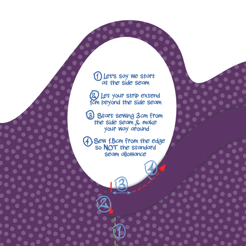
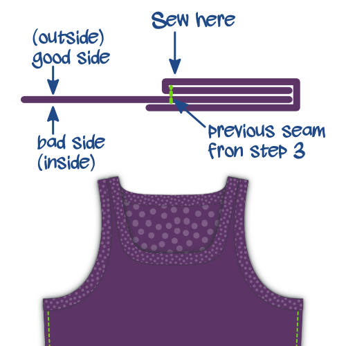

## Step 1: Close seams

Put front and back on top of each other with _good sides together_.
Sew the side seams and the short seams at the shoulder straps. If you have a serger, this is a good moment to use it. If not, finish your seams otherwise.

## Step 2: Finish hem

Fold the hem upwards, and sew it down. If you have a coverlock, use it. If not, use a _twin needle_ or _zig-zag stitch_ to keep the seam stretchable.

<Note>

##### Fold only once, to avoid bulk

Knitwear doesn't ravel, so you can simply fold this over once and sew it down, then neatly trim back the fabric.

</Note>

## Step 3: Sew knit binding to the front

<Note>

##### About knit binding

If you are new to [knit binding](/docs/sewing/knit-binding), you might read [this page on the subject](/docs/sewing/knit-binding).

###### Repeat steps 3 and 4 for both armholes and the neck opening

The procedure outlined below applies to both of the armholes as well as the neck opening. In other words, you'll have to do this three times.

###### Start with the simplest opening

I would advise you to start with whatever opening has the most uniform curvature. By default, those are the arm holes, but if you changed the pattern options (think racerback) that might not be the case.

Either way, the less sharp bends you have, the easier it will be. So start with that to warm up before you do the trickier bends.

</Note>

We are going to finish the arm and neck hole with [knit binding](/docs/sewing/knit-binding)
(note: not a knit band. There's a difference, and it's explained [here](/docs/sewing/knit-binding)).

<Note>

This is the only part of making this A-shirt that requires a bit of practice. Don't worry, all you need to do is make a couple of these and you'll be a pro in no time.

</Note>

### Pick your spot

The first thing we need to do is decide where we are going to start/stop our binding. Here's what I suggest:

- For the armholes: at the side seam. This will hide our seam under the arm
- For the neck opening: the center back of the neck. You might want to mark this with a pin

### Place (the start of) your binding

Put your A-shirt down with the good side up, and place your binding strip on top of it with the good side down (as in, good sides together).

Align the long edge of your strip with the edge of your fabric so the strip lies on top of the fabric (not in the opening). Place the corner on your starting point.

Now shift your binding strip 1cm beyond your starting point. This little extra will guarantee we can join the two ends later.

### Make sure you know where to sew

We are going to sew 1.5cm from the edge. So be careful because this is not the standard seam allowance.

<Tip>

The easy way to keep this 1.5cm distance is by using a seam gauge.
Or do what I do, place a piece of marking tape on your sewing machine and mark a line on it 1.5cm from your needle.
Then all you need to do is keep the edge of your fabric aligned with that line.

</Tip>

Also, we are not starting at our start point, but we skip the first 3cm. We'll need this wiggle room later to join the ends of our binding.

### Sew binding in place

Sew your binding in place while gently stretching the binding, but not the fabric. Make sure not to sew the last 3cm but leave them, just as you did at the start.

You might need to practice a bit to get the hang of it.

> Make sure to stretch your binding more when you're taking a sharper bend.
> Read my notes on [knit binding](/docs/sewing/knit-binding) for more info.

### Mark binding ends

With about 6cm left to go before we complete our circle, it's time to sew the ends of the binding together.

Take one of the edges, and stretch it along the 3cm seperating it from the start point as you would while sewing.

Mark the binding where it reaches the start point. Do the same for the other end.

### Sew binding ends together

Fold your A-shirt in whatever way makes it easier for you to place both binding ends with good sides together, aligning the marks. Sew them together on the mark.

> 6 cm is not much, but should be enough to get both edges comfortably under your sewing machine to sew them togther.

### Finish last 6cm of binding

Now that your binding ends are joined together, it's time to finish the last 6cm of binding. Sew it down, staying 1.5cm from the edge as you did before.

## Step 4: Fold knit binding to the back and sew down

### Fold your binding over the fabric edge to the back

Fold your binding fabric around the fabric of your A-shirt to the back. This is how we'll sew it down.

> While the fabric is folded double at the front (hiding the fabric edge in the process) there's no need for that at the back. We will merely trim back the edge later, given that knit doesn't ravel. If we were to fold back the fabric at the back too, it would only add bulk.

### Sew your binding down

From the right side of your fabric, sew along the inner edge of your binding (furthest from the edge), making sure to catch the binding at the back in the process.

<Note>

If you have a coverlock machine, that would be perfect for this seam

</Note>

You'll have to, once again, stretch your binding a bit while doing this. But this time, there's an extra caveat to look out for.

<Note>

##### Beware of the uneven feed

As you feed your binding through your sewing machine, the feed dogs will pull the bottom layer (back of your binding) forward.

In a perfect world, all layers will follow smoothly.
But more often than not, the top layer (front of your binding) tends to lag behind a bit.
This causes your binding to not neatly fold around the edge of the fabric, but make ugly wrinkles.

So watch out for this, and if you see it happening, stretch the under-layer a bit extra to compensate.

</Note>

## Step 5: Trim back knit binding on the inside

On the inside of your A-shirt, trim back the knit binding against your seam to finish up.

<Note>

Be careful not to cut a hole in your A-shirt. Seriously, this happened to me on more than one occasion.

</Note>

