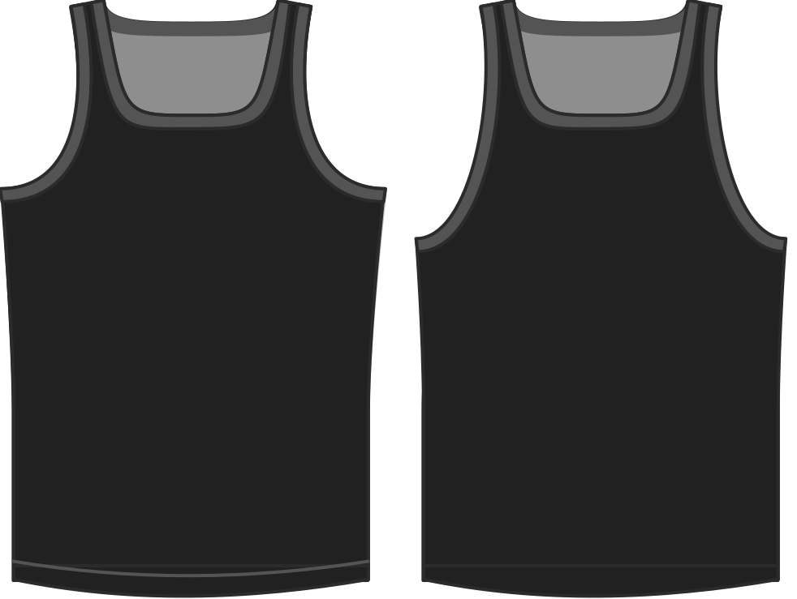

Cuánto bajar la armadura por debajo de la cantidad predeterminada.

> Esta opción también permite valores negativos. Evidentemente, levantarán el agujero en dicha cantidad.

## Efecto de esta opción en el patrón

