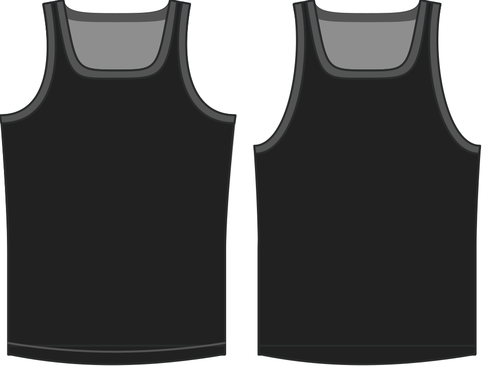

How much to lower the armhole below the default amount.

> This option also allows negative values. They will, obviously, raise the armhole by said amount.

## Effect of this option on the pattern

