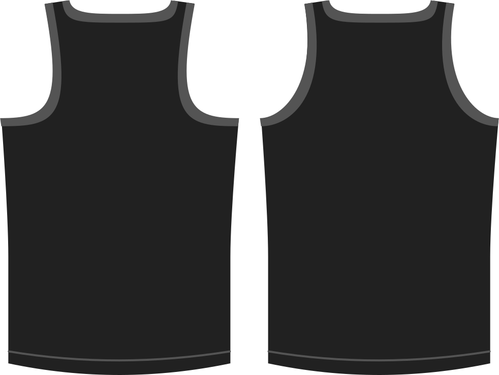

Détermine la courbure de l'emmanchure dans le dos. En d'autres termes, il s'agit de l'ampleur de la découpe de l'ouverture sur votre dos.

> Des valeurs plus élevées courbent davantage les emmanchures, ce qui donne plus un style de dos nageur.

## Effet de cette option sur le motif

