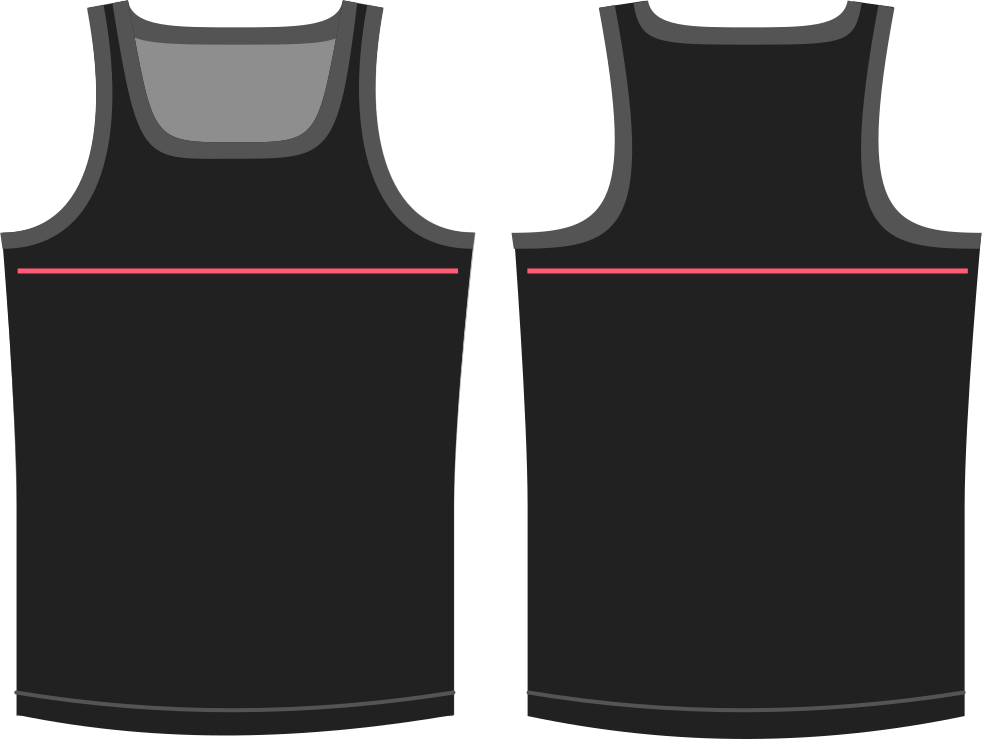

How much room do you want at the chest?

Whatever value you provide here will simply be added to your chest circumference measurement when drafting the garment.

> Dado que una camisa subterránea no tiene armas, un poco de facilidad de pecho va muy lejos. Agrega demasiado, y terminarás con agujeros de armadura.

> ##### Esta opción también permite valores negativos
> 
> Sólo debe utilizar la facilidad negativa si está utilizando un material estirado que desea encajar con fuerza. El stream general debe configurarse con la opción de **estiramiento**.

## Efecto de esta opción en el patrón

