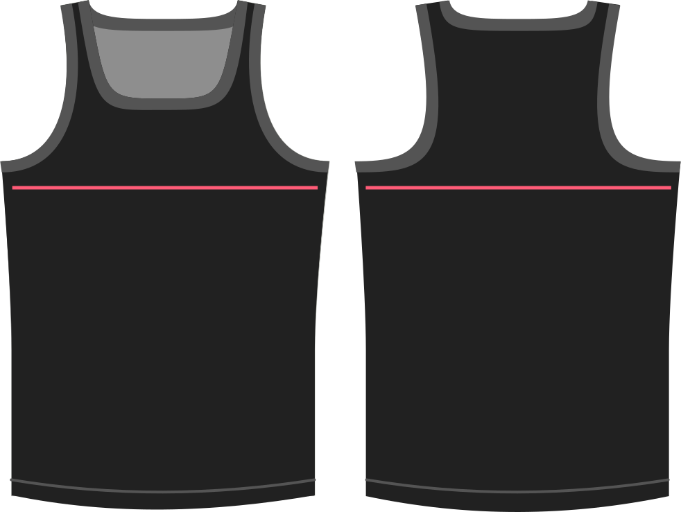

How much room do you want at the chest?

Whatever value you provide here will simply be added to your chest circumference measurement when drafting the garment.

> Aangezien het hemdje geen mouwen heeft heb je niet veel extra ruimte nodig. Als je te veel toevoegt riskeer je te eindigen met gapende armsgaten.

> ##### Deze optie laat ook negatieve waarden toe
> 
> Pas alleen negatieve waarden toe als je elastisch materiaal gebruikt en wil dat het aansluitend past. Algemene stretch zou moeten aangepast worden met de **stretch** optie.

## Effect van deze optie op het patroon

