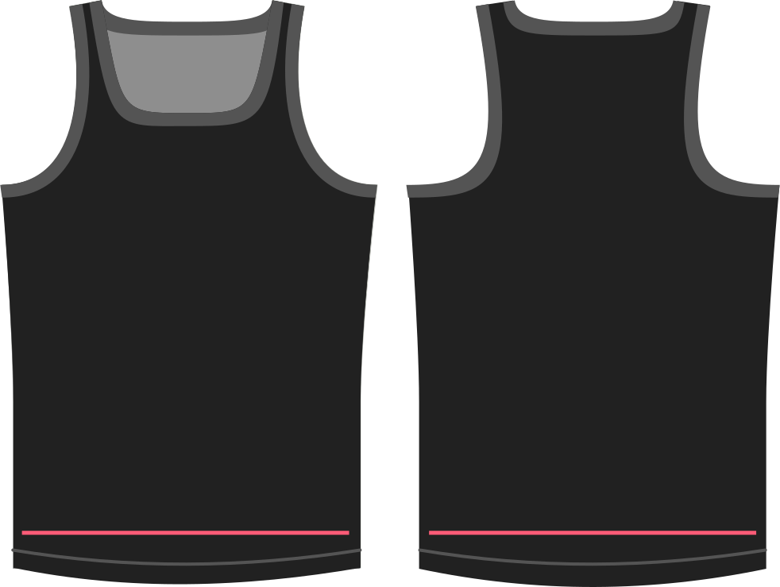

- - -
title: "Hips ease"
- - -

Hoeveel ruimte wil je aan je heupen?

De waarde die je hier geeft wordt toegevoegd aan je heupomtrek bij het tekenen van het patroon.

> ##### Deze optie laat negatieve waarden toe.
> 
> Pas alleen negatieve waarden toe als je elastisch materiaal gebruikt en wil dat het aansluitend past. Algemene stretch moet worden geconfigureerd met de optie stretch.

## Effect van deze optie op het patroon

