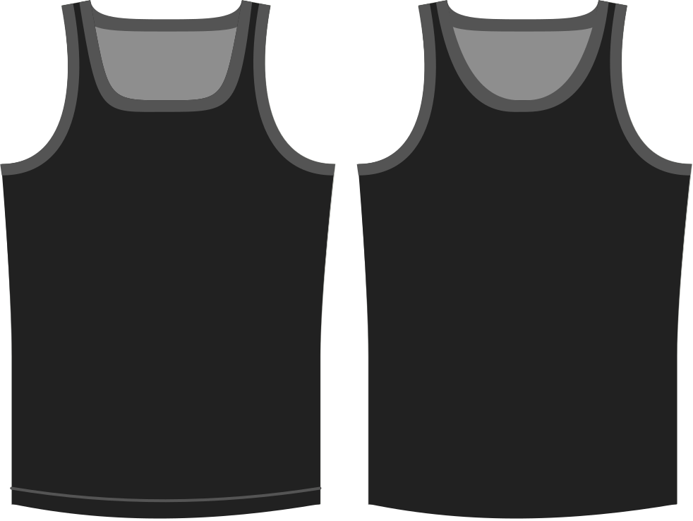

- - -
title: "Neckline shape"
- - -

Bepaalt de curve van de voorkant van de halsopening.

> Hogere waarden buigen de halslijn meer, wat resulteert in een eerder vierkante opening.

## Effect van deze optie op het patroon

