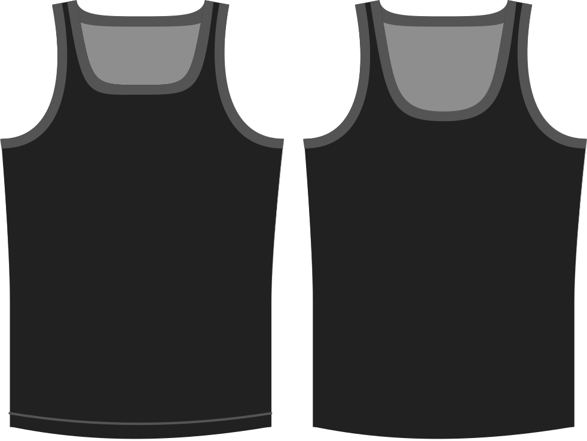

- - -
titre : "Profondeur du décolleté"
- - -

Détermine jusqu'où abaisser l'encolure par rapport à la valeur par défaut.

> Des valeurs plus élevées abaissent davantage l'encolure, ce qui a pour effet de rendre la peau plus exposée.

## Effet de cette option sur le motif

