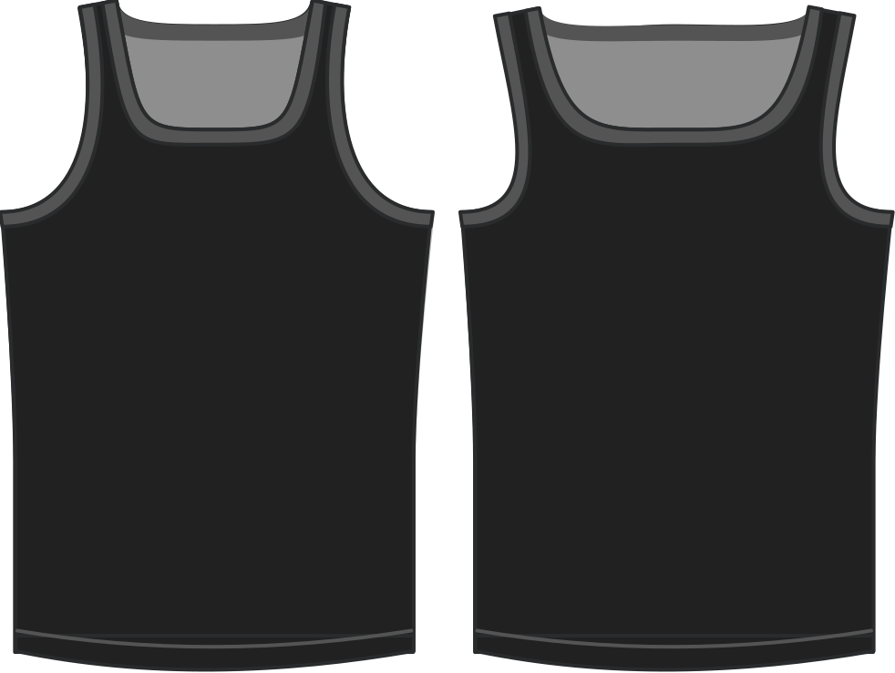

Bepaalt de positie van de schouderband op de schouder.

> Lagere waarden plaatsen de schouderbanden dichter bij de nek, hogere waarden plaatsen ze dichter bij de schouder.

## Effect van deze optie op het patroon

