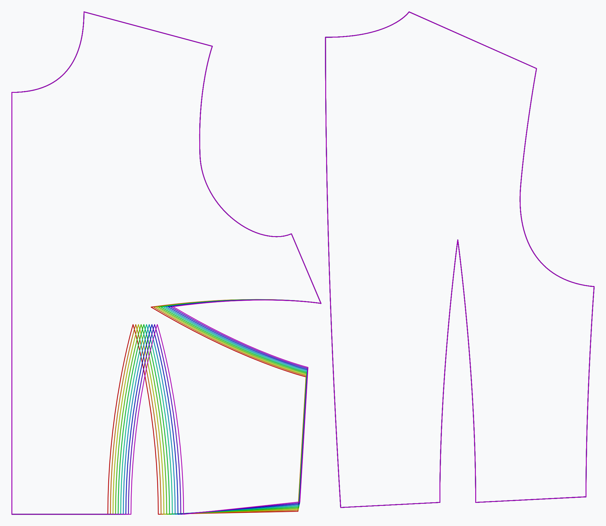

***

De **bustewijdte overwijdte** optie bepaalt hoeveel overwijdte wordt toegepast op de bustewijdte.

<Note>Dit maakt het kledingstuk niet gemakkelijker, maar beïnvloedt alleen het bustepunt</Note>

## Effect van deze optie op het patroon

