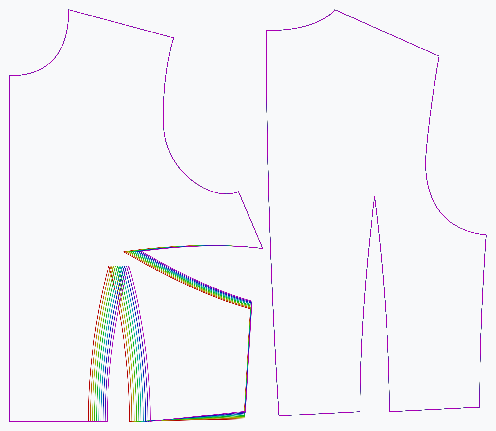

***

The **bust span ease** option controls how much ease is applied to the bust span.

<Note>This will not add ease to the garment, but merely influence the bust point</Note>

## Effect of this option on the pattern

