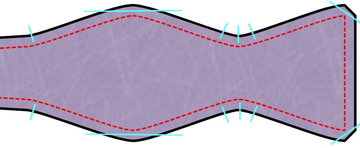

## Anmerkungen und Hinweise

### Präzision

Da eine Fliege eher klein ist, ist Präzision beim Nähen der Schlüssel zu einem guten Ergebnis. Jeder leichte Unterschied zwischen dem oberen und unteren Teil der Schleife wird hervorstechen. Um gute Ergebnisse zu erzielen, fand ich es immer sehr hilfreich, die Nahtlinie auf die Einlage zu übertragen und dieser beim Nähen zu folgen.

### Setze das Bügeleisen weise ein

In späteren Konstruktionsschritten wirst du aufgefordert, deinen Stoff zu bügeln. Sei dabei bitte vorsichtig, damit du deinen womöglich empfindlichen Stoff nicht zu viel Hitze aussetzt.

Es ist immer eine gute Idee, dein Bügeleisen auf ein paar Stoffresten zu testen. Dies erlaubt dir, die richtigen Hitzeeinstellungen für den verwendeten Stoff zu finden.

### Fadenlauf wählen

Dieses Schnittmuster enthält einen Fadenlauf. Der Fadenlauf ist hier größtenteils dafür gedacht, um mit der Einlage verwendet zu werden. Da jedes Teil des Schnittmusters mit Einlage versehen wird, ist der Fadenlauf des Oberstoffes nicht so wichtig. Du kannst hier auch vom Standard abweichen, um einen informelleren Eindruck zu erzeugen.

<Note>

Wenn das alles sehr verwirrend klingt, empfehle ich dir, die Hilfeseite
zum Thema [Stoffmaserung] (/docs/sewing/fabric-grain) zu lesen.

</Note>

### Band und Beschläge zur Einstellung der Fliege

Standardmäßig macht dieses Design eine Fliege mit fester Länge, die die richtige Länge für eine bestimmte Halsgröße hat. Wenn du jedoch die Option Anpassungsband aktivierst, kannst du auch eine Krawatte erstellen, die ein Anpassungsband und Beschläge verwendet, mit denen sich die Fliege an verschiedene Halsgrößen anpassen lässt. Das ist sehr nützlich, wenn deine Hemden nicht alle dasselbe Halsmaß/Kragenweite haben oder wenn du manchmal gerne Hemden trägst, die etwas mehr Zugabe am Hals haben.

Diese Anpassungsbänder und Fliegenhalter findest du in den besseren Kurzwarenläden oder kannst sie online bestellen.

<Note>

Diese Anleitung bezieht sich auf die Art von Verstellband, das in regelmäßigen Abständen mit
Löchern versehen ist. Es wird in Kombination mit dem zweiteiligen
Beschlag verwendet, der aus einem ovalen Schlaufenteil und einem Teil mit einer kleineren Schlaufe
und einem angebrachten T-förmigen Haken besteht.

Es gibt noch andere Arten von Fliegenbändern und Beschlägen, aber ihre Verwendung liegt
außerhalb des Rahmens dieser Anleitung.

</Note>

### Nahtzugabe

Da die Fliege mit den rechten Seiten des Stoffes zueinander konstruiert wird, muss das Ganze am Ende von innen nach außen gedreht werden. Du solltest vielleicht erwägen, eine kleinere Nahtzugabe wie 6mm (¼ inch) zu verwenden, um die Menge an Stoff zu reduzieren.

## Konstruktion

### Schritt 1: Einlage einsetzen

Bringe Einlage an allen Teilen an, wo du sie für notwendig hältst.

### Ohne Einstellband

#### Schritt 2: Nähen Sie die Schleife an das Kragenband

Lege eines der Kragenbandteile auf eines der Schleifenteile, rechts auf rechts. Richte die Enden beider Stücke aus. Nähe nun über das Ende um beide Teile zusammenzufügen.

Auf ähnliche Weise nähst du ein zweites Schleifenteil an das andere Ende desselben Kragenbandes.

Wiederhole diese Schritte, um die anderen 2 Schleifen an das andere Kragenband zu nähen.

Alle Nähte außeinander bügeln.

Nun hast du zwei identische einseitige Fliegen.

#### Schritt 3: Beide Seiten zusammenfügen

Lege beide Seiten aufeinander, rechte Seiten zusammen. Näht alle entlang der Kanten, lasst aber in der Mitte des Kragenbandes einen Bereich von 5 cm offen. Durch diese Öffnung werden wir die Fliege auf rechts wenden.

#### Schritt 4: Wenden

Schneide die Nahtzugabe an den üblichen Stellen zurück und mache kleine Schnitte, um glatte Kurven zu ermöglichen.

Verwende dann das hintere Ende einer großen Häkelnadel oder ein anderes, angemessen langes und schmales Objekt, um beide Seiten durch die kleine Öffnung auf rechts zu wenden. Beginne damit, die beiden Stoffteile am Ende der Schleife sanft auseinanderzuziehen. Dann drücke das Ende der Schleife zwischen die beiden Stoffteile. Drücke vorsichtig weiter, während du den Rest der Fliege über sie hinweg ziehst. Das kann ein mühsamer Prozess sein. Lass dir Zeit und sei behutsam. Es passiert schnell zu fest zu schieben und dadurch Nähte oder Stoff zum Reißen zu bringen.

Sobald du die Fliege auf rechts gewendet hast, drücke alle Ecken und Kanten nach außen bevor du die Fliege bügelst.

#### Schritt 5: Schließen

Jetzt muss nur noch das kleine Loch geschlossen werden, mit dem wir die Fliege auf die richtige Seite gedreht haben. Du kannst dies per Hand mit einem Leiterstich oder einem Blindstich tun. Oder du nimmst die Maschine und nähst direkt an der Kante des Bandes entlang. Da diese Stelle normalerweise vom Kragen deines Hemdes verdeckt wird, wird es nicht so auffallen.

Bügel die Fliege nun ein letztes Mal und bewundere deine Arbeit.

### Mit Anpassungsband

#### Schritt 2: Das Band anfügen

Als Erstes nähst du das Anpassungsband an das Short Bow Teil. Das Band sollte 290mm lang sein. Wenn es eine andere Länge hat, musst du sicherstellen, dass du es so ausrichtest, dass das Band und das kurze Schleifenteil zusammen so lang sind wie das lange Schleifenteil.

Lege die rechte Seite der kurzen Schleife und des Bandes zusammen.

Nähe nun über das Ende um beide Teile zusammenzufügen.

#### Schritt 3: Beide Seiten zusammenfügen

Lege die beiden Teile der mittleren Schleife rechts auf rechts übereinander.

Nähen Sie entlang der Kanten, aber lassen Sie das kurze Ende offen. Durch diese Öffnung drehen wir das Fliegenteil auf die rechte Seite.

Lege die lange Schleife auf das Band und den Teil der kurzen Schleife, ebenfalls mit der rechten Seite zusammen.

Auch hier nähst du an den Kanten entlang und lässt das kurze Ende offen.

#### Schritt 4: Wenden

Schneide die Nahtzugabe an den üblichen Stellen zurück und mache kleine Schnitte, um glatte Kurven zu ermöglichen.

Verwende dann das hintere Ende einer großen Häkelnadel oder ein anderes, angemessen langes und schmales Objekt, um beide Teile durch die Enden auf rechts zu wenden. Beginne damit, die beiden Stoffteile am Ende der Schleife sanft auseinanderzuziehen. Dann drücke das Ende der Schleife zwischen die beiden Stoffteile. Drücke vorsichtig weiter, während du den Rest der Fliege über sie hinweg ziehst. Das kann ein mühsamer Prozess sein. Lass dir Zeit und sei behutsam. Es passiert schnell zu fest zu schieben und dadurch Nähte oder Stoff zum Reißen zu bringen.

Sobald du ein Teil auf rechts gewendet hast, drücke alle Ecken und Kanten nach außen bevor du die Fliege bügelst.

Mache dies mit beiden Teilen.

#### Schritt 5: Zubehör hinzufügen

Jetzt müssen wir die beiden Zubehörteile anbringen, die die Fliege einstellbar machen. Das ovale Schlaufenstück wird an dem Teil ohne das Anpassungsband befestigt. Und das Teil mit dem T-Haken kommt auf das Teil mit dem Band.

Befestige zunächst das Stück ohne die Schleife. Das liegt daran, dass das Stoffende des Schleifenstückes durch die ovale Öffnung passen muss, bevor wir das Zubehör annähen. Wenn du die Reihenfolge änderst, könnte es nicht mehr hindurchpassen.

Um die Enden abzuschließen, falten wir den Stoff in drei Schritten, , bevor wir ihn in einem vierten Schritt vernähen:

1. Zuerst falten wir die Seiten schräg nach innen.
2. Dann falten wir das Ende mit einer kleinen Nahtzugabe um, etwa 5 mm.
3. Dann falten wir es wieder um, etwa 1 cm lang.
4. Zum Schluss steckst du die ovale Schlaufe unter diese letzte Falte und nähst quer.

Führe nun das Stück Anpassungsband durch die ovale Schlaufe und befestige den T-Haken am Ende des Bandes, indem du es auf die gleiche Weise nähst.

Hake das T in einer der Verstelllöcher fest und deine Fliege ist fertig!

