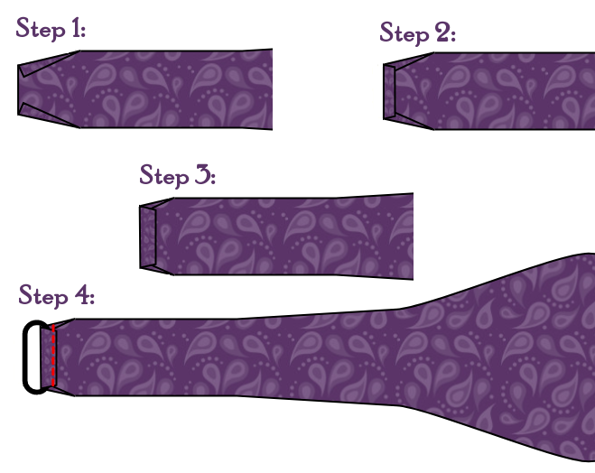

- - -
title: "Benjamin bow tie: Sewing Instructions"
- - -

## Notas y consejos

### Precisión

Since a bow tie is a rather small item, precision with sewing is key to a good result. Cualquier ligera diferencia entre la parte superior e inferior del arco se destacará. To get a great result I found it very helpful to trace the actual seam lines onto the interfacing and follow that while sewing.

### Presione sabiamente

Más adelante en las etapas de construcción, se le pedirá que pruebe su tejido. Please be careful that you are not using too much heat on a delicate fabric that can't handle it.

Es una buena idea intentar presionar algunos restos de tela antes de empezar. This will allow you to figure out what is a good heat setting for the fabric you are using.

### Eligiendo tu grano

Este patrón incluye una línea de grano. This grain line is mostly there to be used with the interfacing. Since each pattern piece is interfaced, the grain line of the fabric itself is not so important. You can even change this from the standard for more informal impressions.

<Note>

If this all sounds very confusing, might I suggest reading the help
page on [Fabric grain](/docs/sewing/fabric-grain).

</Note>

### Bow tie adjustment ribbon and hardware

By default, this design makes a fixed-length bow tie that is the right length for a certain neck size. However, by enabling the Adjustment Ribbon option, it can also make a tie that uses an adjustment ribbon and hardware that makes the bow tie adjustable to different neck sizes. This is useful if not all of your shirts have the same neck measurements, or if you sometimes like shirts with more ease in the neck.

These adjustment ribbons and bow tie hardware can be found in the better haberdasheries or can be ordered online.

<Note>

These instructions are for the type of adjustment ribbon that comes with
holes at regular intervals, to be used in combination with two-piece
hardware consisting of an oval loop part and a part with a smaller loop
and attached T-shaped hook.

There are other styles of bow tie ribbons and hardware, but their use is
outside the scope of these instructions.

</Note>

### Margen de costura

Since the bow tie is constructed with the right sides of the fabric against each other, the whole thing will have to be turned inside out. You probably want to consider using a small seam allowance of 6mm (¼ inch) to reduce the bulk.

## Construcción

### Paso 1: Aplicar interfaz

Aplicar interfaz a todas las partes donde sientes que es necesario.

### Sin cinta de ajuste

#### Step 2: Sew the bow to the collar band

Put one of the Collar Band parts on one of the Bow parts, right sides together. Alinear los extremos de ambas partes. Ahora coser a lo largo del extremo para unirse a las partes.

In a similar fashion, sew a second Bow part to the other end of the same Collar Band.

Repeat these steps to sew the other 2 Bows to the other Collar Band.

Pulse Abrir todas las costuras.

Ahora tienen dos idénticos lazos de un solo lado con un solo lado.

#### Paso 3: Unirse a ambos lados

Diga ambos lados que usted hizo sobre el otro, derecha juntos juntos. Sew all along the edges, but leave an area of 5 cm open in the middle of the collar band. Through this opening we will turn the bow tie right side out.

#### Paso 4: girando

Clip the seam allowance back in the usual spots and make little cuts to allow for a smooth curves.

Then use the back of a large crochet hook, or some other appropriately long skinny object, to turn the two sides right-side-out through the little opening. Start by gently pulling the two fabric pieces at the end of the bow apart. Then push the end of the bow up between the two pieces of fabric. Keep gently pushing while pulling the rest of the tie down over it. Este puede ser un procedimiento tedioso. Take your time and be gentle. Es fácil empujar demasiado duro y rasgar las cintas o tejidos.

Once you have the tie right side out, make sure you push all the corners and sides out before giving it a good press.

#### Paso 5: Cerrando

Now all that is left is closing the little hole we used to turn the bow tie right side out. Puedes hacer esto a mano con una banda de deslizamiento, o una banda de escalera. O puede usar la máquina y doblar a la derecha en el borde de la banda. Since this will normally be hidden by the collar of your shirt, it will not be all that obvious.

Ahora dale una última prensa y admira su trabajo.

### Con cinta de ajuste

#### Paso 2: Adjuntar la cinta

The first thing to do is to sew the adjustment ribbon to the Short Bow part. La cinta debe ser de 290mm de largo. If it is different, you have to make sure that you align it such that the ribbon and short bow piece together are as long as the long bow piece.

Put right sides of the Short Bow piece and the ribbon together.

Ahora coser a lo largo del extremo para unirse a las partes.

#### Paso 3: Unirse a ambos lados

Lay both of the Medium Bow parts on top of each other, right sides together.

Sew all along the edges, but leave the short end open. Through this opening we will turn the bow tie part right side out.

Lay the Long Bow on top of the ribbon and Short Bow part, also right sides together.

Again, sew all along the edges, leaving the short end open.

#### Paso 4: girando

Clip the seam allowance back in the usual spots and make little cuts to allow for a smooth curves.

Then use the back of a large crochet hook, or some other appropriately long skinny object, to turn the two parts right-side-out through the ends. Start by gently pulling the two fabric pieces at the end of the bow apart. Then push the end of the bow up between the two pieces of fabric. Keep gently pushing while pulling the rest of the tie down over it. Este puede ser un procedimiento tedioso. Take your time and be gentle. Es fácil empujar demasiado duro y rasgar las cintas o tejidos.

Once you have the part right side out, make sure you push all the corners and sides out before giving it a good press.

Hágalo con ambas partes.

#### Paso 5: Añadir hardware

Ahora tenemos que añadir las dos piezas de hardware que hacen que la corbata del arco sea ajustable. The oval loop piece will be attached to the part without the adjustment ribbon. And, the piece with the T-hook will go on the part with the ribbon.

Primero hacer la parte sin el ribbon. This is because the fabric tail of the ribbon piece will have to go through the oval part before sewing on its hardware. Si lo haces en la otra secuencia, es posible que no puedas alimentarlo.

To finish the ends, we're going to fold the fabric in three steps, before sewing it in a fourth step:

1. First we fold the sides in at an angle.
2. Then we fold the end over by just a small seam allowance, something like 5 mm.
3. Then we fold it over again, for about 1 cm.
4. Finally we stick the oval loop under this last fold and stitch across.

Now feed the adjustment ribbon piece through the oval loop, and attach the T-hook to the end of the ribbon, sewing it in the same way.

¡Gana la T en uno de los agujeros de ajuste y tu corbata de arco se hace!

