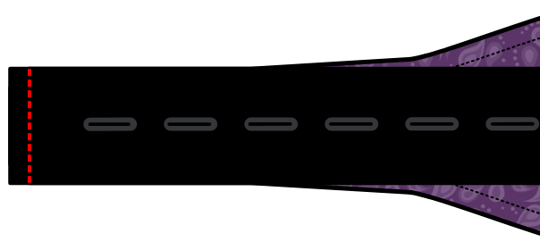

## Notes et conseils

### Précision

Le nœud papillon étant un objet plutôt petit, la précision de la couture est essentielle pour obtenir un bon résultat. Toute légère différence entre la partie supérieure et la partie inférieure du nœud se verra. Pour obtenir un excellent résultat, j'ai trouvé très utile de tracer les lignes de couture sur l'entoilage et de les suivre pendant la couture.

### Repassez judicieusement

Plus loin dans les étapes de construction, on vous demandera de repasser votre tissu. Faites attention à ne pas utiliser trop de chaleur sur un tissu délicat qui pourrait ne pas le supporter.

C'est une bonne idée de faire des essais sur quelques morceaux de tissu avant de commencer. Cela vous permettra de déterminer le bon réglage de chaleur pour le tissu que vous utilisez.

### Déterminez le sens du tissu

Ce patron comprend un sens de droit fil. Ce droit fil est principalement là pour être utilisé avec l'entoilage. Puisque chaque pièce de patron est entoilée, le droit fil du tissu lui-même n'est pas si important. Vous pouvez même changer cela du standard pour un effet plus original.

<Note>

Si tout cela semble très confus, puis-je suggérer de lire la page d'aide 
sur [le droit fil de tissu](/docs/sewing/fabric-grain).

</Note>

### Ruban d'ajustement du nœud papillon et quincaillerie

Par défaut, ce modèle produit un nœud papillon de longueur fixe, adapté à un certain tour de cou. Cependant, en activant l'option Ruban d'ajustement, on peut également faire un lien qui utilise un ruban d'ajustement et des accessoires qui permettent d'ajuster le nœud papillon à différentes tailles de cou. Ceci est utile si toutes vos chemises n'ont pas les mêmes mesures de cou, ou si vous portez parfois des chemises avec plus d'aisance au cou.

Ces rubans d'ajustement et ces accessoires pour nœuds papillon se trouvent dans les meilleures merceries ou peuvent être commandés en ligne.

<Note>

Ces instructions s'appliquent au type de ruban de réglage fourni avec
trous à intervalles réguliers, à utiliser en combinaison avec un matériel en deux parties
composé d'une partie à boucle ovale et d'une partie à boucle plus petite
et d'un crochet en forme de T.

Il existe d'autres styles de rubans de nœuds papillon et de matériel, mais leur utilisation n'entre pas dans le cadre de ces instructions.

</Note>

### Marge de couture

Puisque le nœud papillon est construit avec le tissu endroit contre endroit, tout l'ouvrage devra être retourné. Vous voulez probablement envisager d'utiliser une petite marge de couture de 6 mm (¼ pouces) pour réduire les surépaisseurs.

## Montage

### Étape 1 : Thermocoller l'entoilage

Appliquez de l'entoilage sur les pièces où vous pensez que c'est nécessaire.

### Sans ruban d'ajustement

#### Étape 2 : Coudre le nœud au col

Placez l'une des parties de la bande de col sur l'une des parties du nœud, endroit contre endroit. Alignez les extrémités des deux parties. Maintenant coudre à travers les extrémités pour rejoindre les pièces.

De la même manière, cousez un deuxième nœud à l'autre extrémité de la même bande de col.

Répétez ces étapes pour coudre les deux autres nœuds à l'autre bande de col.

Ouvrez toutes les coutures au fer à repasser.

Vous avez maintenant deux nœuds papillon identiques à une seule face.

#### Étape 3 : Assemblez les deux côtés

Posez les deux côtés que vous avez fabriqués l'un sur l'autre, endroit contre endroit. Coudre tout le long des bords, mais laissez une zone de 5 cm ouverte au milieu de la bande de col. A travers cette ouverture, nous retournerons le nœud papillon sur l'endroit.

#### Étape 4 : Retourner

Couper le surplus de couture aux endroits habituels et faire de petites coupes pour permettre de réaliser des courbes douces.

Utilisez ensuite le dos d'un grand crochet, ou un autre crochet suffisamment long et fin. pour retourner les deux côtés à l'endroit par la petite ouverture. Commencer par séparer délicatement les deux pièces de tissu à l'extrémité du nœud. Poussez ensuite l'extrémité du nœud entre les deux morceaux de tissu. Continuez à pousser doucement pendant que vous tirez en coulissant sur le reste de l'ouvrage. Cette manœuvre peut être un peu fastidieuse. Prenez votre temps et soyez délicat. C'est facile de pousser trop fort et de déchirer les points ou le tissu.

Une fois notre ouvrage sur l'endroit, assurez-vous de pousser tous les coins et côtés avant de lui donner un bon coup de fer.

#### Étape 5 : Fermeture

Il ne reste plus qu'à refermer le petit trou que nous avons utilisé pour retourner le nœud papillon à l'endroit. Vous pouvez le faire à la main avec un point de couture invisible. Ou vous pouvez utiliser la machine et coudre au point droit au bord de la bande (couture nervure). Puisque ce sera normalement caché par le col de votre chemise, ce ne sera pas très visible.

Maintenant donnez-lui un dernier coup de fer et admirez votre travail.

### Avec ruban d'ajustement

#### Étape 2 : Attacher le ruban

La première chose à faire est de coudre le ruban d'ajustement à la partie du nœud court. Le ruban doit faire 290 mm de long. Si c'est différent, vous devez vous assurer de l'aligner de telle sorte que le ruban et la pièce courte du nœud ensemble sont aussi longs que la pièce longue du nœud.

Assemblez les côtés droits du nœud court et du ruban.

Maintenant coudre à travers les extrémités pour rejoindre les pièces.

#### Étape 3 : Assemblez les deux côtés

Posez les deux parties du nœud moyen l'une sur l'autre, endroit contre endroit.

Cousez tout le long des bords, mais laissez l'extrémité la plus courte ouverte. Par cette ouverture, nous tournerons la partie du nœud papillon sur l'endroit.

Posez le nœud long sur le ruban et le nœud court, également endroit contre endroit. ensemble.

Coudre à nouveau tout le long des bords, en laissant l'extrémité courte ouverte.

#### Étape 4 : Retourner

Couper le surplus de couture aux endroits habituels et faire de petites coupes pour permettre de réaliser des courbes douces.

Utilisez ensuite le dos d'un crochet de grande taille, ou un autre objet fin et long, afin de retourner les deux côtés à travers la petite ouverture. Commencer par séparer délicatement les deux pièces de tissu à l'extrémité du nœud. Poussez ensuite l'extrémité du nœud entre les deux morceaux de tissu. Continuez à pousser doucement pendant que vous tirez en coulissant sur le reste de l'ouvrage. Cette manœuvre peut être un peu fastidieuse. Prenez votre temps et soyez délicat. C'est facile de pousser trop fort et de déchirer les points ou le tissu.

Une fois notre ouvrage sur l'endroit, assurez-vous de pousser tous les coins et côtés avant de lui donner un bon coup de fer.

Répétez l'opération avec les deux parties.

#### Étape 5 : Ajouter les accessoires d'ajustement

Maintenant, nous devons ajouter les deux pièces d'ajustement qui rendent la fixation réglable. La boucle ovale sera fixée à la pièce sans le ruban d'ajustement. La partie avec le crochet en T sera placée sur la partie avec le ruban.

Faites d'abord la partie sans le ruban. En effet, le bout de tissu du ruban devra passer par la pièce ovale avant d'être cousue sur son accessoire. Si vous le faisiez dans l'ordre inverse, vous ne pourriez peut-être pas le passer.

Pour finir les extrémités, nous allons plier le tissu en trois étapes, avant de le coudre dans un quatrième temps :

1. Nous commençons par plier les côtés en biais.
2. Ensuite, nous rabattons l'extrémité sur une petite marge de couture, d'environ 5 mm.
3. Ensuite, on le replie à nouveau, sur environ 1 cm.
4. Enfin, nous collons la boucle ovale sous ce dernier pli et nous cousons en travers.

Faites ensuite passer le morceau de ruban d'ajustement dans la boucle ovale et attachez le crochet en T à l'extrémité du ruban, en le cousant de la même manière.

Crochetez le T dans une des boucles d'ajustement et votre nœud papillon est terminé !

