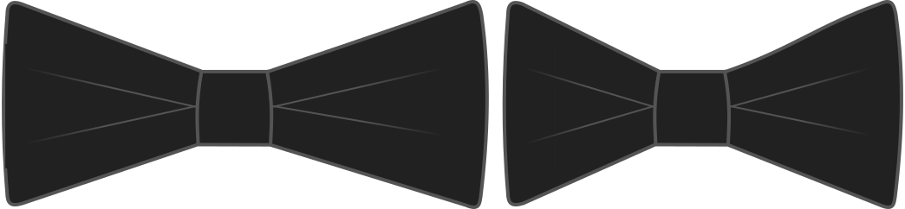

- - -
title: "longueur du nœud"
- - -

Vous pouvez faire des nœuds papillon larges ou étroits. Cette option vous permet de changer la taille horizontale des extrémités du nœud. Faites-les plus grand pour être plus flamboyant, ou petit pour un style plus discret.

## Effet de cette option sur le motif

