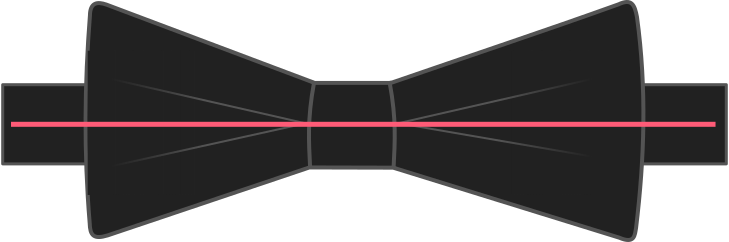

Using the neck circumference is one part of getting a well-fitting bow tie. The other is how much collar ease you normally use for your shirts. Together they dictate how long the bow tie becomes.

> #### Not used with the adjustment ribbon option
> 
> This option is used to make a precise fitting bow tie. When you use the adjustment ribbon, this option is not used.

## Effect of this option on the pattern

