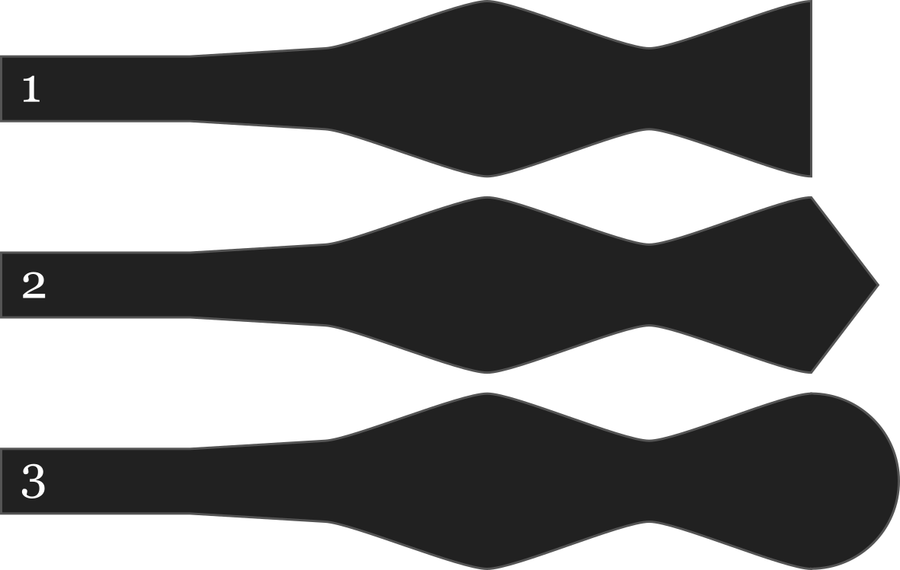

- - -
title: "End style"
- - -

Zusätzlich zu den vier verschiedenen Fliegen-Stilen kann jeder Stil mit drei verschiedenen Spitzenoptionen individualisiert werden:

- Gerade
- Spitz
- Abgerundet

## Effekt dieser Option auf das Schnittmuster

