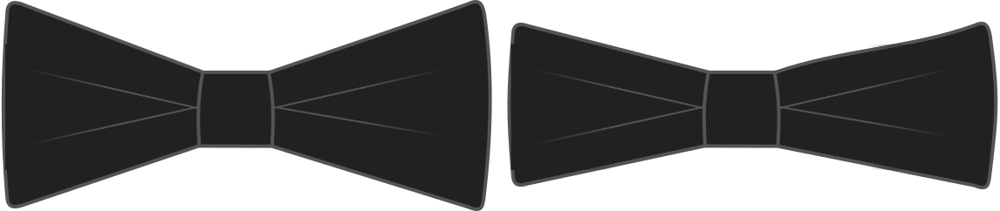

- - -
title: "Tip width"
- - -

You can make BIG bow ties, or small ones. This option allows you to change the vertical size of the bows. Make them larger to be more flamboyant, or small for a more subdued style.

<Note>

###### No se usa con el tipo de empatado cuadrado

Esta opción se ignora con la opción de empatado cuadrado. Los lazos cuadrados de arco son tan anchos como el ancho del nudo.

</Note>

## Efecto de esta opción en el patrón

