<Note>

###### Bibi is a customizable pattern building block

Bibi can be sewn as a simple top, but it is mostly designed as a building block for other patterns or custom designs.

Bibi is highly customizable, but it does not in itself represent a specific garment or style.
Some option combinations might not make much sense, and you may need to experiment with different options. 

You may want to finish the hem, armholes, and/or neck using knit bands, knit binding or ribbing fabric.
These instructions give basic guidelines for that, 
but you might also want to look at instructions from other designs, like Sven, Aaron or Teagan.

There is also lots of other stuff you could customize.

</Note>

<Note>

As with all knits and stretch fabrics, a serger/overlock will make your life easier.
If you don't have one, don't despair. You don't really need one.
All serged seams on Bibi can also be sewn with a short, narrow zigzag stitch (~2 mm wide) on a standard sewing machine.

For the topstitching steps, a coverlock works best, but if you don't have a coverlock, a twin needle will also give good results.
Of course, you can also use a zigzag stitch.

</Note>

### Step 0: Prepare the fabric

Cut out the parts including seam allowance and transfer markings and notches to the fabric.
Note that there are two different kinds of notches. You probably want to use a different notch shape or a different pen/chalk color for ×-notches.

### Step 1: Prepare the front part

If your pattern is for someone with a larger bust, your design will likely include
either fabric gathering or a bust dart at the side seam of the front part.

If your pattern contains neither an indicated gathering section nor a dart, skip to step 2.

#### Bust darts

If the pattern was drafted with _darts_, fold your front part _good sides together_ along the center line of the dart.

Sew using an elastic stitch along the dart line from the side seam towards the bust. 
Near the dart tip, make sure to stitch as parallel to the fold line as possible while still stitching over the folded edge.

If not using a serger, cut away any unnecessary fabric from the dart and finish raw edges. 

Repeat this for both sides.

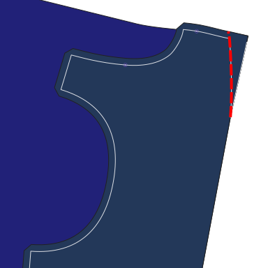

#### Gathering

If you didn't select the dart option, gather the fabric by doing 2 or 3 parallel straight stitches through the seam allowance where indicated on the pattern.
The stiches should have a longer stitch length setting, and you must *not* secure the ends by backstitching.
Keep the thread ends loose and long.

Hold the bobbin threads with one hand tight and bunch together the fabric with the other hand until
you've gathered the section to the same length as the distance between the notches on the back part pattern.

Secure the threads by tying a knot.

Repeat this for both sides.

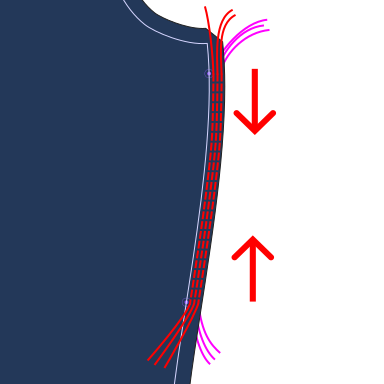

<Note>

There are lots of alternative techniques for this. If the difference between the lengths isn't that large,
you could simply adjust/stretch the fabric while sewing the side seam later. Or you could pleat folds manually and pin them in place.

Experiment with different methods on scrap fabric and look up books and tutorials for tips if you are unsure.

</Note>

### Step 2: Sew the shoulder seams

Match up the front and back parts along the edges between the neck and the armholes _good sides together_ and matching raw edges.

Sew using an elastic stitch. Repeat for both sides.

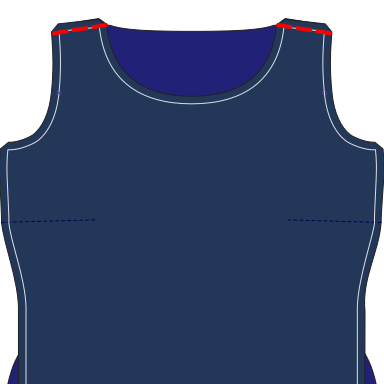

### Step 3: Sew the sleeves

If your design has a separate sleeve part, pin the sleeve part to the main body part, _good sides together_, matching notches and raw edges. 

The hem of the sleeve points towards the neck opening.

Note that the sleeve part is not perfectly symmetrical. The ×-notch of the sleeve goes to the back part.
The round notch attaches to the front part.

Sew with an elastic stitch. Repeat for both sleeves.

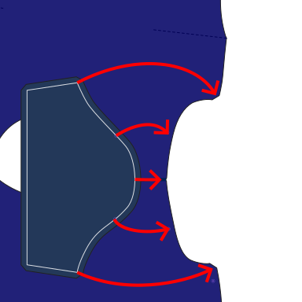

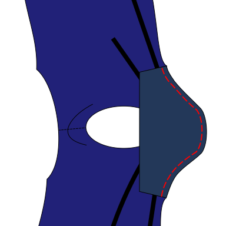

If your design doesn't have a sleeve part, skip to the next step.

### Step 4: Sew the side seams

_good sides together_, pin the side seams and the bottoms of the sleeves (if present) together.

With the front part on top, sew using an elastic stitch. Repeat for both sides. Remove any threads used for gathering.

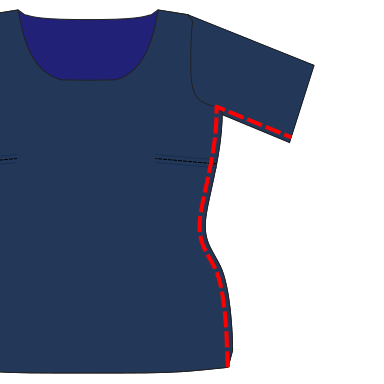

### Step 5: Create the hem

#### Using a waistband

If you've chosen to finish the hem with a waistband, 
sew together the short sides of the waistband, _good sides together_,
to create a tube.

Then fold the fabric in half along its length, raw edges together, so the good sides are outside.

With the main body piece turned inside-out, pin the ring inside the bottom opening, matching raw edges. 
Mark and align quarters for a consistent stretch.
The ribbing is a bit shorter, so stretch it a bit while pinning.

Sew using an elastic stitch.

Fold the hem to the outside.

Optional: Topstitch the seam allowance towards the main body piece to keep it in place.

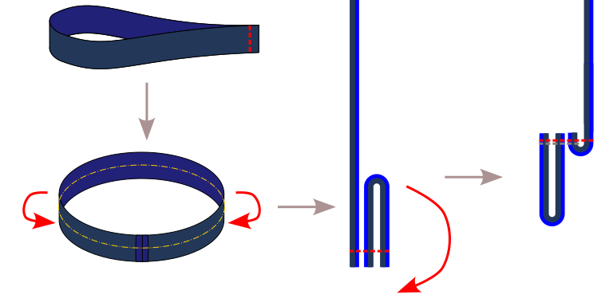

#### Simple hem

If you've chosen the option without a waistband, 
fold over the hem allowance to the inside and topstitch in place using an elastic stitch.

### Step 6: Finish the neck

<Note>
This is explained in more detail in the [Teagan instructions](/docs/designs/teagan/instructions#step-3-sew-the-neck-finish) and on [this page](/docs/sewing/knit-binding).
</Note>

Turn the main body piece right side out.
Place the knit binding piece _good sides together_ on the back of the neck,
matching the raw edge of the neck opening.
The solid line on the pattern (where the seam allowance ends) should be exactly at the center back of the garment.

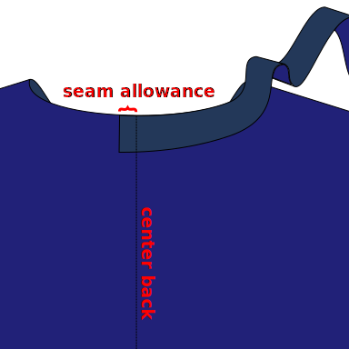

Sew the neck binding to the main body piece. 
The distance of the stitch to the raw edge is the width of the neck band
divided by four.
This is probably not equal to the standard seam allowance!
For example, if your knit band is 6 cm wide, sew 1.5 cm from the edge.

Place your presser foot 3 cm along the knit binding, so a 3 cm tail will be left unstitched. 
This will help us join the ends of the binding later.

Stop sewing 3 cm before the end, leaving a tail like we did at the beginning.

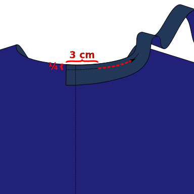

Sew the tails _good sides together_ to close the loop, making sure the neck binding is stretched evenly.

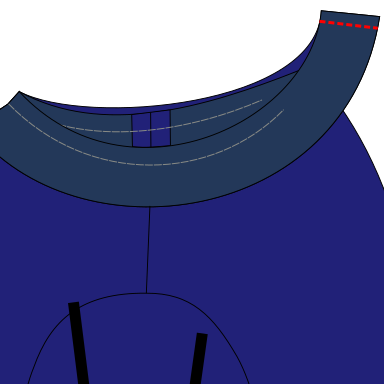

Then sew down the remaining, unstitched length of the neck binding, keeping the same distance as before.

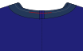

Fold the neck binding upwards and to the inside of the top. 
This will create a fold at the stitch line you just created,
and another one at the original raw edge from the front and back parts.

Topstitch the neck binding in place from the outside. 
The inside edge can be left raw if you're using knit fabric. 
Trim loose fabric from the inside to reduce bulk.

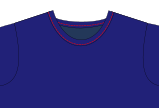

### Step 7: Finish the armholes
                 
#### With sleeves

If your design has a sleeve part, 
follow the waistband instructions again for the cuff or sleeve opening 
and either attach a piece of ribbing or do a simple folded hem.

<Note>

Alternatively, you can also finish the bottom edge of the sleeves right at the start.
This is a little bit easier as you can work on flat fabric, but the inside of the sleeves won't be as clean
as the bottom seam will go right to the armhole opening and won't be hidden.

</Note>

#### Without sleeves

If your design is sleeveless or has only short cap sleeves as part of the main body, 
finish the armholes the same way you finished the neckline.
