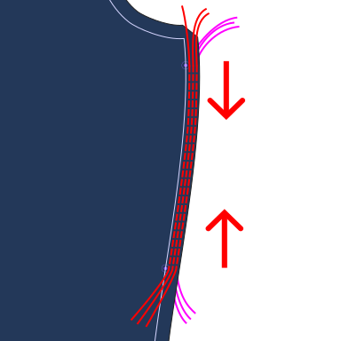
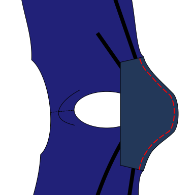

<Note>

###### Bibi is a pattern building block

Bibi can be sewn as a simple top, but is mostly designed as a building block for other patterns or custom designs.

Bibi is highly customizable, but it does not in itself represent a specific garment or style. Some option combinations might not make much sense. 

You may want to finish the hem, armholes, and/or neck using knit bands, knit binding or ribbing fabric.
In this case, you may want to look at instructions from other designs, like Aaron or Teagan.

There is also lots of other stuff you could customize.

</Note>

### Step 0: Prepare the fabric

Cut out the parts including seam allowance and transfer markings and notches to the fabric.
Note that there are two different kinds of notches. You probably want to use a different notch shape or a different pen/chalk color for notches with an ×.

### Step 1: Prepare the front part

If your pattern is for someone with a larger bust, your design will likely include
either fabric gathering or a bust dart at the side seam of the front part.

If your pattern contains neither an indicated gathering section nor a dart, skip to step 2.

#### Bust darts

If you drafted the pattern with _darts_, fold your front part _good sides together_ along the center line of the dart.

Sew using an elastic stitch along the dart line from the side seam towards the bust. 
Near the dart tip, make sure to stitch as parallel to the fold line as possible while still stitching over the folded edge.

If not using a serger, cut away any unnecessary fabric from the dart and finish raw edges. 

Repeat this for both sides.

#### Gathering

If you didn't select the dart option, gather the fabric by doing 2 or 3 parallel straight stitches through the seam allowance where indicated on the pattern.
The stiches should have a longer stitch length setting, and you must *not* secure the ends by backstitching.
Keep the thread ends loose and long.

Hold the bobbin threads with one hand tight and bunch together the fabric with the other hand until
you've gathered the side seam to the same length as the distance between the notches on the back part pattern.

Secure the threads by tying a knot.

Repeat this for both sides.

<Note>

There are lots of alternative techniques for this. If the difference between the lengths isn't that large,
you could simply adjust/stretch the fabric while sewing the side seam later. Or you could pleat folds manually and pin them in place.

Experiment with different methods on scrap fabric and look up books and tutorials for tips if you are unsure.

</Note>

### Step 2: Sew the shoulder seams

Match up the front and back parts along the edges between the neck and the armholes _good sides together_ and matching raw edges.

Sew using an elastic stitch. Repeat for both sides.

### Step 3: Sew the sleeves

If your design has a separate sleeve part, pin the sleeve part to the main body part, _good sides together_, matching notches and raw edges. 

The hem of the sleeve points towards the neck opening.

Note that the sleeve part is not perfectly symmetrical. The ×-notch of the sleeve goes to the back part.
The round notch attaches to the front part.

Sew with an elastic stitch. Repeat for both sleeves.

If your design doesn't have a sleeve part, skip to the next step.

### Step 4: Sew the side seams

_good sides together_, pin the side seams and the bottoms of the sleeves (if present) together.

With the front part on top, sew using an elastic stitch. Repeat for both sides. Remove any threads used for gathering.

### Step 5: Hem the openings

If not using knit binding or knit bands fold over the fabric at the remaining openings _wrong sides together_ once and topstitch in place with an elastic stitch.
