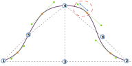

Ця опція контролює розкид вгору в другому квадранті ковпачка рукава.

<Tip>

Дивіться [розуміння конструкції манжета](/docs/designs/brian/options#understanding-the-sleevecap) для детального
розгляду того, як побудований манжет і як різні варіанти впливають на його форму.

</Tip>
